# Generate VQ-VAE2 model for HipMRI Study on Prostate Cancer
###### Author: Arpon Sarker (s4745413)

### Overview
This report's objective was to construct a Vector Quantized Variation Autoencoder (VQ-VAE2) that is able to generate based on processed 2D slices of prostate cancer from the HipMRI Study with a Structured Similarity
(SSIM) of greater than 0.6. It is trained to learn a discrete latent representation to generate new images.

This model combines variational autoencoders with vector quantization techniques to efficiently encode high-dimensional data into a lower-dimensional latent space with its discrete representations which allows the model to learn
structured features of the MRI images. The model is made of three components: the encoder, quantization step to compute the codebook and the decoder. In the encoder, this is a neural network that maps the input (the values of each pixel
in the image) into continuous latent space. From the quantization step, the continuous latent space representations are replaced by the nearest discrete vector from a learned codebook from the encoding before. The codebook contains the set of discrete embedding vectors that the models learns during training. Using a discrete represenation here allows the model to extract more meaningful and structured patterns and relationships. The decoder then takes the quantized latent variables and reconstructs from this and aims to be as close as possible to the input data which is what the loss function compares itself to. 

In the image below, the image is from the original paper that introduced VQ-VAEs. [<a href="#ref1">1</a>] This image shows the model's architecture starting with CNN model used as the encoder which transforms  the input image into the latent space. This is then passed to the vector quantization layer in the middle which quantizes the input's latent space variables using the embedding space by representing the continuous variables as discrete representations which is seen in the image as columns signifying its discrete representation and uses straight-through gradient to backpropagate gradients between the encoder and decoder models. The decoder at the end is also a CNN model which transforms the vectors in embedding space using the codebook it has constructed to generate the image that should be similar to the input image.
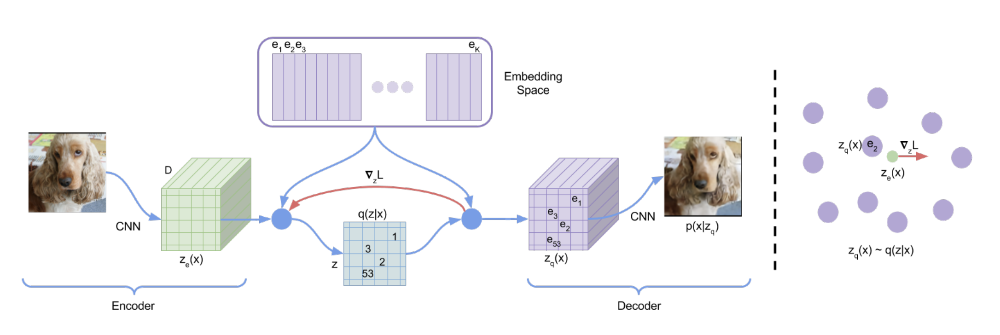

In making the convolutional neural networks for both the encoder and decoder, a residual stack was used which was composed of residual layers. This helped mitigate the issue of vanishing gradients which can often occur especially in problems like that need a deep learning network and help the model understand complex transformations without degradation in quality. Residual connections allowed the model to learn the identity function more easily and helps allow gradients to flow smoothly which is important in comparing and generating from the input image to the output. Residual stacks are groups of residual layers used to process features at different levels of abstraction such as bigger and larger features differentiated from the more miniscule blobs of the image at grayscale or white. Furthermore, this model is a VQ-VAE2 model as it uses multi-level latent spaces from these residual stacks as its hierarchical latent structure rather than using more complex models such as PixelCNN or transformers which are both self-attention and autoregressive models.

The loss function used multiple losses to compute the training and validation loss [<a href="#ref3">2</a>] which were:

1. Reconstruction Loss: This compares how well the reconstructed image is similar to the input image.
2. Commitment Loss: Ensures that latent vectors are close to the corresponding vectors from the codebook
3. Codebook Loss: Ensures that the quantized vectores are close to the encoder's output

The formula for the total loss which combines all of these are:

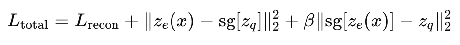

### Deep Learning Pipeline
## 1. Data Preparation

The data preparation was handled in dataset.py which used the Hip MRI data for pelvic cancer which was published in 20 September 2021.[<a href="#ref3">3</a>] In this dataset, they were stored as NIfTI files and was grayscale
containing 256x128 images. This had to be resized in the next step at the data pipeline. The splits used was 90.5% for training, 5.2% for validation and 4.3% for testing which was used as this is the split given in each of the directories already.

| Dataset    | Number of Images |
|------------|------------------|
| Training   | 11,460            |
| Validate   | 660               |
| Test       | 540               |
| **Total**  | **12,660**        |

## 2. Data Pipeline

In the data pipeline stage, the data came in two different sizes and 256x128 was chosen as the final image to be resized before inputting the images into the model. Furthermore, the transformations used were
only normalising the data to further be able to generalise and generate images from the normal distribution.

## 3. Model Architecture
The model architecture is in modules.py. 

VQ-VAE model structure (need to be CLICKED)

 
<pre>
VQVAE(
  (encoder): Encoder(
    (conv_stack): Sequential(
      (0): Conv2d(1, 32, kernel_size=(4, 4), stride=(2, 2), padding=(1, 1))
      (1): ReLU()
      (2): Conv2d(32, 64, kernel_size=(4, 4), stride=(2, 2), padding=(1, 1))
      (3): ReLU()
      (4): Conv2d(64, 64, kernel_size=(3, 3), stride=(1, 1), padding=(1, 1))
      (5): ResidualStack(
        (stack): ModuleList(
          (0-1): 2 x ResidualLayer(
            (res_block): Sequential(
              (0): ReLU(inplace=True)
              (1): Conv2d(64, 32, kernel_size=(3, 3), stride=(1, 1), padding=(1, 1), bias=False)
              (2): ReLU(inplace=True)
              (3): Conv2d(32, 64, kernel_size=(1, 1), stride=(1, 1), bias=False)
            )
          )
        )
      )
    )
  )
  (pre_quantization_conv): Conv2d(64, 64, kernel_size=(1, 1), stride=(1, 1))
  (vector_quantization): VectorQuantizer(
    (embedding): Embedding(512, 64)
  )
  (decoder): Decoder(
    (inverse_conv_stack): Sequential(
      (0): ConvTranspose2d(64, 64, kernel_size=(3, 3), stride=(1, 1), padding=(1, 1))
      (1): ResidualStack(
        (stack): ModuleList(
          (0-1): 2 x ResidualLayer(
            (res_block): Sequential(
              (0): ReLU(inplace=True)
              (1): Conv2d(64, 32, kernel_size=(3, 3), stride=(1, 1), padding=(1, 1), bias=False)
              (2): ReLU(inplace=True)
              (3): Conv2d(32, 64, kernel_size=(1, 1), stride=(1, 1), bias=False)
            )
          )
        )
      )
      (2): ConvTranspose2d(64, 32, kernel_size=(4, 4), stride=(2, 2), padding=(1, 1))
      (3): ReLU()
      (4): ConvTranspose2d(32, 1, kernel_size=(4, 4), stride=(2, 2), padding=(1, 1))
    )
  )
)
</pre>

The architecture for the Residual Stack is:

Residual Stack model structure (need to be CLICKED)

 
<pre>
ResidualStack(
  (stack): ModuleList(
    (0-1): 2 x ResidualLayer(
      (res_block): Sequential(
        (0): ReLU(inplace=True)
        (1): Conv2d(64, 32, kernel_size=(3, 3), stride=(1, 1), padding=(1, 1), bias=False)
        (2): ReLU(inplace=True)
        (3): Conv2d(32, 64, kernel_size=(1, 1), stride=(1, 1), bias=False)
      )
    )
  )
)
</pre>

The architecture for each individual Residual Layer making up the Residual Stack is:

Residual Layer model structure (need to be CLICKED)

 
<pre>
ResidualLayer(
  (res_block): Sequential(
    (0): ReLU(inplace=True)
    (1): Conv2d(64, 32, kernel_size=(3, 3), stride=(1, 1), padding=(1, 1), bias=False)
    (2): ReLU(inplace=True)
    (3): Conv2d(32, 64, kernel_size=(1, 1), stride=(1, 1), bias=False)
  )
)
</pre>

## 4. Training/Validation Procedure
The training and validation for the model happened in train.py. Using a for loop to loop through 100 epochs of the training and validation sets so the validation set can support the training set to reduce the total loss where the optimiser used was Adam
and the learning rate used was 1e-4. The SSIM was also calculated in each epoch alongside the average training and validation losses. SSIM was attempted to be used as part of the loss function but this provided nothing reasonable and couldn't be transformed
as a function to minimise where the goal of this project was to maximimse SSIM. The loss function (defined by function *loss\_fn*)calculates the total loss by summing binary cross-entropy loss of reconstruction loss and the embedding loss. The model parameters used are below:

* BATCH\_SIZE: 16
* NUM\_EPOCHS: 100
* LEARNING\_RATE: 1e-4
* NUM\_EMB (number of embeddings): 512
* E\_DIM (dimension of each embedding): 64
* COMMIT\_COST (also known as Beta): 0.25
* N\_RES\_LAYERS (Number of residual layers in stack): 2
* RES\_H\_DIM (Hidden layer dimensions of stack): 32
* H\_DIM (Hiden layer dimensions of CNN): 64

Weights and Biases was used during the training loop to graph the plots of the training loss, validation loss and SSIM.
The training loss plot and its last 20 epochs are graphed below:

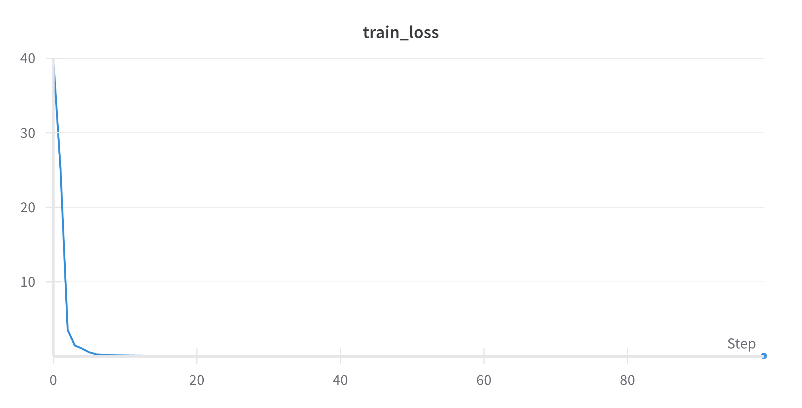

The values are quite small so the blue line is actually below the x-axis. The training loss at the 100th epoch was 0.048428. Below is the zoomed in version of the last 20 epochs.

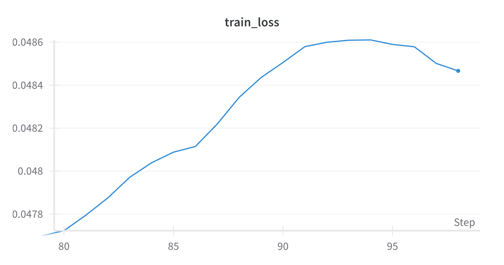

The validation loss plot and its last 20 epochs are graphed below:

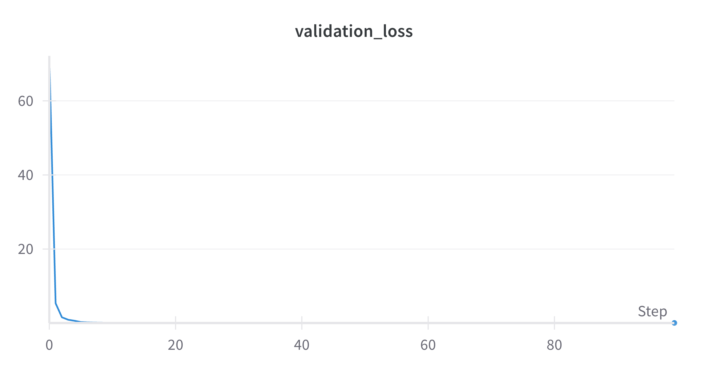

As before the values are also quite small and hence the line is behind the x-axis. The final validation loss at the 100th epoch was similar to the training loss's at 0.047603.
Furthermore, below is the last 20 epochs of the validation loss.

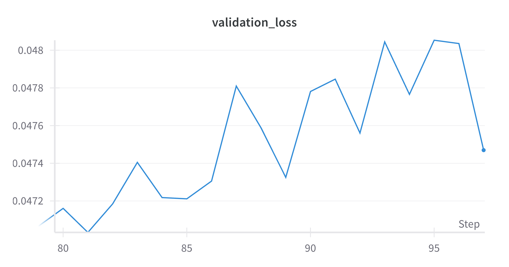

The SSIM plot is graphed below:

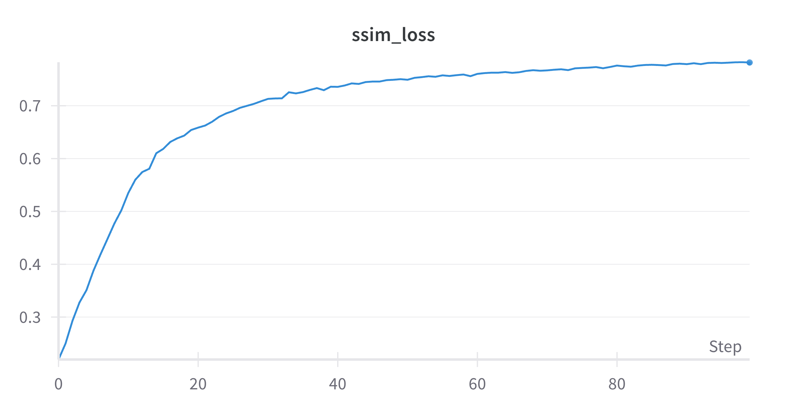

The SSIM at the last epoch was 0.78913.

## 5. Testing Procedure
The testing and inference happened in predict.py. This calculates the SSIM metrics and generates images by loading in the VQVAE checkpoint saved from the 100th epoch from train.py.

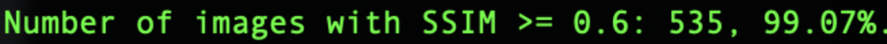

It can be seen that the model did well and succeeded in generating most of the images as above the 0.6 threshold on the test set.

The generated images are below:

**Original_0_Image_0**

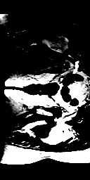

**Reconstructed_0_Image_0**

**Original_0_Image_1**

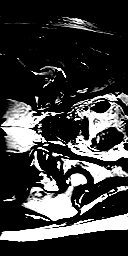

**Reconstructed_0_Image_1**

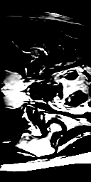

**Original_0_Image_2**

**Reconstructed_0_Image_2**

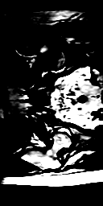

The rest of the reconstructed images are stored in the assets/ directory. As it can be seen from above the images are quite well constructed and seem to be a little bit smoother
and less detailed in the major white parts where the original image had speckles of minute details whereas, the model couldn't capture this but captured the overall shapes 
across the black background.

### File Structure
The modules are:

| Module    | Description|
|------------|------------------|
| dataset.py | Creates the dataloaders for each of the training, validation and test datasets and preprocesses the data|
| modules.py | Creates the model architecture which contains the Encoder, Decoder, ResidualLayer, ResidualStack, VectorQuantizer and VQVAE|
| predict.py | Computes the SSIM and generates results|
| train.py   | Trains the VQVAE model and includes training, validation and saving the model as well as connecting to Weights and Biases for plots|

### Dependencies:
| **Dependency** | **Version** |
|----------------|-------------|
| pytorch        | 2.0.1      |
| numpy          | 1.25.0     |
| matplotlib     | 3.7.1      |
| torchvision     | 0.15.2     |
| torchsummary | 1.5.1     |
| wandb          | 0.15.0     |
| tqdm           | 4.65.0     |
| nibabel        | 5.1.0      |
| pytorch-msssim | 0.2.1 |

### References

[1] Paper: Neural Discrete Representation Learning, Aaron van den Oord, Oriol Vinyals, Koray Kavukcuoglu, 2017. [https://arxiv.org/abs/1711.00937](https://arxiv.org/abs/1711.00937)

[2] Website: Preserving Details in Darkness: A VQ-VAE Based Approach with SSIM Loss for Low-Light Image Enhancement, Farzaneh Koohestani, Zahra Babak, Nader Karimi, Shadrokh Samavi [https://ieeexplore.ieee.org/document/10578944](https://ieeexplore.ieee.org/document/10578944)

[3] Website: Labelled weekly MR images of the male pelvis, Jason Dowling, Peter Greer, 2021. [https://data.csiro.au/collection/csiro:51392v2?redirected=true](https://data.csiro.au/collection/csiro:51392v2?redirected=true)

