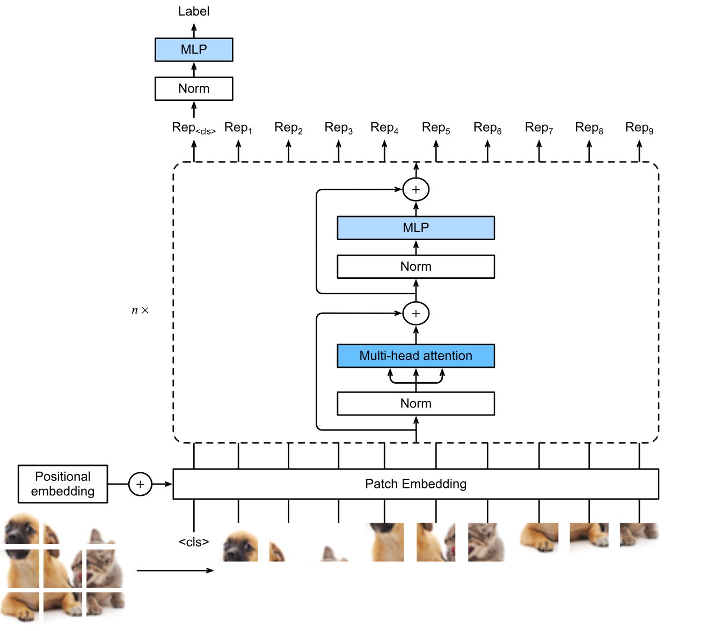
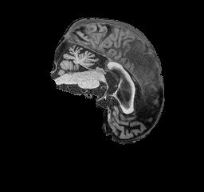
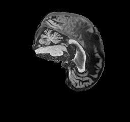
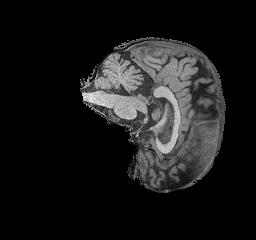
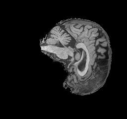

# Alzheimer's Disease Classification Using Vision Transformers (Task 5)

Author: John Kong 4697959

## Problem Description

This project focuses on classifying Alzheimer's disease (AD) and normal cognition (NC) using brain MRI images from the Alzheimer's Disease Neuroimaging Initiative (ADNI) dataset. We use a Vision Transformer (ViT) model to achieve this classification, leveraging its powerful capabilities in image recognition tasks. The goal is to distinguish between AD and NC with high accuracy, providing a deep learning-based approach to support medical diagnosis.

## The Model and How it works

The Vision Transformer (ViT) applies transformer architecture, which has been highly successful in natural language processing, to image data. Instead of relying on convolutions, the ViT divides each image into smaller patches, treats them as sequences, and processes them through multi-head self-attention mechanisms. The model learns global relationships between image patches, allowing it to capture complex spatial patterns that are critical for accurate classification. [1]

## Model Architecture

Vision Transformer Architecture:



The Vision Transformer consists of several key components [2]:

1. **Patch Embedding**:

The input image is divided into fixed-size patches (e.g., 16x16 pixels). Each patch is flattened into a vector and linearly transformed into an embedding. These patch embeddings serve as the input tokens to the transformer.

2. **Positional Encoding**:

Since transformers do not inherently understand the spatial relationships between patches, positional encodings are added to the patch embeddings. These encodings provide information about the position of each patch within the image, enabling the model to consider spatial order.

3. **Transformer Encoder**:

The encoder consists of multiple layers of multi-head self-attention and feed-forward neural networks. The attention mechanism allows the model to focus on different patches when making predictions, while the feed-forward layers capture complex patterns and relationships between patches.

4. **Classification Head**:

A special classification token `CLS` is added to the sequence of patch embeddings. This token aggregates information from all patches through the transformer layers. The final state of this token is used as the image representation, which is passed through a fully connected layer to produce the output class (AD or NC).

## Implementation Details in `modules.py`

The code for the Vision Transformer is organized into four main classes [3]: 

1. **`PatchEmbedding`**:

This class splits the input image into patches and embeds each patch into a fixed-size vector using a linear layer. The patch embeddings are then combined with positional encodings to retain spatial information.

2. **`MultiHeadSelfAttention`**:

This class implements the multi-headed self-attention mechanism. The multi-head self-attention mechanism computes attention scores for each patch, determining the importance of different patches relative to each other. This mechanism is implemented using matrix multiplication and scaled dot-product attention. 

3. **`TransformerEncoderBlock`**: 

This class defines the structure of each transformer block, consisting of a multi-headed self-attention layer followed by a feed-forward neural network with skip connections and layer normalization. The feed-forward layer consists of two linear layers with a GELU (Gaussian Error Linear Unit) activation in between. The feed-forward network is applied independently to each token.

4. **`VisionTransformer`**:

This is the main class for the Vision Transformer model. It integrates all the components mentioned above and defines the forward pass for the entire architecture, from patch embedding to the classification head. 

## Implementation Details in `dataset.py`

This file is responsible for data loading and preprocessing. It includes the following components [4]:

1. **Data Loading**:

The file defines functions to load the ADNI dataset and split it into training, validation, and test sets. The dataset is split with an 80-20 rule for training and validation, while a separate set is used for testing. The `get_data_loaders` function uses PyTorch’s `DataLoader` class to load and batch the data efficiently.

2. **Transforms**:

Several image transformations are applied to preprocess the data, including resizing, normalization, and augmentation such as random flips or rotations. Specifically, the dataset is normalized using `ImageNet`'s means and standard deviations and the images are also resized to `224x224` pixels, a typical input size for Vision Transformers [5]. These augmentations are designed to increase data diversity, helping the model generalize better to unseen images.
 
3. **Data Pipeline**:

The dataset is split into training (80%) and validation (20%) sets. An independent test set is used to evaluate the final model’s performance. The function `get_data_loaders` returns PyTorch DataLoader objects for training, validation, and testing. It accepts parameters like batch size and validation split ratio.

## Data Configuration and Data Example

The dataset is organized in the following folder structure and can be obtain from the Rangpur Path: `/home/groups/comp3710/ADNI`.

```
AD_NC
├── test
│   ├── AD
│   └── NC
└── train
    ├── AD
    └── NC
```

Below are some example of input images of the different classes:

AD:




NC:




## Dependencies

To run this project, you will need the following dependencies:

```
Python 3.8+
PyTorch 1.12+
torchvision 0.13+
scikit-learn 1.0+
matplotlib 3.5+
numpy 1.21+
```

## Training Process

### Initial Training Process and Parameters 

The initial training configuration for the Vision Transformer included a learning rate of `3e-4`, a weight decay of `1e-5`, and a batch size of `32`. The model used a dropout rate of `0.1` and a patience value of `20` epochs for early stopping to mitigate overfitting. The optimizer chosen was `Adam`, suitable for training Vision Transformers due to its adaptive learning rate mechanism, and the loss function used was `CrossEntropyLoss`, a standard choice for multi-class classification tasks like this.

### Hyperparameter Tuning Process

In this project, several key hyperparameters were systematically tuned to optimize model performance and address issues such as overfitting. The selection of these hyperparameters was guided by their impact on the model's learning dynamics and generalization capabilities (test accuracy).

Here’s a breakdown of the hyperparameters chosen for tuning and the rationale behind each:

1. **Number of Epochs**:

The number of training epochs was tested as a straightforward way to determine if extending training time alone could improve test accuracy. Additionally, I wanted to use the epochs to  experiment with the time constraints and computational limits on Rangpur. By adjusting epochs from `30`, `50`, `80`, and up to `200`, the goal was to observe if a prolonged training period would allow the model to converge better on the validation and testing sets.

2. **Learning Rate**:

The learning rate dictates how quickly or slowly the model updates its weights during training. Tuning this parameter is crucial because a learning rate that is too high might cause the model to converge too quickly, potentially missing the optimal point, while a rate that is too low may result in slow convergence or getting stuck in a local minimum. A range of values around the initial learning rate of `3e-4` (e.g., `1e-4` to `5e-4`) was tested to identify the optimal balance.

3. **Batch Size**:

The batch size affects both the model's learning process and computational efficiency. A smaller batch size, while more computationally demanding, can lead to more frequent updates and better generalization, while a larger batch size offers stability in the gradient updates. By tuning this parameter, the aim was to observe how varying sizes (e.g., `16`, `32`, `64`) influence the accuracy and speed of convergence.

4. **Dropout Rate**:

Dropout is a regularization technique that helps prevent overfitting by randomly setting a fraction of input units to zero during training. The initial dropout value was set to `0.1`, and this was varied (e.g., `0.1`, `0.3`, `0.5`) to assess its impact on the model’s ability to generalize better to unseen data.

5. **Weight Decay**:

Weight decay adds a penalty to the loss function based on the magnitude of the model weights, encouraging the network to learn simpler, more generalizable patterns. The initial value was set to `1e-5`, and various values (`1e-4`, `5e-5`, `1e-6`) were tested to reduce overfitting and improve test performance by regulating model complexity.

## Training Results and Evaluation

### Hyperparameter Tuning Results

##### 1. Epoch Tuning 

_Parameters kept constant: learning rate = 3e-4, weight decay = 1e-5, batch size = 32, dropout = 0.1._

| Epochs | Best Validation Accuracy (%) | Test Accuracy (%) | Early Stopping |
|--------|------------------------------|-------------------|----------------|
| 30     | 68.1                        | 65.0              | No              |
| 50     | 51.2                        | 50.4              | Yes             |
| 80     | 72.0                        | **67.2**          | No              |
| 200    | 82.0                        | 65.3              | No              | 

##### 2. Learning Rate Tuning

_Parameters kept constant: epochs = 80, weight decay = 1e-5, batch size = 32, dropout = 0.1._

| Learning Rate | Best Validation Accuracy (%) | Test Accuracy (%) | Early Stopping |
|---------------|------------------------------|-------------------|----------------|
| 1e-4          | 77.4                        | 64.9              | No            |
| 3e-4          | 72.0                        | **67.2**          | No             |
| 5e-4          | 72.3                        | 66.1              | No            |

##### 3. Dropout Tuning

_Parameters kept constant: epochs = 80, learning rate = 3e-4, weight decay = 1e-5, batch size = 32._

| Dropout | Best Validation Accuracy (%) | Test Accuracy (%) | Early Stopping |
|---------|------------------------------|-------------------|----------------|
| 0.1     | 72.0                        | **67.2**         | No             |
| 0.3     | 64.5                        | 63.6              | Yes            |
| 0.5     | 60.8                        | 58.9              | Yes            |

##### 4. Batch Size Tuning

_Parameters kept constant: epochs = 80, learning rate = 3e-4, weight decay = 1e-5, dropout = 0.1._

| Batch Size | Best Validation Accuracy (%) | Test Accuracy (%) | Early Stopping |
|------------|------------------------------|-------------------|----------------|
| 8          | 73.6                        | 66.3              | No             |
| 16         | 70.1                        | **67.0**          | No             |
| 32         | 72.2                        | **67.2**          | No             |
| 64         | 72.6                        | 65.6              | No            |

##### 5. Weight Decay Tuning

_Parameters kept constant: epochs = 80, learning rate = 3e-4, batch size = 32, dropout = 0.1._

| Weight Decay | Best Validation Accuracy (%) | Test Accuracy (%) | Early Stopping |
|--------------|------------------------------|-------------------|----------------|
| 1e-6         | 51.2                        | 50.9              | Yes             |
| 1e-5         | 72.2                        |**67.2**           | No             |
| 1e-4         | 62.4                        | 59.3              | No            |
