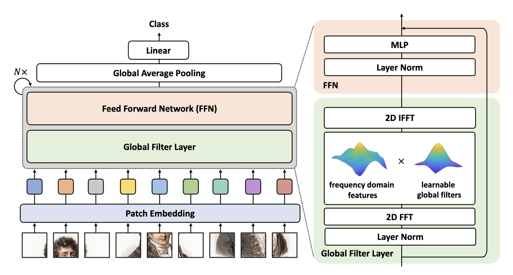
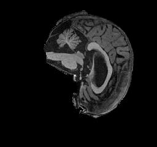
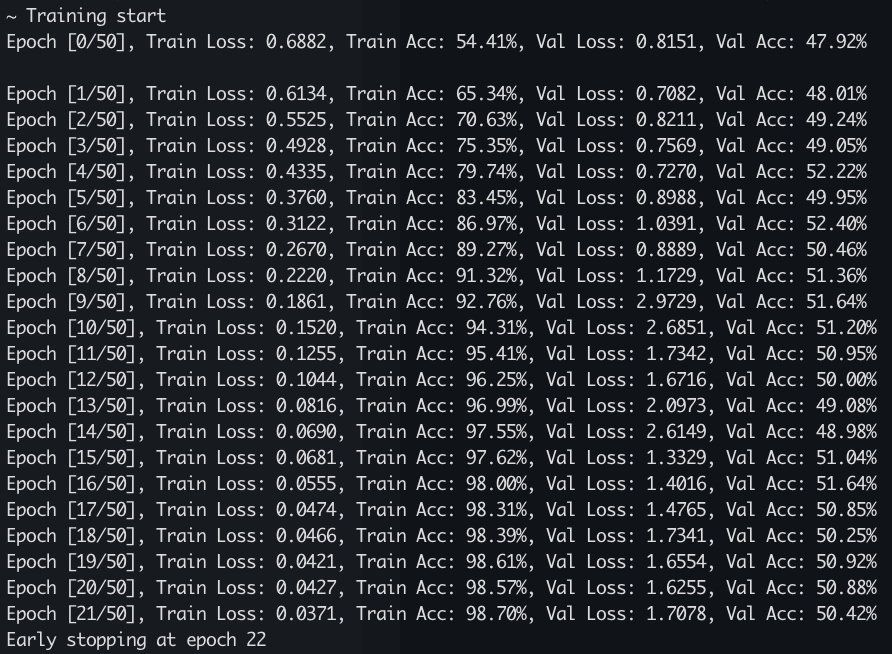
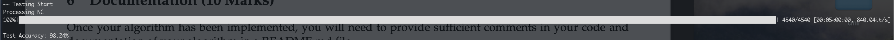

# Using a Vision Transfomer (GFNet?) to classify Alzheimer's diseased brains 

## Repo Description
This repository contains code to implement a machine learning Global Filter Network (GFNet) model on the problem of classifying MRI brain scans as either "Alzheimer's Diseased" or "Cognitive Normal" using data supplied by the Alzheimer's Disease Neuroimaging Initiative (ADNI). Through data pre-processing and model tuning this problem was able to be slolved with a final test accuracy of 98.24% 

## GFNet Model Explanation
The GFNet is a relatively modern classification model based on Vision Transformer model architecture. The model differs from a standard vision transformer achitecture by replacing the self-attention sub layer with three key operations. Firstly the 'Global filter layer' applies a 2D disccrete fourier transformation on the patches, then it performs an element-wise multiplication between the frequency-domain features and its learnable/learned global filters, finally it performs a 2D inveser Fourier transformation.
The formulation and development of the global filter layer was motivated by digital image processing and its use of frequency filters. The basic idea is to learn interactions among spatial locations in the frequency domain, these are modeled as a set of learnable global filters that are applied to the spectrum of input features. 
A standard convolutional layer adopts a relatively small filter size to enforce inductive biases of the locality,  "Gloabl Filter Network for Image Classification" paper proves that the global filters are able to cover all the frequencies and as a result the model is able to capture both long and short-term interactions of the features. Furthermore, as the Fourier Transform is used, via the Fast Fourier Transform Algorthim, to mix information of different tokens, the global filter is far more efficient than self-attention and MLP due to it's O(N log N) comlexity. This leads to less sensitivity on token length and thus is more compatible with larger features maps.
The following image provides a highlevel overview of the GFNet Architecture specifically regarding it's difference from a classical transformer:

## Problem Details
The ADNI dataset contains a total of 30,520 brain MRI images broken into a training and testing set, both of which are also broken into Alzheimer's Diseased (AD) images and Cognitive Normal (NC) images. There are a total of 21,520 training images and 9,000 testing images, each image is titled with the naming convention "PatientID__MRISliceID.jpeg" (e.g. 808819_89.jpeg) with a total of 20 images per patients. Each image is greyscale and has a size of 256 x 240 pixels, domain professionals commonly use a small sample of a patients brain MRI scan's to determine if they have any neurodegerative diseases, such as Alzheimer's in this case. This machine learning model acts to simulate the role of the professional in classifying patient brain scans into one of two classes, AD or NC.
The following image is an individual example of an MRI brain scan from the dataset:
 

## Dependencies
The following modules and their corresponding versions were used in my implementation of this project:

- Python: 3.11
- PyTorch: 2.5.0
- NumPy: 2.1.2
- Matplotlib: 3.9.2
- Scikit-Learn: 1.5.2
- TorchData: 0.9.0
- TorchVision: 0.20.0
- tqdm: 4.66.5
- timm: 1.0.11
- Pillow: 11.0.0
- opencv-python: 4.10.0.84

Additionaly I implmented a specific Conda Environment to follow best practices and to simplify reproducability  
The following commands can be used to reproduce the environment involved in training and testing this model
'''
conda create -n GFNet
conda activate GFNet
conda install python==3.11
conda install pip
pip install torch torchvision pillow opencv-python scikit-learn timm tqdm numpy matplotlib
'''

My initial model training and testing took place on the UQ Rangpur remote compute environment, which utilises NVIDIA A100 GPU's in its GPU-focused clusters. However due to increased use by other students, all further training and testing was performed on my 2020 M1 Macbook Pro. 

## Data Preprocessing
The following Preprocessing was performed on the images in aim of facilitating optimal model learning. Specifically two custom dataset classes are used in dataset.py, ADNI for the training data and ADNITest for the testing data. These custom classes perform specific actions on the data to ensure they're suitable for training and testing by labeling and augmenting the images and then provides functionality for getting individual items. After preprocessing the images are saved into specific 'processed' folders to be used for training and testing.
### Image resizing
Each image is cropped to remove the black borders around the brain scan, which do not positivley contribute to the problem feature space. Then a smaller padding is added to the image and it's re-sized to 224x224 pixels for a more suitable input to the model and to make them better suited for down-sampling. 
### Data Normalisation
All the images are normalised around a mean of 0.25 and a standard deviation of 0.25, these specific values we found to be the most suitable after calculating specific values all the subsets of data (Training_AD, Training_NC, Testing_AD, Testing_NC). The normalisation of the images is a standard procedure when performing machine learning to speed up model convergence.
### Data Augmentation
Further augmentations on the training data were used to randomly obfuscate features, in order to prevent overfitting. Specifically, a random erasing was performed on a small section of the images in an attempt to ensure the model doesn't hyper focus on any one specific section of the images.
### Data splits - Train, test and validation
The training data was split into an 80% training and 20% vaidation data to estimate validation accuracy during training. The existing train and test split of approximately 70% to 30% respectively was maintained. Additionally, specific grouping was performed on the data to ensure multiple scan images from the same patient aren't split between training, validation or testing sets. 
#### Justification
These ations detailed above were specifically performed to ensure there was no data leakage between training and testing the model, there was no overfitting of the data during training of the model and the model can better generalise the data. 

## Results
The following outputs and results were produced by running 'train.py'

### Model hyperparameters & More
The following specific hyper parameters and auxilary functions/algorithms were used for the model to achieve the above results:
EPOCHS = 30
LEARNING_RATE = 1e-3
LEARNING_RATE_MIN = 1e-6
LR_EPOCHS = 10
WEIGHT_DECAY = 5e-4
EARLY_STOP = 15
BATCH_SIZE = 32
**AdamW optimizer**: a weighted Adam optimizer with the above weight decay.
**CosineAnnealing Learning Rate**: A learning rate scheduler to adjust the learning rate of the model over multiple epochs.
**Early Stopping**: If validation accuracy doesn't increase for more than 10 epochs in a row, the training stops early.
### Summary
The results indicate that the model is overfitting to the data and further/different steps are required during data-preprocessing and augmentation phase in order better generalise the model. 

## References
Y. Rao, W. Zhao, Z. Zhu, J. Lu, and J. Zhou, “Global Filter Networks for Image Classification,” Oct. 26, 2021, arXiv: arXiv:2107.00645. Accessed: Oct. 18, 2024. [Online]. Available: http://arxiv.org/abs/2107.00645
'raoyongming', GFNet Model Code "Global Filter Networks for Image Classification", Jun. 12, 2023, Accessed: Nov. 30, 2024. Available: https://github.com/raoyongming/GFNet