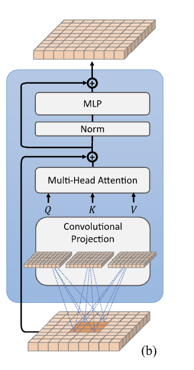
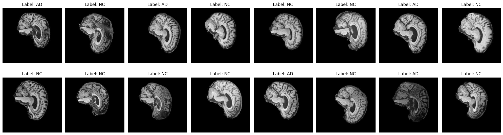
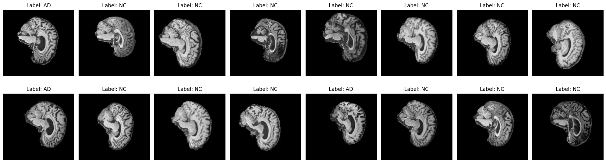
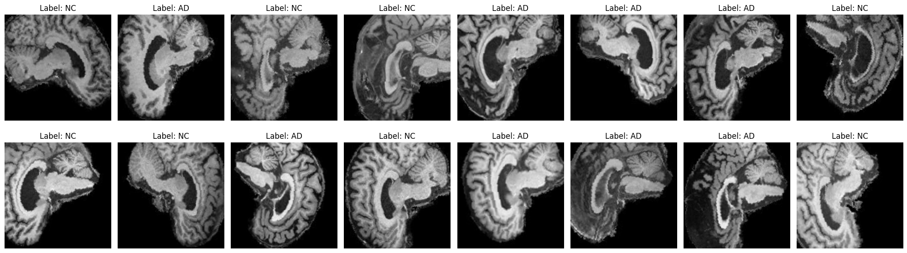
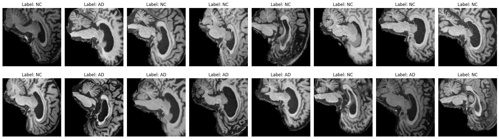

# Classify Alzheimer’s disease (normal and AD) of the ADNI brain data using Convolutional Vision Transformer (CvT)

This project aims to classify Alzheimer's disease (normal vs. AD) using the Convolutional Vision Transformer (CvT) on ADNI brain data.

## Convolutional Vision Transformer
The Convolutional Vision Transformer (CvT) adds two main features to improve the Vision Transformer: Convolutional Token Embedding and Convolutional Projection.

- Convolutional Token Embedding: This layer uses convolutions to create overlapping patches from images, which are then turned into tokens. It reduces the number of tokens while increasing their detail, similar to how CNNs work, without needing extra position embeddings.

- Convolutional Transformer Blocks: In these blocks, the Convolutional Projection uses depth-wise separable convolutions to handle the query, key, and value in the attention mechanism. This is more efficient than the standard linear approach used in earlier transformers.

The model only adds a classification token in the final stage, and a fully connected layer makes the final class prediction. CvT is designed to be more efficient while still capturing rich features for image classification [Wu et al., 2021].

Below is a visualization of the Convolutional Transformer Block, which includes the convolution projection as the first layer.



## ADNI brain data
Alzheimer’s disease (AD) is a progressive neurodegenerative disorder that leads to cognitive decline due to brain tissue deterioration, affecting millions globally. The ADNI study monitors the progression of AD by tracking biomarkers (such as chemicals in the blood and brain changes in MRI/PET scans) along with clinical measures. These assessments are conducted across three disease stages: cognitively normal, mild cognitive impairment, and dementia (Alzheimer's Disease Neuroimaging Initiative, n.d.). 

The ADNI dataset is an extensive and widely utilized resource that includes longitudinal data across multiple domains such as clinical, imaging, genetic, and biomarker information. It contains diverse data types, including structural, functional, and molecular brain imaging, biofluid biomarkers, cognitive evaluations, genetic data, and demographic details (Alzheimer's Disease Neuroimaging Initiative, n.d.).

This dataset contains two classes which are Normal Control (NC) and Alzheimer's disease (AD). In addition, this dataset contains:

Training data:
- NC: 11120
- AD: 10400

Testing data:
- NC: 4540
- AD: 4460

## Preprocessing
To do the classification of the ADNI brain data, it needs to prepare the training, validation, and test data. Here, it splits the original training data into training and validation data by 80:20 respectively. Therefore, the number of the dataset for doing the classification is:

Training data:
- NC: 8943
- AD: 8273

Validation data:
- NC: 2177
- AD: 2127

Testing data:
- NC: 4540
- AD: 4460

This is the sample of the training dataset:


This is the sample of the training dataset:


Furthermore, the training and validation data is augmented to expand and diversify a dataset by applying different transformations to the original data. This technique enhances the performance and generalization ability of models. This is the process of data augmentaion applied:

```Python
# tranformation and data augmentation for training data
transform = transforms.Compose([
        transforms.Resize((224, 224)),
        transforms.RandomHorizontalFlip(),
        transforms.RandomRotation(20),
        transforms.CenterCrop(128),
        transforms.ToTensor(),
        transforms.Normalize(mean=[0.1155, 0.1155, 0.1155], std=[0.2224, 0.2224, 0.2224])
    ])

# transformation and data augmentation for testing data
transform_test = transforms.Compose([
    transforms.Resize(224),
    transforms.CenterCrop(128),
    transforms.ToTensor(),
    transforms.Normalize(mean=[0.1155, 0.1155, 0.1155], std=[0.2224, 0.2224, 0.2224])
])
```
The value of mean and the standard deviation for normalization is got from the direct calculation on the dataset. In addition, the center crop is applied to the test data because of to make the image clearer when inputting to the model. These are the data after data augmentation:

This is the sample of the training dataset after augmentation:


This is the sample of the training dataset after augmentation:


## Hyperparameter
In the modules.py, this is the hyperparameter used for the model:
```Python
CONV_EMBEDDING_INPUT_CHANNELS=3
CONV_EMBEDDING_DIM=64
CONV_EMBEDDING_KERNEL_SIZE=7
CONV_EMBEDDING_STRIDE=4
CONV_EMBEDDING_PADDING_SIZE=2
TRANSFORMER_BLOCK_DROPOUT=0.1

CVT_INPUT_CHANNELS=3
CVT_CLASS_COUNT=2
CVT_EMBEDDING_DIM=32
CVT_HEAD_COUNT=8
CVT_HIDDEN_DIM=128
CVT_TRANSFORMER_BLOCK_COUNT=4
CVT_DROPOUT=0.3
```

Moreover, for training the model:
```
NUM_EPOCHS = 100
EARLY_STOPPING_PATIENCE = 10
OPTIMIZER_LEARNING_RATE = 1e-3
SCHEDULER_STEP_SIZE = 10
SCHEDULER_GAMMA = 0.1
```
Where the details are:
- Loss Function: Cross Entropy
- Optimizer: ADAM (Adaptive Moment Estimation)
- Scheduler: StepLR

## References
- Alzheimer's Disease Neuroimaging Initiative. (n.d.). ADNI data. Retrieved October 22, 2024, from https://adni.loni.usc.edu/data-samples/adni-data/
- Wu, H., Xiao, B., Codella, N., Liu, M., Dai, X., Yuan, L., & Zhang, L. (2021). CvT: Introducing Convolutions to Vision Transformers. *CoRR*, abs/2103.15808. Available at: [https://arxiv.org/abs/2103.15808](https://arxiv.org/abs/2103.15808).


