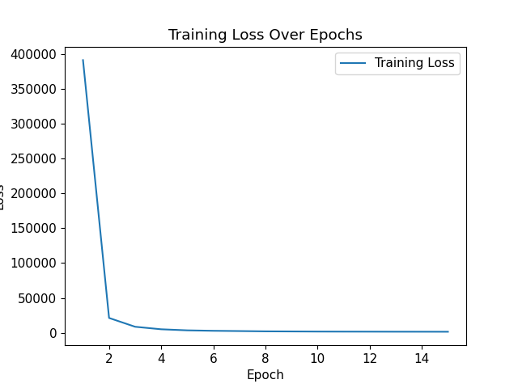

# YOLOv7 for Skin Lesion identification

This is a project using YOLOv7 (You Only Look Once v7) model to identify and classify skin lesions. The dataset of skin lesions was retrieved from ISIC Challenge Datasets 2017(https://challenge.isic-archive.com/data/#2017). Except the training data and test data, the corresponding gold standard lesion diagnoses and binary mask images are used for classification and IoU (Intersection over Union) calculation. 

## Model summary
The YOLO model is a real time visual object detection model. It uses gride to divide the input images, and each grid cell detects the objects inside. For each grid cell, YOLO output groups of boundary boxes and corresponding confidence level, class features. When there are multiple overlapping bounding boxes, YOLO uses a non-maximum suppression method to select the best box and ignore redundant results.

## My implementation
### Data loading
I downloaded training data and test data and the corresponding lesion diagnoses and binary mask images and put them in "/data/train" and "/data/test" respectively under working directory. 

Then I created an ISICDataset (inherited from Dataset of pyTorch) under sataset.py to load the dataset. I created a custom __getitem__  function to load the data in the format I need. That is:

___For each image, a transform was applied to resize it and transform to tensor type.___ 

___For each diagnoses, I manually checked that there are no instances of having melanoma and seborrheic keratosis at the same time. Thus, I re-encoded them for classification. More specifically, 1 for having melanoma, 2 for seborrheic keratosis, and 0 for not having none of them.
	I also created a get_dataloader function to load the ISICDataset using DataLoader of pyTorch.___ 

### Model define
Since the YOLOv7 model is very complex, we are allowed to use pre-trained models. I was not able to find a pre-trained YOLOv7 model specifically for the ISIC 2017 dataset.

Then, I first tried to load the standard YOLOv7 model (yolov7.pt, downloaded from https://github.com/WongKinYiu/yolov7/releases/tag/v0.1y) and use an independent classifier to classify based on the 80 one hot encoded class feature in outputs. But the performance was really limited, I got an average IoU only around 0.017. 

Thus, I decided to train a YOLOv7 specifically for our dataset. I loaded the structure of the standard YOLOv7(yolov7_training.pt, downloaded from https://github.com/WongKinYiu/yolov7/releases/tag/v0.1y) and adjusted base on that. To better fit our dataset, I adjusted the detection layer of YOLOv7. 
    
Firstly, I wrote a helper function to extract the ground truth boundary box from the ground truth mask images. I printed out the height and width of some samples of the boundary box to construct anchors that suit the dimensions for our data. 
    
Then, I modified the class number by replacing the detection layer. In my instance the original number of classes defined in the pretrained YOLO was 80, and I changed it to 3 to represent the 3 possible diagnoses.

I also implemented a customer loss function which calculates and combined the loss of boundary box matching, confidence level matching, and classification matching. More specifically, the YOLO box loss was calculated by using the Mean Squared Error on the parameters. A extra enhancing weight is multiplied to the YOLO box loss to allow more customization. 
Confidence level loss was calculated in two part: the ones with object labeling in target, and the ones without. They were both calculated using the cross entropy with logistics, but they get different weight when combining the losses. A weaken weight were applied to the confidence level loss for where there were no objects in target labeling.
Then there is a classification loss for punishing the wrong classification. The classification loss was calculated by cross entropy loss

A construct_yolo_target function was implemented to help me transform the mask image into standard YOLO boxes. It returns a tensor with shap: (number of anchors, grid size, grid size,5 + number of classes). In the last term, the 5 include information of YOLO box (x center, y center, width, and height), objectness, one-hot encoded class.

### Training
To train the YOLO model, I loaded the yolov7_training.pt model as described previously to enable training on standard YOLOv7.  I loaded the dataset with a batch size of 4, and Adam optimizer was used with learning rate of 0.001. The custom loss function (described in model section) was used to provide loss during the training. 

In the training, since our data set was not formatted as a standard YOLO trainset required, I used a helper function construct_yolo_target to construct the labeling as same format as the predict output from the model. 20 epochs of training were performed on the training set. I saved the model after each epoch to compare the performance later. Also, the average loss in each training epoch was recorded and shown in the plot below: 

We can see that the loss start very high and decreased rapidly. This indicating the standard yolo was performed badly initially, and our training is efficiently enhancing the performance. 

A validation based on the training set was performed imminently after the 20 epochs of training to get a rough idea about the IoU performance. Since we have only one object to detect in each image, the prediction with maximum confidence in each image was evaluated. The performance shown in this validation will be further described in the Reflection section below.

### Testing

To better estimate the generalized performance of my YOLO model, I tested the model on the test set. 
To visualize the result, I have drawn the ground truth boundary box and predicted boundary box from YOLO as overlays on every given image in the test set. 
Similarly, since we have only one object to detect in each image, the prediction with maximum confidence in each image was evaluated and drawn. 
The images with overlays are then saved under "data/test/predictions/" folder. The result of testing will be justified in Reflection section below.

## Reflection

After trained the model, I found the model did not perform as expected. The best average IoU score I was able to get form the new trained model was around 20. I then goahead and checked the visualization of the prediction. I found several problems:

1. There are some data with weak visual distinction. Meanwhile, there are some interfering visual features which are much more distinctive. For example:
2. Some of the ground truth boundary boxes seem off. Especially they look like been rotated 90 degree. For example:
3. Many of the detections seems to focus on the smaller features in images while the actual objects are very large. For example: 

To Fix those problems, I then checked the code. 
1. First I stared with the last problem, the detector only sensitive to small features. Based on my understanding, I think there is a great chance this is because the anchors being too small. I retrained the model with enlarged anchor values. 