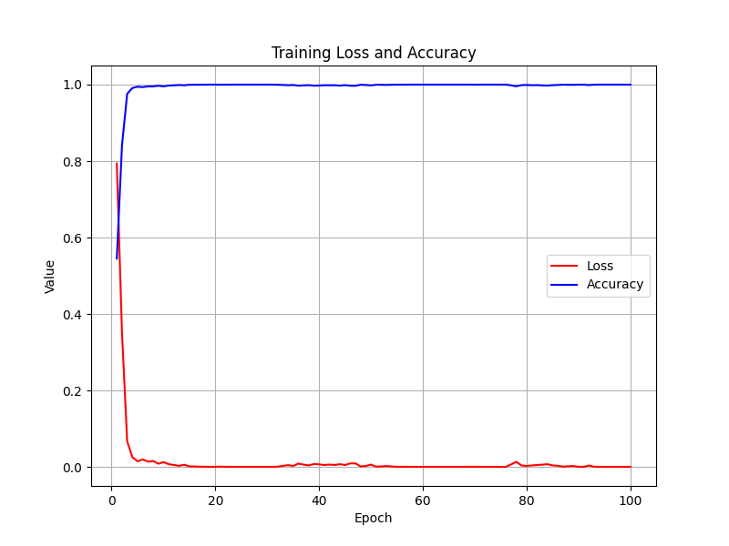

# Alzheimer's Disease Classification using GFNet

This project focuses on classifying Alzheimer's disease (normal and AD) using the ADNI brain data. We employ one of the latest vision transformers, GFNet, to achieve a minimum accuracy of 0.8 on the test set.

## Table of Contents
- [Introduction](#introduction)
- [Problem_Description](#problem_description)
- [Algorithm_Description](#algorithm_description)
- [Dataset](#dataset)
- [Model](#model)
- [Training](#training)
- [Evaluation](#evaluation)
- [Results](#results)
- [Appendix](#appendix)

## Introduction

This project focuses on classifying Alzheimer's disease (AD) versus normal cognitive function using the Alzheimer's Disease Neuroimaging Initiative (ADNI) brain MRI dataset. The goal was to implement a state-of-the-art vision transformer, specifically the GFNet [[1]](https://ieeexplore.ieee.org/document/10091201?denied=), to achieve a minimum accuracy of 0.8 on the test set. However, the model achieved an accuracy of approximately 0.65. This README outlines the problem, the implemented solution, how it works, dependencies, and the results obtained.

## Problem_Description

Alzheimer's disease is a progressive neurodegenerative disorder characterized by cognitive decline and memory loss. Early detection is crucial for patient care and treatment planning. This project aims to automate the classification of AD using MRI scans, facilitating early diagnosis through deep learning techniques.

## Dataset
The dataset used in this project is the ADNI brain data. For more details on the dataset, refer to the [Appendix](#appendix).

## Algorithm_Description

### GFNet Architecture

GFNet is a vision transformer model that leverages global filter layers to capture both local and global image features effectively. It replaces traditional convolutional layers with Fourier Transform-based global filtering, allowing for efficient and scalable image classification.

### How It Works

- **Data Preprocessing**: MRI images are preprocessed, including resizing to a uniform size, normalization, and augmentation to enhance model generalization.
- **Model Implementation**: The GFNetPyramid architecture is implemented with appropriate modifications to handle single-channel MRI images.
- **Training**: The model is trained using the processed dataset, optimizing the cross-entropy loss function with the AdamW optimizer.
- **Evaluation**: Performance is evaluated on a held-out test set, calculating accuracy and analyzing misclassifications.

## Data Preprocessing

- **Resizing**: Images are resized to \(244 \times 244\) pixels.
- **Normalization**: Pixel values are normalized to have 0.5 mean and 0.5 variance.

These steps enhance the diversity of the training data, helping the model to generalize better.

## Model
We utilize the GFNetPyramid vision transformer for this classification task. GFNetPyramid is an extension of the original GFNet architecture, designed to capture multi-scale features through a hierarchical pyramid structure. It combines global filtering with a pyramid of feature representations, allowing the model to effectively process images at different scales.
## How It Works
The GFNetPyramid model works by integrating global filtering mechanisms within a pyramid architecture to efficiently capture both local and global features from MRI images:

Patch Embedding: The input MRI image is divided into patches, and each patch is embedded into a high-dimensional feature space.

Pyramid Structure: The model consists of multiple stages, each operating at different resolutions. At each stage, the spatial dimensions are reduced, creating a pyramid of feature maps.

Global Filtering: Instead of using standard convolutions, the model applies global filters in the frequency domain using the Fast Fourier Transform (FFT). This allows the model to capture long-range dependencies and global context.

Feature Aggregation: Features from different stages are combined, enabling the model to consider information at various scales.

Classification Head: The aggregated features are passed through a fully connected layer to produce the final classification probabilities.

## Training
The model is trained on the ADNI dataset with the goal of achieving a minimum accuracy of 0.8 on the test set. Training details and hyperparameters are provided in the training script.

## Evaluation
The model's performance is evaluated on a separate test set. Metrics such as accuracy, precision, recall, and F1-score are used to assess the model.

## Reproducibility

To reproduce the results:

1. Clone the repository.
2. download ANDI dataset to `recognition/classify_azheimer/AD_NC`
3. Run the training and predict script: `python predict.py --epoch [num:defaut = 5] --train`.
4. if just want train the model just run `python train.py --epoch [num:defaut = 5]`.

## Results

- **Training Accuracy**: ~0.99
- **Test Accuracy**: ~0.65

The model did not reach the target accuracy of 0.8. Potential reasons include:

- **Complexity of MRI Data**: High variability and subtle differences in MRI scans.
- **Model Overfitting**: The model may have overfitted the training data.
- **Data Imbalance**: Possible imbalance between AD and normal cases.

Below is the training plot showing the train accuracy and loss over epochs:

We can see that the training set has an accuracy of almost 100, which is evidence that the model is overfitting, and it might be better to use a simpler network, but for time reasons it is currently at 65%.

## Dependencies
- Python: 3.12
- PyTorch: 1.10
- Torchvision: 0.11
- NumPy: 1.21
- Matplotlib: 3.4
- timm: 0.4.12

## Appendix
For more information on the ADNI dataset, visit the [ADNI website](http://adni.loni.usc.edu/).

## References
[1]  Rao, Y., Zhao, W., Zhu, Z., Lu, J., & Zhou, J. (2021). Global filter networks for image classification. In Advances in Neural Information Processing Systems (NeurIPS)[Link to the paper](https://ieeexplore.ieee.org/document/10091201?denied=)
