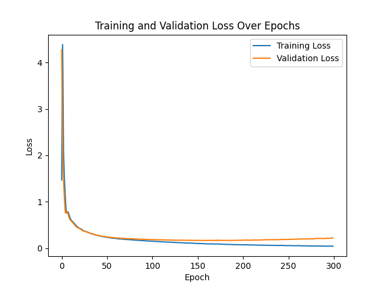

# Facebook Page-Page Network Node Classification

## Overview

This project involves training a Graph Neural Network (GNN) for semi-supervised multi-class node classification using the Facebook Large Page-Page Network dataset. The dataset represents various categories of Facebook pages (e.g., government, politician, tvshow, company) connected based on mutual likes. The task is to classify each node (Facebook page) into one of the provided categories using Graph Attention Networks (GAT) layers.

The model uses the Graph Attention Network (GAT) architecture and includes visualization of learned embeddings using UMAP.

## Dataset

The dataset is provided in the form of an partially processed .npz file containing:

Edges: Connections between nodes representing mutual page likes.

Features: 128-dimensional feature vectors extracted from page descriptions.

Target Labels: Page types (e.g., government, company, tvshow, politician).

## Model Architecture

The GNN model uses four layers of Graph Attention Networks (GATConv) with multi-head attention, combined with ReLU activations and dropout to prevent overfitting. The model architecture is as follows:

GATConv Layers:

- conv1: 8 attention heads for initial node feature transformation.

- conv2: 8 attention heads for further feature transformation.

- conv3: 8 attention heads for deeper representation learning.

- conv4: 1 attention head for the output layer.

Mixed precision training with automatic mixed precision (AMP) was utilized to speed up training and reduce GPU memory usage, enabling the use of larger hidden dimensions.

## Training Details

Hidden Dimension: 512.

Optimizer: AdamW with learning rate 0.0005 and weight decay 5e-4.

Loss Function: CrossEntropyLoss.

Epochs: 200.

Mixed Precision Training: Enabled using PyTorch AMP for increased training efficiency.

Training and Validation Loss

The following plot shows the training and validation loss over 200 epochs:

From the training and validation loss plot, we can observe that the model's loss decreases rapidly in the initial few epochs, indicating that it is learning efficiently. Both training and validation losses converge to near zero as training proceeds, demonstrating effective learning with little overfitting. This steady decrease suggests that the model generalizes well to unseen data, which is an important indicator of good training performance.

However, we can also notice that slight fluctuations towards the end of the training process, suggesting that the learning rate may need to be fine-tuned to prevent oscillations. Despite these minor fluctuations, the model overall performs well with low final loss values for both training and validation sets.

## UMAP Embeddings Visualization
To visualize how well the GNN captures the structure of the graph, **UMAP** was used to reduce the node embeddings to 2 dimensions. The following plot shows the reduced embeddings colored according to their ground truth labels:

The UMAP plot indicates that the model has successfully learned to separate the nodes based on their categories. Different colors represent different page types, and the clustering seen in the visualization suggests that nodes of similar types are grouped together, demonstrating good discriminative power of the learned embeddings. Specifically:

Government (Red): This category is well-clustered and separated from other categories, indicating that the features used to represent government pages are distinct from other node types.
Tvshows (Blue) and Companies (Green): These categories show some overlap, suggesting that certain features between tvshows and companies might be similar, which aligns with the possibility of common public engagement strategies used by both.
Politicians (Orange): This group is relatively distinct but has some overlap with the government cluster, which is expected due to similarities in content between politicians and government pages.
Overall, the UMAP visualization indicates that the embeddings learned by the GNN are effective in capturing the latent structure of the dataset, helping to group nodes of similar types together.

## Prediction Accuracy
The model achieved a prediction accuracy of 98.24% on the entire dataset, which shows that it was able to effectively classify nodes into their respective categories.

### Sample Predictions
Below are some sample predictions from the model:
- Node 0: Predicted = `0` (True = `0`)
- Node 1: Predicted = `2` (True = `2`)
- Node 2: Predicted = `1` (True = `1`)
- Node 3: Predicted = `2` (True = `2`)
- Node 4: Predicted = `3` (True = `3`)

