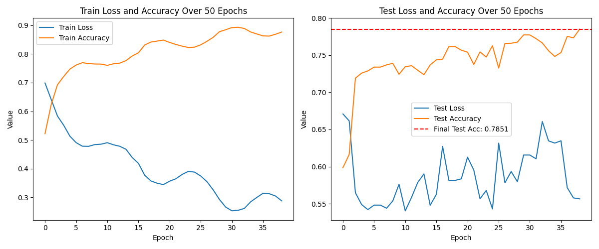

# GFNet Alzheimer's Disease Classification
## Overview
This project implements a Global Filter Network (GFNet) for the classification 
of Alzheimer's Disease (AD) using MRI brain images. The model distinguishes 
between patients diagnosed with Alzheimer's Disease (AD) and Normal Controls 
(NC) by analyzing imaging data.

## Architecture
The GFNet architecture combines convolutional patch embeddings with global 
filtering in the Fourier domain to capture both local and global features of 
input images. By applying global filters, the model effectively captures 
long-range dependencies.


## Dependencies
- Python 3.11
- Pytorch 2.4
- Torchvision 0.19
- timm 1.0.9
- Numpy 2.0.1
- Matplotlib 2.9
- Pillow 10.4

## Installation
```bash
pip install torch torchvision timm numpy matplotlib pillow
```

## Data Preparation
The dataset should be organized into `train` and `test` directories within a 
root directory, with subdirectories for each class (`AD` and `NC`):
```
data/
├── train/
│   ├── AD/
│   └── NC/
└── test/
    ├── AD/
    └── NC/
```

## Preprocessing
- **Training Data**:
  - Grayscale conversion
  - Random affine transformations (degrees up to 10°, translation up to 15%)
  - Random resized cropping (scale between 90% and 110%)
  - Color jitter (brightness and contrast adjustments)
  - Gaussian blur
  - Resizing to `(256, 240)`
  - Conversion to tensor

- **Test Data**:
  - Grayscale conversion
  - Resizing to `(256, 240)`
  - Conversion to tensor

These augmentations help the model generalize better by simulating variations in 
the dataset.

## Train-Test Split
The data is split into training and testing sets to evaluate the model's 
performance on unseen data. The train directory contains the training data, 
and the test directory contains the test data. It is important there are no
images duplicated between the test and training datasets.

## Usage
### Training
```bash
python -m gfnet-alzheimers-s4696842.train \
    data \
    --epochs 50 \
    --batch-size 64 \
    --test \
    --plot \
    --save-to model.pth
```

- `data`: Path to the root data directory.
- `--epochs`: Number of training epochs.
- `--batch-size`: Batch size for training.
- `--test`: Evaluate on test data after each epoch.
- `--plot`: Display training and validation metrics after training.
- `--save-to`: Path to save the trained model.

### Prediction

Use the prediction script to classify new images:

```bash
python -m gfnet-alzheimers-s4696842.predict \
    --image path/to/image.jpg \
    --model model.pth
```

- `--image`: Path to the input image.
- `--model`: Path to the saved model file.

## Example

### Training Metrics



### Prediction Output

```bash
Using device: cuda
using linear droppath with expect rate 0.0
Image tensor shape: torch.Size([1, 1, 256, 240])
Predicted Class: NC
Probabilities: [[0.09264012 0.90735984]]
Probability of AD: 0.0926
Probability of NC: 0.9074
```

## References

- **GFNet Architecture** [Global Filter Networks for Image Classification](https://github.com/raoyongming/GFNet)

## License

See repository root.
