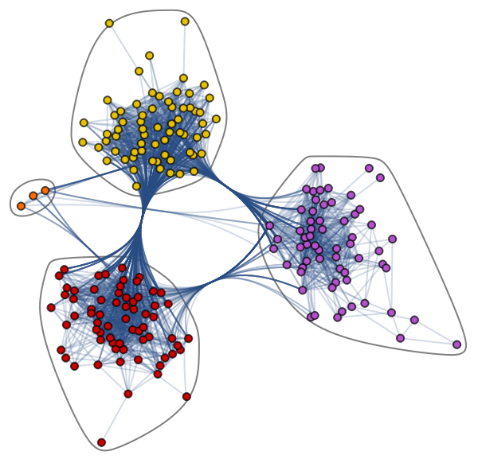

#  Multi-layer graph neural network (GNN) for semi supervised multi-class node classification using Facebook Large Page-Page Network Data

**Table of Contents**
- [Model and Problem Description](#model-and-problem-description)
- [Model Architecture](#model-architecture)
- [Model Usage](#model-usage)
- [Results](#results)
- [References](#references)

## Model and Problem Description
### Graphs
A graph is a data structure that containts nodes and edges. Nodes can represent any arbitrary object, and edges define the relationships between two nodes, and can be either directed or undirected. They are commonly used to model problems consisting of complex relationships and interactions, such as pattern recognition, social network analysis, and more. An example of a graph is shown below,

    

Due to the nature of graph data structures, they are hard to analyse. Reasons why include
  1. Graphs exist in non-euclidean space, not 2D or 3D, making visualisation and interpretation difficult
  2. Graphs are dyanmic - two very visually different graphs can have similar adjacency matrix representations
  3. Large size and dimensionality increases graph complexity for human interpretation

### Graph Neural Networks (GNNs)
Graph Neural Networks are special types of neural networks that are designed to analysis graph data structures. An input graph is passed through a series of neural networks, converted into graph embedding which allows us to maintain information on nodes, edges, etc. There are many types of GNNs, inlcuding
  1. Graph Convolutional Neural Networks (GCNs)
  2. Graph Auto-Encoder Networks
  3. Recurrent Graph Neural Networks (RGNNs)
  4. Gated Graph Neural Networks (GGNNs)

GNNs can carry out a variety of tasks, inluding
  1. Graph Classification
  2. Node Classification
  3. Link Prediction
  4. Community Detection
  5. Graph Embedding
  6. Graph Generation

    

## Model Architecture

## Model Usage

## Results

## References
[1] A Comprehensive Introduction to Graph Neural Networks (GNNs). https://www.datacamp.com/tutorial/comprehensive-introduction-graph-neural-networks-gnns-tutorial
----------------------------------------------------------------------------------------------------------------------------------------------------------------------------------------------------------------------
Training
Epoch [10/400], Loss: 1.26323, Validation Loss: 1.23775
Epoch [20/400], Loss: 1.03208, Validation Loss: 0.98408
Epoch [30/400], Loss: 0.76277, Validation Loss: 0.67652
Epoch [40/400], Loss: 0.56973, Validation Loss: 0.46284
Epoch [50/400], Loss: 0.47164, Validation Loss: 0.36143
Epoch [60/400], Loss: 0.41575, Validation Loss: 0.30780
Epoch [70/400], Loss: 0.38444, Validation Loss: 0.28174
Epoch [80/400], Loss: 0.38172, Validation Loss: 0.26687
Epoch [90/400], Loss: 0.37133, Validation Loss: 0.25546
Epoch [100/400], Loss: 0.34808, Validation Loss: 0.24646
Epoch [110/400], Loss: 0.35629, Validation Loss: 0.23923
Epoch [120/400], Loss: 0.34252, Validation Loss: 0.23486
Epoch [130/400], Loss: 0.34092, Validation Loss: 0.22914
Epoch [140/400], Loss: 0.33166, Validation Loss: 0.22596
Epoch [150/400], Loss: 0.32694, Validation Loss: 0.22643
Epoch [160/400], Loss: 0.32656, Validation Loss: 0.22386
Epoch [170/400], Loss: 0.31865, Validation Loss: 0.21791
Epoch [180/400], Loss: 0.30634, Validation Loss: 0.21633
Epoch [190/400], Loss: 0.31656, Validation Loss: 0.21400
Epoch [200/400], Loss: 0.30447, Validation Loss: 0.21124
Epoch [210/400], Loss: 0.30337, Validation Loss: 0.21200
Epoch [220/400], Loss: 0.29977, Validation Loss: 0.21104
Epoch [230/400], Loss: 0.29541, Validation Loss: 0.21014
Epoch [240/400], Loss: 0.30038, Validation Loss: 0.20703
Epoch [250/400], Loss: 0.29481, Validation Loss: 0.20667
Epoch [260/400], Loss: 0.28921, Validation Loss: 0.20640
Epoch [270/400], Loss: 0.29269, Validation Loss: 0.20486
Epoch [280/400], Loss: 0.28636, Validation Loss: 0.20538
Epoch [290/400], Loss: 0.28911, Validation Loss: 0.20671
Epoch [300/400], Loss: 0.28361, Validation Loss: 0.19912
Epoch [310/400], Loss: 0.27804, Validation Loss: 0.20120
Epoch [320/400], Loss: 0.28651, Validation Loss: 0.20144
Epoch [330/400], Loss: 0.27986, Validation Loss: 0.19939
Epoch [340/400], Loss: 0.28565, Validation Loss: 0.20001
Epoch [350/400], Loss: 0.28654, Validation Loss: 0.19993
Epoch [360/400], Loss: 0.28494, Validation Loss: 0.19804
Epoch [370/400], Loss: 0.27647, Validation Loss: 0.19675
Epoch [380/400], Loss: 0.28092, Validation Loss: 0.19440
Epoch [390/400], Loss: 0.27251, Validation Loss: 0.19472
Epoch [400/400], Loss: 0.27700, Validation Loss: 0.19314

Testing
Test Accuracy: 93.99%
