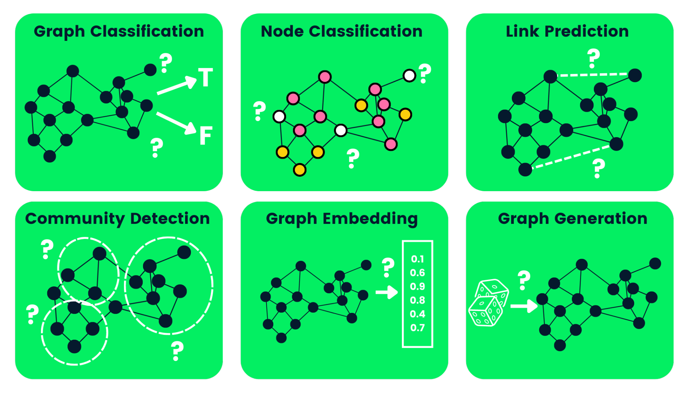

#  Multi-layer graph neural network (GNN) for semi supervised multi-class node classification using Facebook Large Page-Page Network Data

**Table of Contents**
- [Model and Problem Description](#model-and-problem-description)
- [Model Architecture](#model-architecture)
- [Model Usage](#model-usage)
- [Results](#results)
- [References](#references)

## Model and Problem Description
### Graphs
A graph is a data structure that containts nodes and edges. Nodes can represent any arbitrary object, and edges define the relationships between two nodes, and can be either directed or undirected. They are commonly used to model problems consisting of complex relationships and interactions, such as pattern recognition, social network analysis, and more. An example of a graph is shown below,

<div style="text-align: center;">
    
</div>

Due to the nature of graph data structures, they are hard to analyse. Reasons why include
  1. Graphs exist in non-euclidean space, not 2D or 3D, making visualisation and interpretation difficult
  2. Graphs are dyanmic - two very visually different graphs can have similar adjacency matrix representations
  3. Large size and dimensionality increases graph complexity for human interpretation

### Graph Neural Networks (GNNs)
Graph Neural Networks are special types of neural networks that are designed to analysis graph data structures. An input graph is passed through a series of neural networks, converted into graph embedding which allows us to maintain information on nodes, edges, etc. There are many types of GNNs, inlcuding
  1. Graph Convolutional Neural Networks (GCNs)
  2. Graph Auto-Encoder Networks
  3. Recurrent Graph Neural Networks (RGNNs)
  4. Gated Graph Neural Networks (GGNNs)

GNNs can carry out a variety of tasks, inluding
  1. Graph Classification
  2. Node Classification
  3. Link Prediction
  4. Community Detection
  5. Graph Embedding
  6. Graph Generation

<div style="text-align: center;">
    
</div>

### The Problem
The problem is to create a suitable multi-layer graph neural network (GNN) model to carry out a semi supervised multi-class node classification using the Facebook Large Page-Page Network dataset. 

This graph is a page-page graph of verified Facebook sites, where nodes represent pages and the links are mutual likes between sites. Node features are extracted from the site descriptions that the page owners created to summarize the purpose of the site. The categories are restricted to the 4 categories defined by Facebook: 
    - Politicians
    - Governmental Organizations
    - Television Shows
    - Companies

The task related to this dataset is multi-class node classification for the 4 site categories.

## Model Architecture
The model used to solve this problem is a Graph Convolutional Neural Network (GCN). These are similar to traditional CNNs, learning features by inspecting neighboring nodes. GNNs aggregate node vectors, pass the result to the dense layer, and apply non-linearity using the activation function.

This model consists of three graph convolutional layers followed by a linear classifier. It takes as input a dataset containing node features and edge information:
- **1st Layer:** Takes input features and maps to 8 output features.
- **2nd Layer:** Takes 8 input features and maps to 8 output features.
- **3rd Layer:** Takes 8 input features and maps to 4 output features.
- **4th Layer (Classifier):** Maps 4 input features to the number of classes.

In each forward iteration, the model:
1. Extracts node features and edge information.
2. Passes through the first convolutional layer, applying the ReLU activation function.
3. Applies dropout with a probability of 0.5 to help prevent overfitting.
4. Passes through the second convolutional layer, applying ReLU and dropout again.
5. Passes through the third convolutional layer, applying ReLU to generate the final set of node embeddings.
6. Passes through to the classifier layer.

This model uses the standard Cross Entropy Loss and Adam Optimizer.
## Model Usage

1. Download the .npz data from [here](https://graphmining.ai/datasets/ptg/facebook.npz) and store it in your local directory where you have the code. This is a partially processed dataset where the features are in the form of 128 dimesion vectors
2. Train the model using
    ```python
    python train.py
    ```
    Which will saved the model to an output .pth file ```model.pth```
3. Test the model and predict, visualising using t-SNE and UMAP by running
   ```python
   python predict.py
   ```

## Results
The code splits the data given into the form 80/10/10 for training, validating and testing. Upon training the model for 400 epochs with a learning rate of 0.01, we can see the final outputs for the last epochs to be  
``` Epoch [370/400], Loss: 0.27647, Validation Loss: 0.19675
Epoch [380/400], Loss: 0.28092, Validation Loss: 0.19440
Epoch [390/400], Loss: 0.27251, Validation Loss: 0.19472
Epoch [400/400], Loss: 0.27700, Validation Loss: 0.19314
```
We can visualise the training loss and validation loss over the training period.

<div style="text-align: center;">
    
</div>

As we can see, the training and validation loss drops significantly during the first portion of epochs, before stablising at a relatively constant loss for both training and validation. From this, we can test the trained model on the training data, resulting in
```
Testing
Test Accuracy: 93.99%
```
To better visualise the effectiveness of the model, we can construct a t-SNE embeddings plot and a UMAP embeddings plot. These techniques help us understand the relationships and structures within high-dimensional data by projecting it into a lower-dimensional space.
- t-SNE (t-distributed Stochastic Neighbor Embedding) is a dimensionality reduction technique particularly well-suited for visualizing high-dimensional datasets. It works by converting the similarities between data points into probabilities, preserving local structures. The result is that similar data points are mapped closer together in the lower-dimensional space, while dissimilar points are placed farther apart.
- UMAP (Uniform Manifold Approximation and Projection) is another dimensionality reduction method that focuses on maintaining both local and global structures of the data. It models the data as a high-dimensional manifold and tries to preserve the features when projecting it to a lower dimension.

<div style="text-align: center;">
    
    
</div>

From these visualisations, we can see distinct clusters forming in relation to their class labels. The borders of the clusters are relatively well defined, however there is some overlap between classes, such as Governmental Organizations and Politicians, potentially indicating the models inability to distinguish between these categories. Due to the little overlap in the Companies category, this could indicate that the model is very accurate in predicting when a page is in this category.  
Based on the proximity of the clusters, we can potentially draw conclusions about whether different classes have similar features or relationships. The data observed indicates potential relationships between Television Shows and Companies, as well as Politicians and Governmental Organizations. While both the t-SNE and UMAP embedding plots convey the same results, their overall shape is unrelated to one another.  
However, due to the techniques performing dimensionality reduction and the inherent qualitative analysis of the data, there are limitations as to how much reliable information these plots can provide.

## References
[1] A Comprehensive Introduction to Graph Neural Networks (GNNs). https://www.datacamp.com/tutorial/comprehensive-introduction-graph-neural-networks-gnns-tutorial
[2] Facebook Large Page-Page Network https://snap.stanford.edu/data/facebook-large-page-page-network.html
----------------------------------------------------------------------------------------------------------------------------------------------------------------------------------------------------------------------

