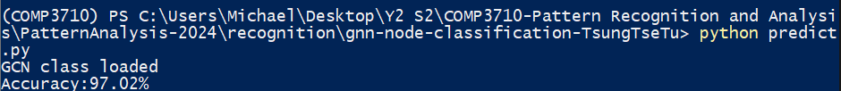

# GNN Node Classification on Facebook Large Page-Page Network

## 1. Project Overview
This project implements a **Graph Neural Network (GNN)** for **semi-supervised multi-class node classification** using the **Facebook Large Page-Page Network Dataset**. This dataset consists of features in the form of 128-dimensional vectors, which represent the attributes of each node (page). The objective is to predict the class of each node based on these features and the graph structure.

We also visualized the node embeddings with t-SNE to show how well the GNN model separates the nodes into distinct classes by colors.

## 2. Requirements
To install the required libraries, run:
```bash
pip install torch torch-geometric numpy matplotlib scikit-learn
```

## 3. Model Structure
The implemented model is a multi-layer **Graph Convolutional Network (GCN)** using two `GCNConv` layers:
- **Input Layer**: 128-dimensional input features per node.
- **Hidden Layer**: A hidden layer with 64 units.
- **Output Layer**: Outputs logits for multi-class classification, where each node is assigned to one of the possible classes.

## 4. Run the Code

### 4.1. Train the Model
The training script (`train.py`) trains the GNN model and saves the trained model weights in `gnn_model.pth`. You can run the training script as follows:

```bash
python train.py
```

This script:
- Load the **Facebook Large Page-Page Network Dataset**
- Initialize a GNN model with **128 input features** and **64 hidden layers**
- Train the GNN model for a number of epochs
- Save the trained model to *gnn_model.pth* for later prediction

### 4.2. Prediction and Evaluation
To evaluate the model and visualize the learned embeddings, run the prediction script (predict.py):

```bash
python predict.py
```

This script:
- Load the pre-trained model
- Predict node classes based on the learned embeddings
- Print accuracy of the model
- Visualize the node embedding using t-SNE(colored)

## 5. Dataset
The dataset I used is a [partially processed dataset](https://graphmining.ai/datasets/ptg/facebook.npz) of **Facebook Large Page-Page Network dataset** where the features are in the form of 128 dim vectors.
It consist of:
- Nodes: Facebook pages.
- Edges: Links between pages.
- Features: 128-dimensional vectors representing the features of each page.
- Labels: The class of each node (page).

The dataset is stored in .npz format and contains the following arrays:
- edges: A list of edges between nodes.
- features: A matrix of node features (128-dimensional).
- target: The class label for each node.

## 6. Result

### 6.1. Accuracy

After running the prediction file, the model achieved an accuracy of:



### 6.2. Embedding Visualization (t-SNE)

The following t-SNE plot shows the learned node embeddings, where each color represents a different class. The plot demonstrates that the GNN effectively clusters nodes of the same class together, indicating that the model has learned meaningful embeddings for node classification.


## 7. Reference
1. Kipf, T. N., & Welling, M. (2016). Semi-Supervised Classification with Graph Convolutional Networks. arXiv preprint arXiv:1609.02907.
2. Facebook Large Page-Page Network Dataset: [Data Source](https://snap.stanford.edu/data/facebook-large-page-page-network.html) [Paritally proecessed one](https://graphmining.ai/datasets/ptg/facebook.npz)

## 8. License
This project is licensed under the Apache License - see the [License](../LICENSE) file for details.