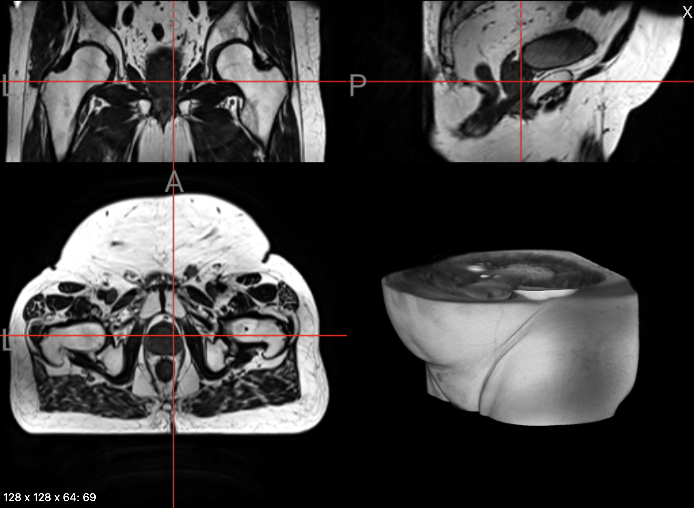
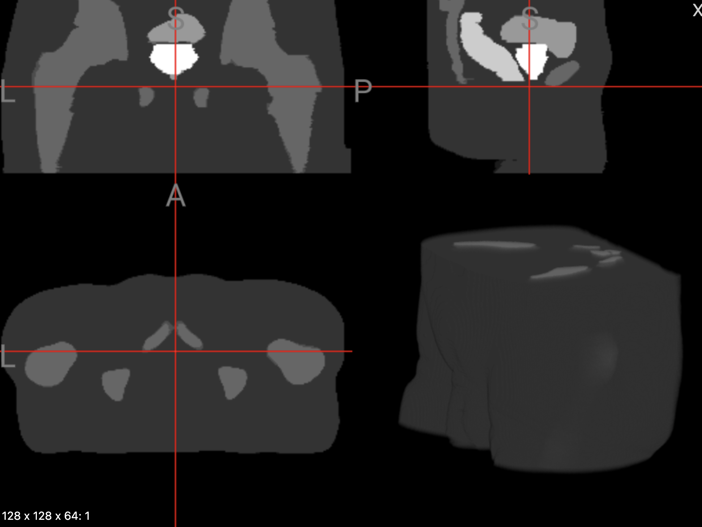
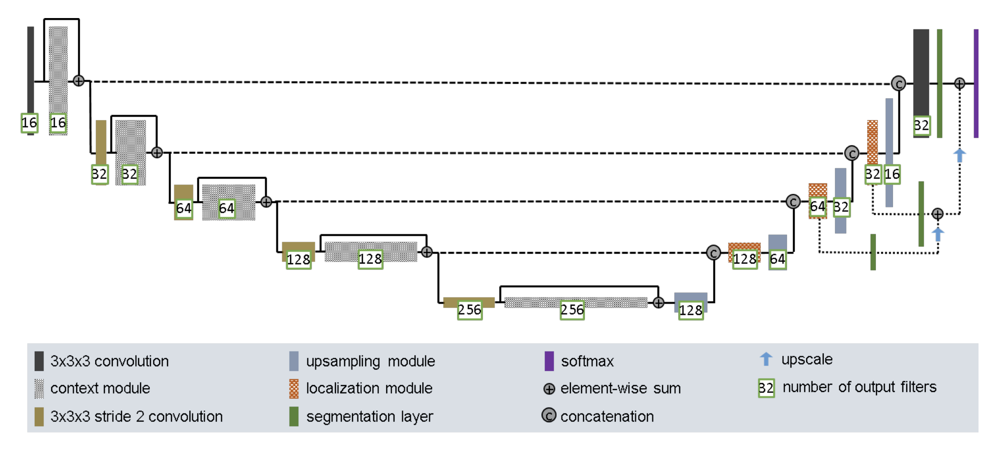
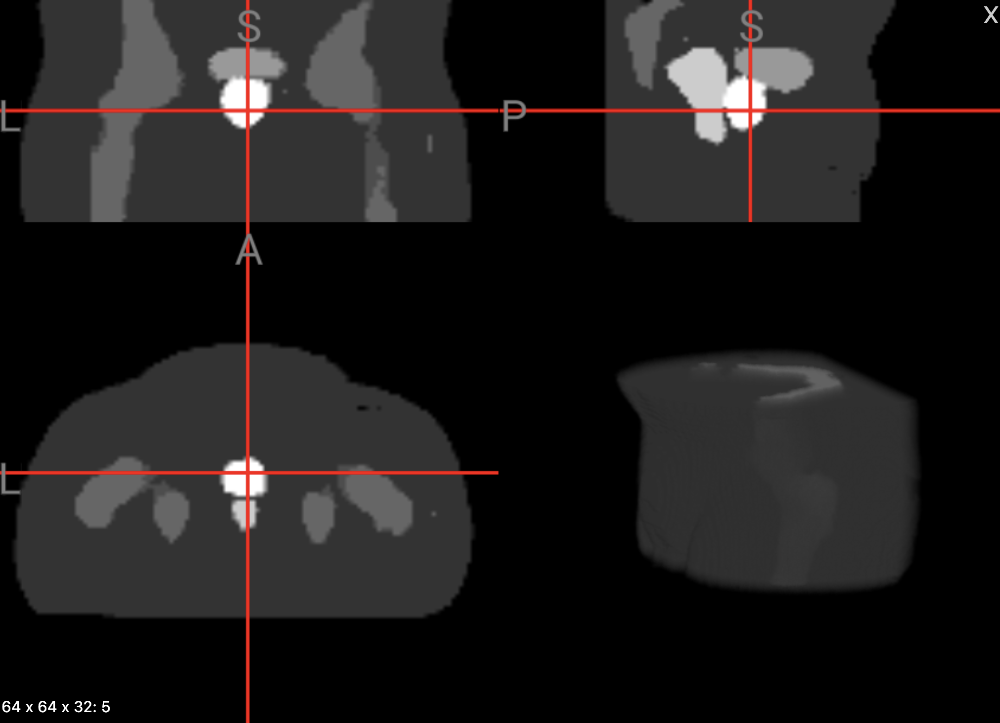
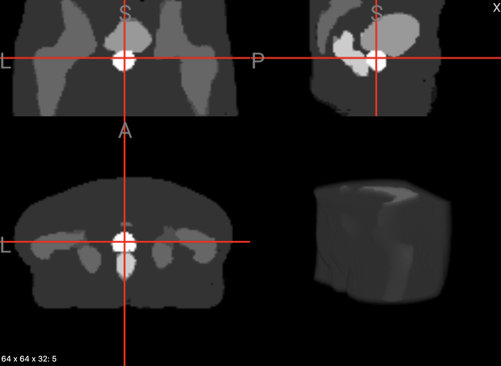
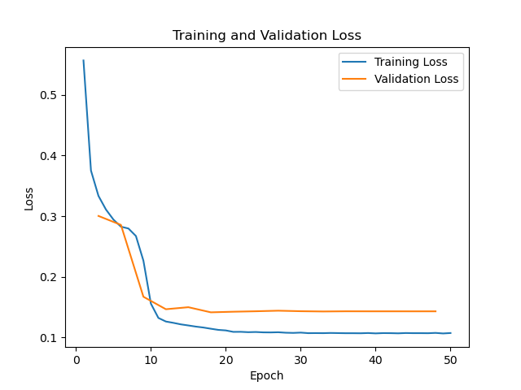
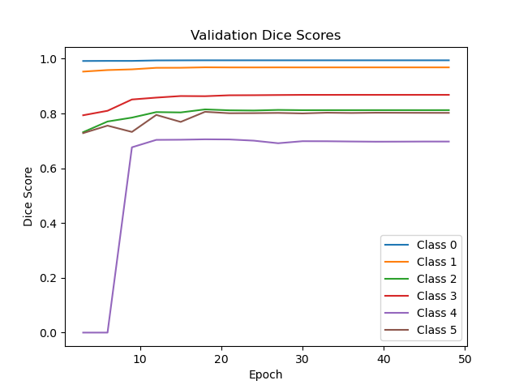
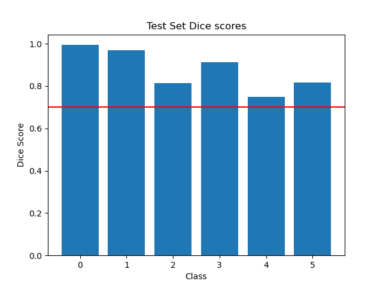

# 3D Improved UNet - Prostate 3D dataset

## Author

Abdullah Badat (47022173), abdullahbadat27@gmail.com

## Project Overview

This project uses a deep learning model, the 3D improved UNet, to segment MRI scans of the prostate.
The model segments the input MRI scans into background, body, bone, bladder, rectum, prostate.
This project aimed to achieve a dice score of greater than 0.7 across all labels. This was achieved.

This project aims to solve the problem of MRI scan segmentation of the hips being a time-consuming, tedious and subjective task.
A model that can perform this segmentation automatically can help clinical decision making by providing a fast, automatic, objective perspective [1].
The model used for this project was designed for segmenting MRI scans of the brain and this project utilises it for hip MRIs.

## Dataset

The dataset [labelled weekly MR images of the male pelvis](https://doi.org/10.25919/45t8-p065) was used. This dataset contains 211 MRI scans, all with corresponding segmentation labels.
The data was split accordingly:

1. Training set: 0 to 194
2. Validation set: 195 to 202
3. Testing set: 203 to 211

This split was chosen to ensure that training would have the largest proportion of the images in order to produce the best model possible.
The validation and testing sets were kept small as there were not many images in total. This specific 195 - 8 - 8 split was chosen as it
ensured there were no shared patients between the train, validation and test sets to prevent data leakage.

### Example MRI Input

Below is an example of an input MRI scan that the model needs to segment.


### Example MRI Mask

Below is an example of a mask that distinguishes the 6 categories.


### Labels

| Class | Semantic label |
| ----- | -------------- |
| 0     | Background     |
| 1     | Body           |
| 2     | Bones          |
| 3     | Bladder        |
| 4     | Rectum         |
| 5     | Prostate       |

### Processing

All input data was resized from 256 x 256 x 128 to 128 x 128 x 64 to reduce the memory demand. The intensity of the images was scaled to be between [0,1] and normalisation was applied.

Data augmentation was performed on the input training data. The augmentatinos included [random flips](https://torchio.readthedocs.io/transforms/augmentation.html#torchio.transforms.RandomFlip),
[random elastic deformation](https://torchio.readthedocs.io/transforms/augmentation.html#torchio.transforms.RandomElasticDeformation) and [random affine](https://torchio.readthedocs.io/transforms/augmentation.html#torchio.transforms.RandomAffine) changes.
Augmentation was key in expanding the limited training dataset and preventing overfitting. These particular augmentations where chosen as they are widely-used, safe and aligned with the augmentations performed in [2].

## The 3D Improved UNet

The 3D Improved UNet model was taken from the paper [Brain Tumor Segmentation and Radiomics Survival Prediction: Contribution to the BRATS 2017 Challenge](https://arxiv.org/pdf/1802.10508v1) [1].
The code implementation of the paper was taken from the [Modified-3D-UNet-Pytorch](https://github.com/pykao/Modified-3D-UNet-Pytorch?utm_source=catalyzex.com) repo [3].

### Model Architecture

The model follows a UNet architecture with a context aggregation downsampling pathway and a localisation upsampling pathway. It features a context and localization pathway that extracts features through 3D convolutional layers and refines segmentation predictions via upsampling and skip connections. Leaky ReLU activations and instance normalization layers are applied at each level, with dropout added for regularization. The network includes a series of downsampling and upsampling operations, with the final predictions generated through a combination of direct and auxiliary paths to enhance segmentation accuracy. Skip connections are used across the 'U' and residual connections are used across the context modules to facilitate better gradient flow during training, enabling deeper networks and preserving important features across layers.



### Convolution equation

The equation for a 3D convolution operation is:

$$
\text{Y(i,j,k)} = \sum_{m=0}^{M-1} \sum_{n=0}^{N-1} \sum_{p=0}^{P-1} X(i+m, j+n, k+p) \cdot K(m,n,p)
$$

Where:

- \( Y(i,j,k) \) is the output at position \( (i,j,k) \) in the 3D feature map.
- \( X(i+m, j+n, k+p) \) is the input value at position \( (i+m, j+n, k+p) \) in the input volume or previous layer.
- \( K(m,n,p) \) is the kernel value at position \( (m,n,p) \).
- \( M \times N \times P \) is the size of the kernel in three dimensions.
- The summation iterates over all positions within the kernel.

## Training and hyperparameters

The model was trained for 100 epochs with a batch size of 5. A small batch size was used as memory was limited. The optimizer used was AdamW with a learning rate of 1e-3 and a weight decay of 1e-2. A learning rate scheduler was used with a step size of 10 and gamma of 0.1. A dice loss function was used for loss.

### DiceLoss loss function

DiceLoss was used for the loss function during training.

$$
\text{DiceLoss} = 1 - \frac{2 \cdot |A \cap B|}{|A| + |B|}
$$

where:

- \( A \) is the predicted set of segmented pixels,
- \( B \) is the ground truth set of segmented pixels,
- \( |A \cap B| \) is the number of overlapping pixels between the predicted and ground truth segments.

## Dependencies

To see exact list of libraries used see `requirements.txt`.

The interesting modules used were:

- nibabel==5.2.1 - load the nifti files
- torchio==0.20.0 - perform 3D data processing and augmentation
- torch==2.6.0 - deep learning model and training loop
- monai==1.3.2 - provdied the dice loss for training and validation

## Repository layout

- dataset.py - Contains the ProstateDataset3D class to load and process the images and masks for a dataloader.
- driver.py - The driver code to run training or inference using the command line.
- modules.py - Contains the Modified3DUNet class which is the model for this task. It also has a function to init weights for the model.
- predict.py - Contains the predict function to run inference using the test set (can be changed) with a trained model.
- train.py - Contains the validate and train loops (as functions) and a function to save predictions for checkpoints.
- utils.py - Contains various constants used throughout the code e.g., default hyperparameters, model dimensions.

## Usage

```
usage: driver.py [-h] -m MODE -s SYSTEM [-sp SAVE_PATH] [-p MODEL_PATH] [-lr LEARNING_RATE] [-bs BATCH_SIZE] [-e EPOCHS] [-wd WEIGHT_DECAY] [-ss STEP_SIZE] [-g GAMMA]

options:
  -h, --help            show this help message and exit
  -m MODE, --mode MODE  Train, debug or predict.
  -s SYSTEM, --system SYSTEM
                        Local or rangpur.
  -sp SAVE_PATH, --save-path SAVE_PATH
                        Path to save preds.
  -p MODEL_PATH, --model-path MODEL_PATH
                        Path to the model file for predict.
  -lr LEARNING_RATE, --learning-rate LEARNING_RATE
                        Learning rate for optimizer.
  -bs BATCH_SIZE, --batch-size BATCH_SIZE
                        Batch size for loader.
  -e EPOCHS, --epochs EPOCHS
                        Epochs to run for training.
  -wd WEIGHT_DECAY, --weight-decay WEIGHT_DECAY
                        Weight decay for optimizer.
  -ss STEP_SIZE, --step-size STEP_SIZE
                        Step size for scheduler.
  -g GAMMA, --gamma GAMMA
                        Gamma for scheduler.
```

### Example Usage

`python3 driver.py -m train -s rangpur -e 150 -bs 4 -sp saves_150_4`

Trains the model with rangpur setup. Runs for 150 epochs and uses a batch size of 4.
Saves the prediction checkpoints in folder saves_150_4.

`python3 driver.py -m predict -s local -sp saves_predict -p model.pth`

Runs inference on the test with a model loaded from model.pth. Saves prediction images to a folder called saves_predict.

## Results

### Prediction examples

Included below are two examples of predictions made by the trained model on the test set.

Example 1:


Example 2:


### Loss curve - training

This graph plots the loss curve for 50 epochs. Validation was run every 3 epochs during training.


### Dice scores - training

This graph plots the change in dice scores across each label during training for 50 epochs.


### Dice scores - test

This graph shows the final dice scores achieved using the test data set. A red line is drawn at
y = 0.7, the minimum required dice score.


## Discussion

The model trained very quickly with the dice scores, training loss and
validation loss all plateauing at approximately 20 epochs. This may indicate that the training set is quite limited.
Visually, the model predictions are 'fuzzy' compared to the ground truths, which indicate that the predictions are not as accurate as they should be
ideally. To improve a larger dataset should be used, only 195 images were used to train the model (out of a
total of 211). A larger dataset and more augmentations e.g., [RandomMotion](https://torchio.readthedocs.io/transforms/augmentation.html), may result in better performance. The lowest dice score accuracy
was for the rectum. This body part is quite small compared to the rest so a better loss function may help e.g., [DiceCELoss](https://docs.monai.io/en/stable/losses.html#diceceloss), improve this performance.

Another consideration was that the model was downsampled from 256 x 256 x 128 to 128 x 128 x 64. This downsampling in the resolution
reduced the total information of an image by a factor 8. This will definitely have reduced the accuracy of the model. The decision to
downsample the images made to reduce the memory demand and speed up training. Using the original image dimensions in training instead of
downsampling will likely improve performance.

## Conclusion

This project explored using the 3D Improved UNet for segmenting MRI scans of male hips. The model successfully achieved the required dice scores
of 0.7 across all labels: background, body, bone, bladder, rectum, prostate.

## References

[1] F. Isensee, P. Kickingereder, W. Wick, M. Bendszus, and K. H. Maier-Hein, "Brain tumor segmentation and radiomics survival prediction: Contribution to the BRATS 2017 challenge," arXiv preprint arXiv:1802.10508, 2018. [Online]. Available: https://arxiv.org/pdf/1802.10508v1

[2] W. Dai, B. Woo, S. Liu, M. Marques, C. B. Engstrom, P. B. Greer, S. Crozier, J. A. Dowling, and S. S. Chandra, "CAN3D: Fast 3D medical image segmentation via compact context aggregation," _arXiv preprint arXiv:2109.05443v2_, Sep. 2021. [Online]. Available: https://arxiv.org/pdf/2109.05443

[3] pykao, "Modified 3D U-Net Pytorch," GitHub repository, 2018. [Online]. Available: https://github.com/pykao/Modified-3D-UNet-Pytorch
