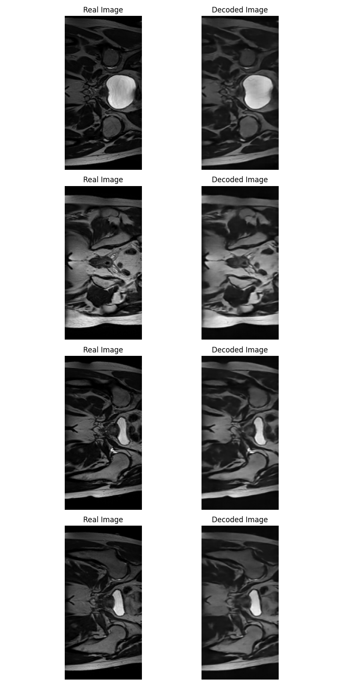

# VQ-VAE generative model on Hip MRI Study for Prostate Cancer Dataset.

## Project Aim
The aim of this project was to create a generative Vector Quantized - Variational Autoencoder (VQ-VAE) model using the Hip MRI Prostate Cancer 2D dataset [1]. The model must produce "reasonably clear images" and have a Structural Similarity Index Measure (SSIM) of over 0.6.

## Model Description

### Overview
The VQ-VAE is an unsupervised generative model that encodes data into a discrete latent representation and then decodes this representation back into a high-quality reconstruction of the original data.

The distinguishing feature of the VQ-VAE is that its latent representation is discrete rather than continuous.

The model builds on the architecture of the Variational Autoencoder (VAE), which encodes data into a continuous latent representation. VAEs can suffer from a problem called “posterior collapse,” where the latent space is ignored when combined with a powerful autoregressive decoder. By using vector quantization (VQ), the VQ-VAE encodes the input into discrete codebook vectors. This discrete latent space helps the VQ-VAE avoid the problem of posterior collapse.

### Model Architecture Overview

*Figure 1. Model Architecture Diagram* [2]

The Model's architecture consists of three main components:

1. **The Encoder**: Encodes the data into a compressed, lower-dimensional space.
2. **The Vector Quantizer**: Quantizes the encoded data into a pre-defined codebook of discrete vectors.
3. **The Decoder**: Decodes the quantized data back into a high-quality reconstruction of the original data.

Furthermore, this particular implementation of the VQ-VAE is designed for processing images. Therefore, both the encoder and decoder consist of convolutional neural networks (CNNs) for image feature extraction. The CNNs include residual layers, where the input is added to the output of a layer, helping to minimize gradient loss and improve training stability.

### Loss Function
  

*Figure 2. Loss Function* [2]

The loss function consists of three main components:

1. **Reconstruction Loss**: Measures how well the decoded data matches the original input.
2. **Embedding Loss**: Measures how well the output of the encoder (the encoded representation) maps to the nearest codebook vector. This loss encourages the encoded output to be close to the corresponding codebook vector.
3. **Commitment Loss**: Encourages the encoded latent vector to commit to a specific embedding from the codebook and ensures that the output does not fluctuate significantly, promoting stability during training.

The Embedding Loss and Commitment Loss combine to form the Vector Quantization (VQ) Loss. The VQ Loss is then combined with the Reconstruction Loss to form the Total Loss.

For calculating the above losses, this implementation of the VQ-VAE uses Mean Squared Error (MSE) for the Reconstruction Loss and the quantization losses. 

### How it works

The VQ-VAE model in this report is designed for encoding and decoding images from the Hip MRI Prostate Cancer 2D dataset [1].

#### Training

The encoder processes the input images and compresses them into lower-dimensional data using convolutional neural networks (CNNs) and residual layers for feature extraction.

This compressed data is then passed to the vector quantizer (VQ), which maps it to a codebook embedding, forming part of the discrete latent representation. At this stage, the embedding loss is calculated to measure the difference between the encoder output and the nearest codebook vector.

Next, the commitment loss is calculated, ensuring that the encoded latent vector commits to a specific codebook embedding, encouraging stability in the quantization process.

The embedding is subsequently passed to the decoder, which also uses CNNs and residual layers to reconstruct the image from the discrete representation.

The reconstruction loss is then calculated by comparing the input image to the output (reconstructed) image. This reconstruction loss, along with the embedding and commitment losses, is backpropagated through the model to adjust the model’s weights, improving performance in future training iterations.

#### Validation 

At the end of each training epoch, the model is evaluated against the validation set to measure its performance during training. The real images from the validation set are compared to the model’s reconstructed versions. Validation losses (reconstruction, embedding, and commitment losses) and the Structural Similarity Index Measure (SSIM) are calculated and reported.

By keeping track of the validation losses and SSIM, we can monitor the model’s performance, ensuring it is not overfitting to the training data and is making progress toward its reconstruction accuracy goal (SSIM).

#### Testing

Once the model has finished training, we evaluate its performance on the test set, which contains images the model has not seen during training. The test set images are passed through the model, and their reconstructed outputs are compared to the original input images. The average SSIM score is calculated to assess the quality of the reconstructions. Additionally, several random test images are selected for visual comparison, showing both the original and reconstructed versions.

### Specific Model Architecture

*Figure 3. pytorchinfo summary: input_size=(16, 1, 256, 128)*

Above, we have the torchinfo summary of the specific VQ-VAE model used in this report. The batch size is 16. Our image size is 1 x 256 x 128. 

### Hyperparameters

The parameters below yielded the best performance I was able to achieve (in both speed and accuracy), in the time given. I used the original paper [2] and a model based on this paper [3] for guidance. 

- Number of Epochs = 150 (Max - Early Stopping Used)
- Batch Size = 16
- Learning Rate = 0.002 (Using Adam Optimiser)
- Number of Hidden Layers = 128
- Number of Residual Hidden Layers = 32
- Number of channels = 1
- Number of embeddings = 512
- Embedding Dimension = 64
- Beta = 0.25 (Commitment Loss)

### Data Pre-processing

The Hip MRI Prostate Cancer 2D greyscale dataset [1] was provided for us on the university cluster. It was already split into training (~ 90%), validation (~ 5%), and testing sets (~ 5%).

The dataset comprised of Nifti files. I was provided with code [4] for loading Nifti the files into images. The loading code can also normalise the images, which was done for this model. 

Without further pre-processing I was able to achieve our goal of over 0.6 SSIM and "reasonably clear" reconstructions.

## Model Results

### Training
The model was trained with the above parameters. I experimented with varying the learning rate and batch size and found the above hyperparameters to give the best accuracy in the least amount of training time (without the training becoming unstable). Early stopping was used [5] to stop the training when there was no further improvement in validation loss. This can help avoid overfitting and save on computational resources. Little improvement was achieved beyond 60 epochs. 

#### Training and Validation output losses (reconstruction loss)

*Figure 4. Training and Validation Output Loss (Reconstruction Loss) over epochs*

Figure 4 shows the training and validation output losses from the decoder (reconstruction loss) reduce over each epoch. This demonstrates that the model is learning well.

*Figure 5. Training and Validation Output Loss (Reconstruction Loss) over epochs - zoomed in*

Zooming in (Figure 5) we can see that the validation loss fits closely to the train loss, indicating that the model is not overfitting. 

#### Training and Validation VQ losses

*Figure 6. Training and validation vector quantization (VQ) loss over epochs*

Similarly, in Figure 6 we see the training and validation VQ losses fit closely together and reduce over epochs, demonstrating that the VQ is improving its codebook mappings as epochs progress. This is also a sign that the model is not overfitting. 

#### Validation Structural Similarity Index Measure (SSIM)

*Figure 7. Structural Similarity Index Measure (SSIM) over epochs*

In figure 7 we see that we go beyond our goal of achieving an SSIM of 0.6, with a final max SSIM of 0.84 on the validation set (during training).

#### Image reconstructions on validation set

*Figure 8. Image reconstructions on the validation set after 60 Epochs*

Figure 8 shows a sample of 4 images taken from the validation set and passed through our model at the 60th epoch. We can see that the decoded images resmeble the real images very well. 

### Testing

#### Structural Similarity Index Measure (SSIM)

*Figure 9. Average SSIM on test set*

During testing we achieve an average SSIM score of 0.85, well above our target of 0.6.

#### Image reconstructions on test set

*Figure 10. Image reconstructions on the test set using the trained model*

## Usage

### Dependencies

All dependencies are listed below. To reproduce results, these dependencies must be installed with the listed version (or higher)
    
    Dependency                  Version

    - nibabel                   5.2.1
    - numpy                     1.26.3
    - matplotlib                3.9.2
    - python                    3.12.4 
    - scipy                     1.14.1
    - torch                     2.4.0
    - torchmetrics              1.4.2
    - torchvision               0.19.0

### Dataset Access

- The Hip MRI Prostate Cancer 2D dataset [1] can be accessed [here](https://doi.org/10.25919/45t8-p065). 
  
- The dataset will need to be split into files for training (~ 90%), validation (~ 5%), and testing (~ 5%).
  
- Ensure the file paths for training, validation, and testing are stroed in `train_dir` , `validate_dir` , and `test_dir` variables respectively, found in `tain.py` and `predict.py`.

### Running the Model and Reproducing Results

#### Training

To train the model run `train.py` 

- Be sure to enter a name for the `model_description` variable so that it can be identified when saved. 

- The model images and graphs will be saved in a folder under the name of the model. i.e. `{model_description}` . 

- The training data (which can be used for graphing) will be saved in the `data_viz` folder as `{model_description}.pkl`. 

- The model itself will be saved in the `saved_model` folder as `{model_description}.pth` 

- Furthermore, choose whether to use early stopping by adjusting the `early_stopping` boolean. 

#### Testing

To test the model run `predict.py`

- Be sure to enter the correct model path that you would like to load under the `model_path` variable (default is the model I trained). 
  
- Also, enter the filepath where you would like the test images to be saved in the varable `test_save_dir` (default saves to the `test_images` folder). 
  
- The average SSIM score will print when running the file. 

## References

[1] J. Dowling and P. Greer, Dec. 2014, "Labelled weekly MR images of the male pelvis", CSIRO, doi: https://doi.org/10.25919/45t8-p065

[2] A. v. d. Oord, O. Vinyals, and K. Kavukcuoglu, “Neural Discrete Representation Learning,” arXiv:1711.00937 [cs], May 2018, arXiv: 1711.00937. [Online.]. Available: http://arxiv.org/abs/1711.00937

[3] M. Laskin. "Vector Quantized Variational Autoencoder." github.com. Accessed: Oct. 1, 2024. [Online.] Available: https://github.com/MishaLaskin/vqvae/tree/master

[4] S. Chandra, "Report Pattern Recognition - Version 1.57," unpublished.

[5] Nawras. "early stopping in PyTorch." stackoverflow.com. Accessed: Oct. 10, 2024. [Online.] Available: https://stackoverflow.com/questions/71998978/early-stopping-in-pytorch

[6] ChatGPT...

