# VQVAE Prostate Cancer Image Reconstruction of HIPMRI Dataset

## VQVAE (1 on marking)

### Algorithm and the Problem Solved

The model chosen is the VQVAE model from the VQVAE2 paper, without the additional PixelCNN layer post-training. This model encodes both a top and bottom latent representation of the input image. The bottom level goes through a single encoder, while the top is derived from a second encoding of the bottom level. Both of these are then vector quantized using the nearest discrete embedding vectors in a learned codebook. Finally, the top and bottom quantizations are concatenated and decoded, producing an output image.

The model training process minimizes the difference between the input and reconstruction through a combination of reconstruction loss as well as quantization loss. Reconstruction loss is derived from the reconstruction approximation of the input, while quantization loss penalizes deviations from original latent vector during quantizaton.

The problem this type of model solves is the issue traditional Variational Auto-Encoders (VAEs) have with generating high-quality images. VAEs only use continuous latent space which often leads to blurry reconstruction. Vector Quantization discretizes the latent space, which promotes sharper and more detailed images. Generally speaking, these models address problems to do with image restoration and enhancement, compressing images into compact representations, and understanding image distributions.

The specifics of the model, including all architecture and loss calculations are included below.

### Architecture (How it works)

#### ResBlock

Residual Blocks allow networks to learn mode complex and nuanced features. The convolution layers with non-linear activation learns intricate relationships between image parts, while the skip connection ensures gradient flow and overcome vanishing gradients.

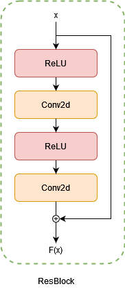

#### Encoder

Through a series of convolutions, activations, and residual blocks, the encoders are able to extract meaningful features from the input data, while reducing the dimensionality. The early convolutions finer details, while later convolutions learn the structure of the image.

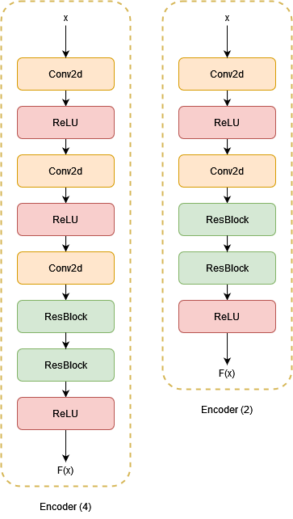

#### Vector Quantizer

The vector quantizer initializes a collection of fixed vectors in a latent space. Each vector is a distinct point in the space and is used to approximate the continuous representations produced by the encoder.

When the encoder produces a continuous representation, the quantizer uses Euclidean distance to find the nearest embedding vector, which is the output of the module.

_Loss:_

Quantization loss is the squared difference between the input and embedding vector:

$$\text{loss} = \frac{1}{N} \sum\_ {i=1}^{N}(\text{quantize}\_i - \text{input}\_i)^2$$

The input representations assigned to embedding vectors (cluster size) is updated using exponential decay:

$$ \text{cluster size} \larr \text{decay} + (1 - \text{decay}) \times \text{embed one hot sum} $$

The codebook averages are similarly updated, so that they best capture input representations:

$$ \text{embed avg} \larr \text{decay} + (1 - \text{decay}) \times \text{embed sum} $$

Finally, these embeddings are normalized.

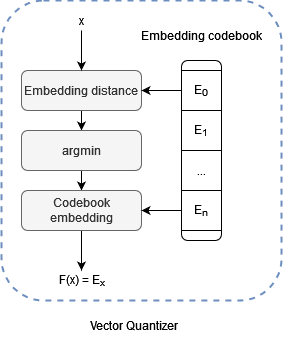

#### Decoder

Through a series of convolutions, activations, and residual blocks, the decoder upsamples the quantized vector into an image of equal size to the input. A forward pass of the decoder randomly upsamples the image with the reconstruction loss being used to calculate gradients that are backpropogated through the decoder to tune the learnable parameters such as kernel and connection weights.

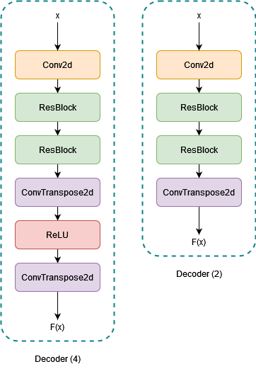

#### VQVAE

The model encodes the input image into a bottom encoding $I_b$. This is further encoded into a top encoding, $I_t$. This top encoding is discretized using vector quantization. The top encoder takes two paths: (1) it is decoded and concatenated with $I_b$ and (2) it is upsampled for the final concatenation.

In (1), $I_b$ and a quantized, decoded $I_t$ are also quantized.

Finally, paths (1) and (2) are concatenated and decoded to produce the final output image.

This architecture is distinct from traditional VQVAEs as it has a top and bottom level quantization. This allows the model to learn finer details and generate images with higher-fidelity.

The loss in the outputted images is measures by the reconstruction loss times the quantization loss with a scaling factor that reduces quantization influence [1].

Both of these loss functions are Mean Squared Error which is the difference in the input image and output image for reconstruction loss and the input representation and vector embedding for quantization loss. The total loss function is therefore:

$$ \text{loss} = \frac{1}{N} \sum_i^N ||x_i - F(x_i)||^2 + \lambda \frac{1}{N} \sum_i^N ||e_i - Q(e_i)||^2$$

Where $x_i$ is the input image, $F(X)$ is the output, $e_i$ is the quantized input and $Q(e_i)$ is the quantized output.

This loss is used to calculate gradients that are backpropogated through the model adjusting the learnable parameters of each of the model components.

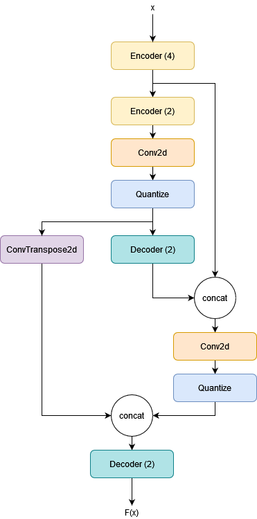

### Pre-processing (5 on marking)

#### Training, Test, Validation Split

The HIPMRI prostate cancer dataset was provided with a split of:

- Training: 11,460
- Test: 540
- Validation: 660

This split is unusual as typically the test set needs to be large enough (roughly 20-30% of total dataset) to provide meaningful model evaluation. However, since it is a relatively small dataset for a complex model like VQVAE, it is likely that the split was designed to increase the amount of model training at the expense of evaluation. In future _more traditional splits could be used_ to better evaluate the model.

#### Normalization

The images are normalized to help the model converge faster, prevent overfitting, improve generalization, and inhibit feature dominance.

#### Batch Size

A smaller batch size of 10 (in config.yaml) is used for regularization and stable convergence. When a small batch size is used, the gradients computed during backpropogation are based on fewer samples. As a consequence, the gradients are noisier and more stochastic. This prevents the model from converging too quickly and overfitting to the training data as well as inhibits memorization of training patterns leading to better generalization.

#### Other

Images are resized and have extra dimensions removed.

---

## Requirements (2 on marking)

The project requires **Python Version 3.12** or later and the following dependencies:

- `matplotlib==3.9.2`
- `nibabel==5.3.1`
- `numpy==2.1.2`
- `PyYAML==6.0.2`
- `torch==2.4.1+cu118`
- `torchmetrics==1.4.3`
- `torchvision==0.19.1+cu118`

These are included in the requirements.txt file and can be installed with:

```bash
pip install -r requirements.txt
```

### Addressing Reproducability

The `config.yaml` file provides a seed to model training and prediction which is used to seed randomness for python, numpy, and torch so the results of training and prediction will be reproduced (see `set_seed()` in `utils.py`).

---

## Execution (2 on marking)

Training and prediction both require a configuration yaml. Note that the configuration file is the same for both training and prediction. A configuration example is provided:

`~/config/example_config.yaml`

### Training

To run VQVAE training run the command:

```bash
python train.py --config 'path/to/your/config.yaml' # update path
```

The training will output to the following directories:

- `~/logging/training.log` (execution logs including model loss and ssim)
- `~/samples/epoch_{i}.png` (sample reconstructed images)
- `~/visuals` (loss and ssim plots)
- `~/models` (best model from training)

#### Model Perfomance

The task required a SSIM of >0.6. As in the SSIM plot, the model was able to reconstruct images with an SSIM of ~75% for both the training and validation set. This aligns with the reconstruction loss converging toward zero for both sets. At no point during the training process does the training performance diverge from the validation performance, indicating that the model is not overfitting to training data. The model appears to have stable convergence with no oscillations or spikes indicating appropriate learning rates, regularization techniques, and balance between reconstruction and commitment loss.

It is also noteworthy that the validation performance is greater than the training performance throughout the entire process. This would seem to indicate seem leakage, however, the only interactions the model has with the validation set are in no gradient contexs (see `avg_ssim()` and `avg_loss()` in `metrics.py`). It is possible that the validation set is incidentally dominated by samples the model reconstructs with strong performance and so _modified splits and regularization techniques_ should be used to explore this relationship.

<center> <i> Training and Validation Loss Plot </i> </center>

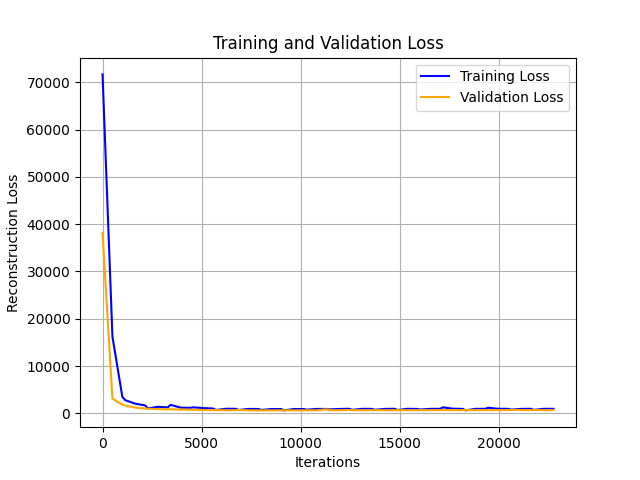

<center> <i> Training and Validation SSIM </i> </center>

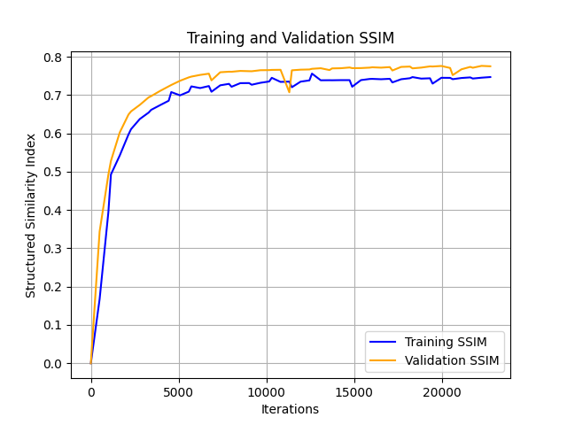

#### Training Samples

The following are reconstruction samples from the training execution. The top images represent the input image and the bottom represent the reconstruction.

By the final epoch the reconstructed images closely resemble the input images, providing a visual confirmation of strong performance.

<center> <i> Epoch 1 </i> </center>

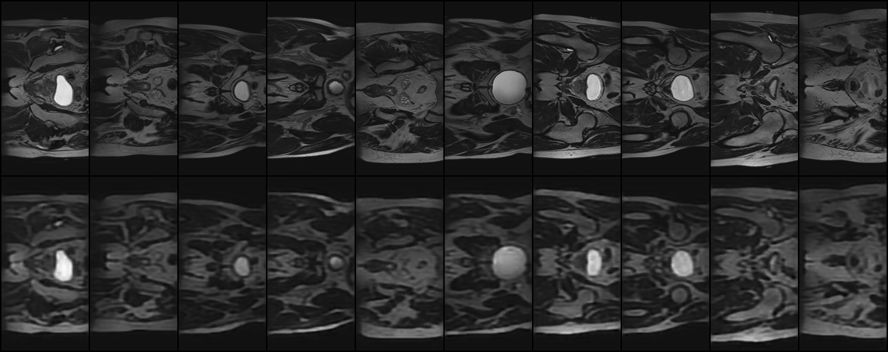

<center> <i> Epoch 10 </i> </center>

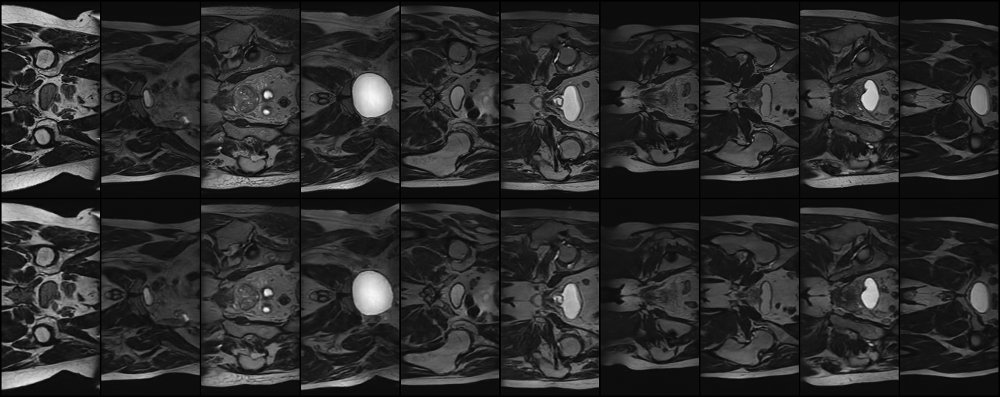

<center> <i> Epoch 20 </i> </center>

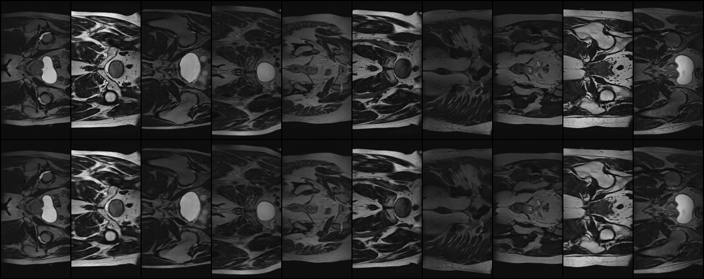

### Prediction

To run VQVAE prediction (you will need to execute training first to save a model) run the command:

```bash
python predict.py --config 'path/to/your/config.yaml' # update path
```

The prediction will output to the following directories:

- `~/logging/predict.log` (execution logs including test ssim)
- `~/samples/predict_set_{i}` (sample reconstructed images)

#### Test Performance

The model again achieved a SSIM of ~0.75 (see `predict.log`) over the test set. This indicates suitable performance across the training, validation, and test datasets and is sufficient evidence of suitable overall performance. This is reaffirmed by the reconstructed test images, which are suitably similar to the input samples.

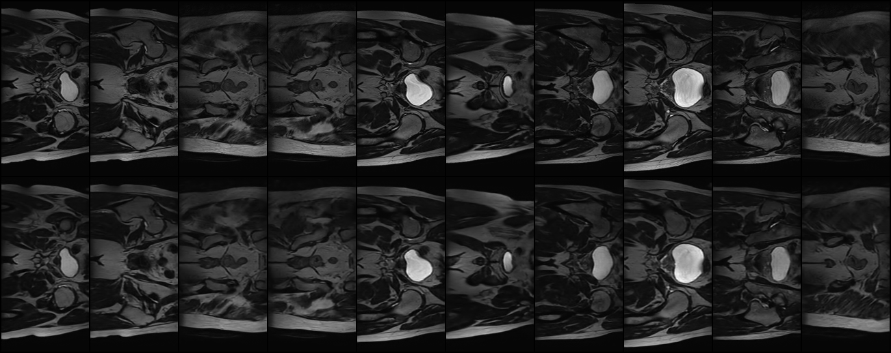
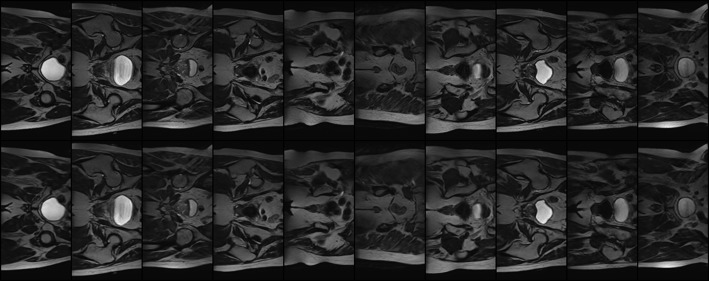
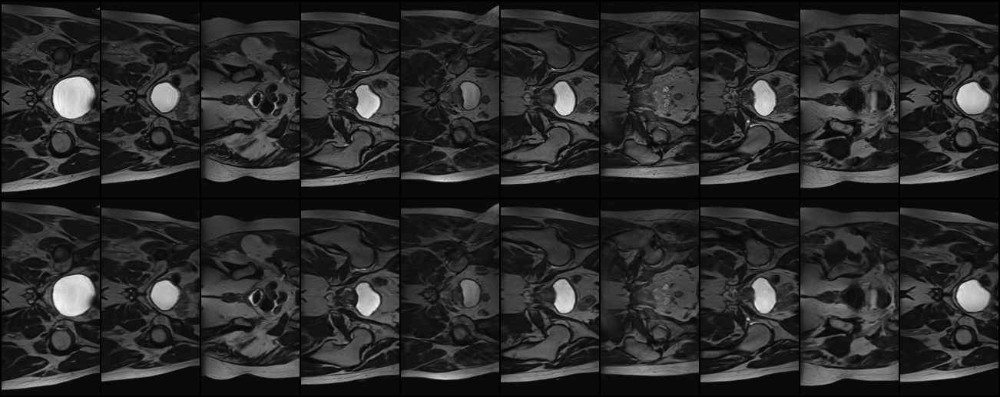

---

## Further Explore and Justify

### VQVAE2

The architecture chosen for this task was the VQVAE architecture used from the VQVAE2 model. This VQVAE model maps continuous data onto a finite set of discrete codes. The reconstruction of these images relies on the nearest latent vectors in the codebook, which can lead to the loss of fine details and introduce blur and artifacts (which can be seen in the sample images). This reliance on discrete quantization can result in blurriness because the model may average out variations in pixel intensity when selecting the nearest latent code, leading to a smoothing effect that diminishes high-frequency details.

In a VQVAE2 model, a PixelCNN prior is included which is expected to boost performance, specifically for finer details. A PixelCNN uses self-attention autoregressive modelling, so that each pixel in the image is conditioned on previously generated pixels. The model is able to learn the depedencies between image pixels and is then able to learn finer details and textures.

In future, this PixelCNN should be added to the model to improve performance and better capture finer details in the images. However, this was not necessary as all objectives of the task were achieved before implementation:

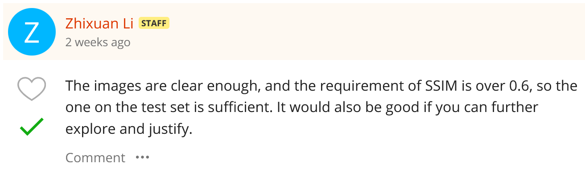

### Split

As discussed previously, a more traditional training, test, validation split could be used for better model evaluation.

---

## References
