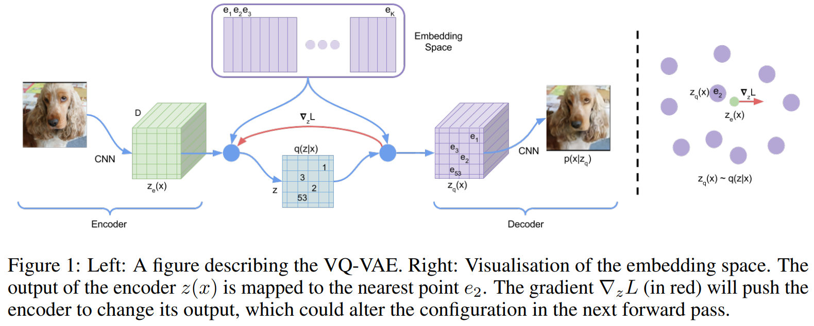
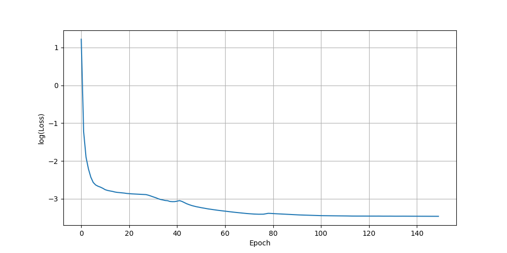
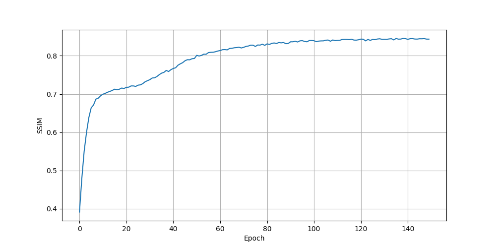
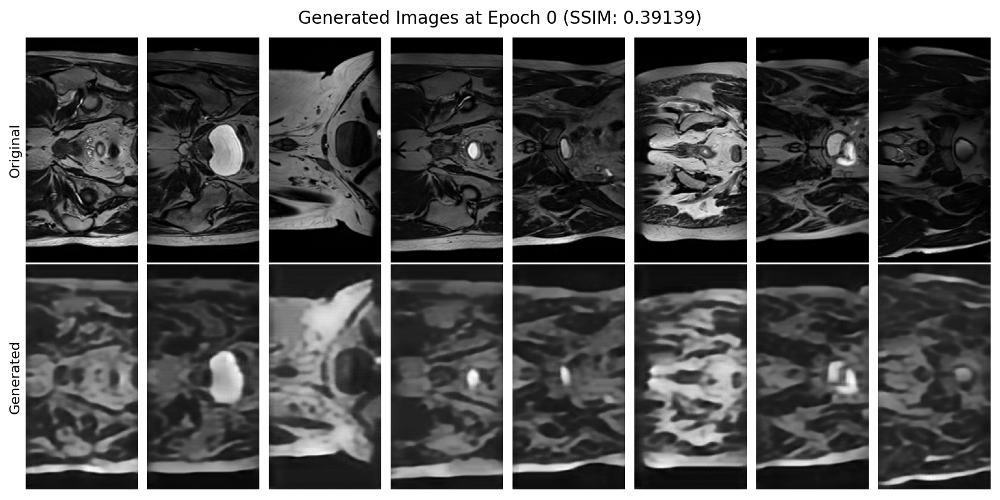
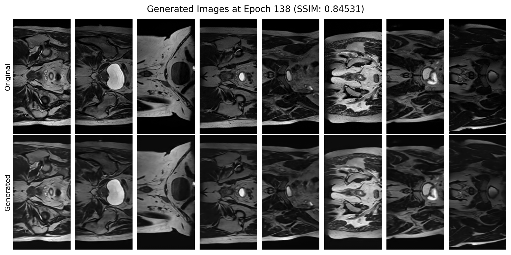
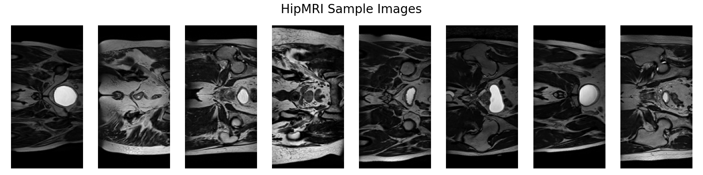

# VQ-VAE for HipMRI Study on Prostate Cancer

COMP3710 - Semester 2 2024

Kirra Fletcher s4745168

## Description

This repository provides an implementation of a [Vector Quantised Variational
AutoEncoder (VQ-VAE)](https://arxiv.org/abs/1711.00937) for generation of [hip MRIs](https://data.csiro.au/collection/csiro:51392v2?redirected=true) for the purpose of prostate 
cancer study. The generative model produces 256 x 128 greyscale images of 2D slices of hip MRIs with a [structural similarity (SSIM)](https://en.wikipedia.org/wiki/Structural_similarity_index_measure) score of approximately 0.8.

## The VQ-VAE Model

The Vector Quantised Variational AutoEncoder is a type of Variational AutoEncoder that has the additional bottleneck of discretising the latent space between the Ecoder and Decoder with the use of a vector quantiser. A regular VAE reconstructs from a continuous latent space usually resulting in blurry boarders in the remade image, the discretisation of the latent space in the VQ-VAE allows for sharper object boarder in the reconstructed image, allowing for higher image quality. Additionally, regular VAE's use KL Divergence in the loss function, prioritising image smoothness over reconstruction quality, while the VQ-VAE uses embedding loss, resulting in a more structured latent space and hence higher image quality. 

The arcitecture of the VQ-VAE is similar to a regular VAE, shown below. The data sample goes through a CNN based Encoder, mapping the data to a continuous latent space. The Vector Quantisation discretises the latent space by learning a minimum loss embedding of the continuous vector to a discrete one-hot embedding of the closest index. The discrete vector is then fed into a inverse-CNN based Decoder, mapping it back to the data space, reconstructing the image. 



In summary

* The `Encoder` class uses a convolutional neural network to map the data into the latent space. 
* The `VectorQuantizer` class discretises the latent space.
* The `Decoder` class uses an inverse convolutional stack to map the latent space back to the data space.


## Outputs

Running the `train.py` file trains the model on the training data set and plot generated images, and metrics. The following is a sample output using the following hyperparameters:

```
# Default Hyperparameters:
n_hiddens = 128
n_residual_hiddens = 32
embedding_dim = 64
n_embeddings = 512
beta = 0.25
learning_rate = 3e-4

# Hyperparameters changed from default:
batch_size = 8
n_epochs = 150
n_residual_layers = 5
```





The log-loss plot and SSIM plot show that model reaches an SSIM score of 0.8 at around 50 epochs, and the following 100 epochs bring the peak SSIM to 0.84531 at epoch 138. Using the best epoch, the 138-model, on the unseen test set, the SSIM score was 0.85, meaning the model did not overfit to the validation set. 150 epochs took 57 minutes to train on the UQ Rangpur cluster, so to save time with similar results the models could be trained on fewer epochs. The following two plots show the reconstructed images from the VQ-VAE at epoch 0 vs the best performing epoch, as well as the final test set performance using the epoch 138 model:






## Data Manipulation

The [HipMRI dataset](https://data.csiro.au/collection/csiro:51392v2?redirected=true) contains 12,000 greyscale 2D MRI slices of the male pelvis. The train-validation-test split is 10380, 1080, 540 data points respectively, making it a 86.5%, 9%, 4.5% split. This split is slightly train-heavy compared to a 'usual' split of 70-20-10, however with the relatively high number of samples total, and empirical sucess as shown above, this split is justified.

The training set was used to calculate model losses to reweight and train the model, while the validation set was used after each epoch to calculate the SSIM score. The best performing epoch's model was selected as the final model, which was re-evaluated using the test set SSIM score.

The dataset contained images of various sizes, however the majority are of size 256 x 128. To address this issue the different sized images were resized to 256 x 128 and anti-aliasing was applied to minimise distortions. All datasets were normalised to improve gradient descent.



## Usage Instructions

1. Ensure required dependencies are installed
2. Alter `train_file_path` and `test_file_path` in `train.py` to contain the Nifti files of the respective data sets 
3. Optionally alter the hyperparametes in `train.py` on lines 25-36, or the file saving directory on lines 38-44
4. Run `train.py` on a GPU. It should train the model, consistenty producing metric plots and progressively better image generation plots. 

### Dependencies

* nibabel >= 5.3.1
* skimage == 0.24.0
* tqdm == 4.66.5
* numpy >= 1.16.4
* matplotlib >= 3.7.2
* torch == 2.5.0
* glob >= 7.0.6

## Code structure

* `dataset.py`: Contains functions to load torch DataLoaders from file path containing Nifti files, and to plot sample images from the data set.
* `modules.py`: Contains torch neural network classes that comprise the VQ-VAE model, including the sub-models such as the Encoder, VectorQuantiser and Decoder.
* `train.py`: Contains the model set up, model hyperparameters, training loop and metric calculations and recordings. Can be executed to run training and result recording. 
* `predict.py`: Contains generation functionality to run data samples through the VQ-VAE and plots the reconstructed images against the original images. 
* `utils.py`: Contains helper functions for reading Nifti files and calculating SSIM scores. 
