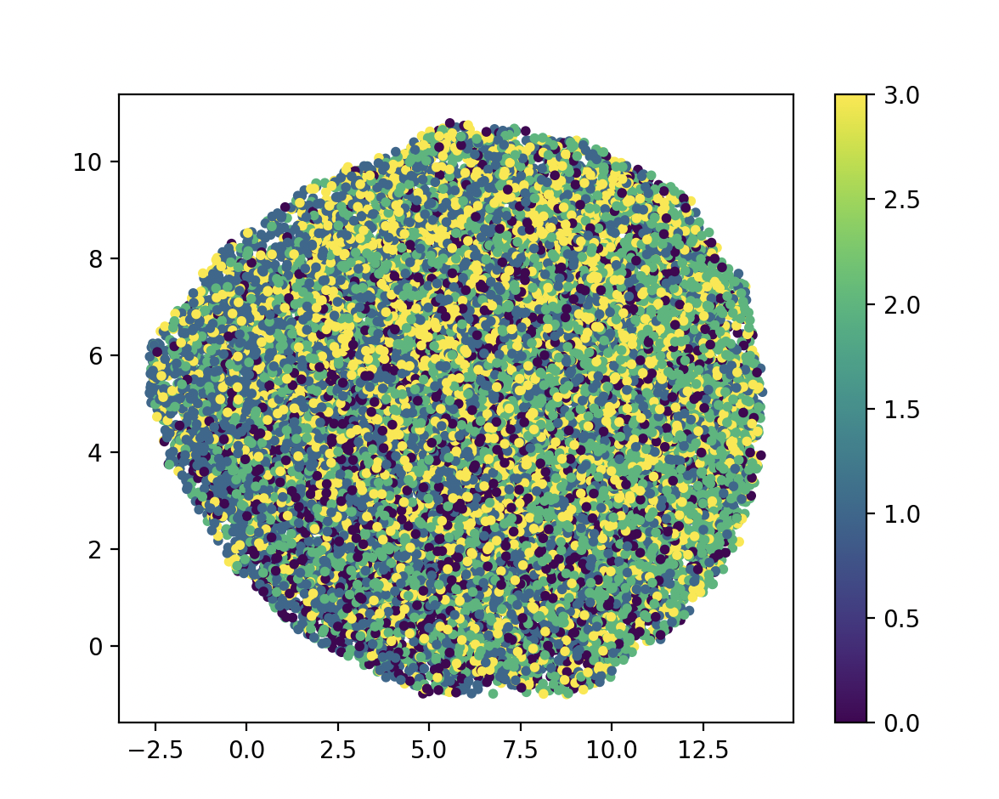
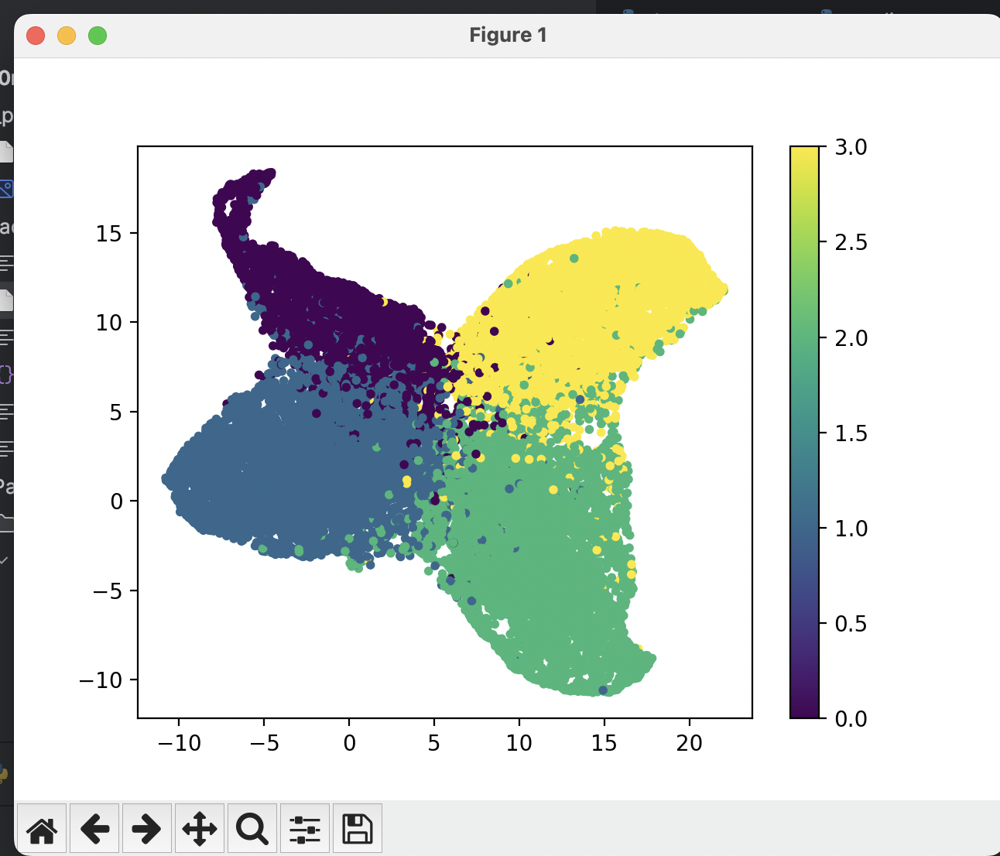
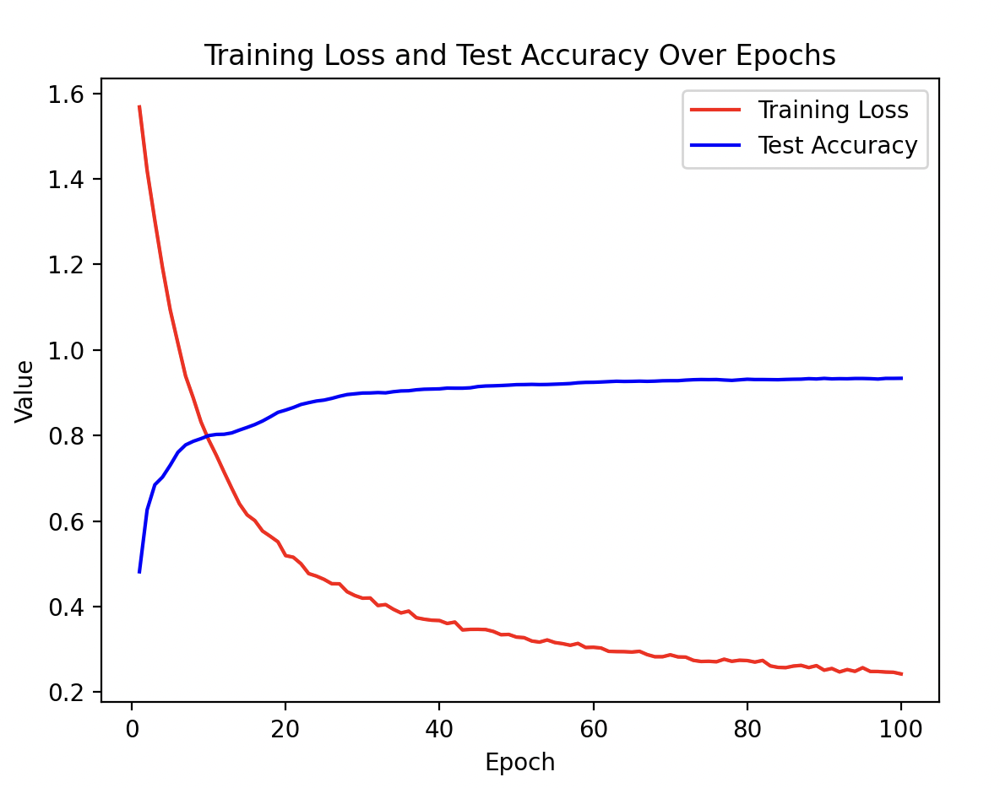
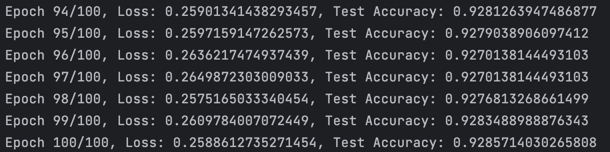

# Graph Node Classification Using GCN

This project implements a **Graph Convolutional Network (GCN)** to classify nodes in a **Facebook Page-Page Network**. The goal of this task is to classify Facebook pages into one of four categories:
1. **Politicians**
2. **Government Organizations**
3. **Television Shows**
4. **Companies**

The graph node classification task is an essential application in many real-world domains where the data is represented as a graph structure. In this case, nodes represent Facebook pages, and edges represent mutual "likes" between these pages. The model is trained to categorize each page based on its feature representation and the connections to other nodes in the network.

## Problem and Algorithm Description

The problem at hand involves classifying nodes in a graph based on their features and connectivity. The algorithm used is a **Graph Convolutional Network (GCN)**, which is particularly effective for learning graph-structured data. GCNs generalize traditional convolution operations to graphs, where each node aggregates information from its neighbors to update its representation. This is especially useful for semi-supervised learning tasks like node classification.

The GCN in this project has three main components:
- **Graph Convolution Layers**: These layers propagate and transform node feature information based on their neighbors' features.
- **Dropout Layers**: These help prevent overfitting by randomly zeroing out node activations during training.
- **ReLU Activation Function**: Introduces non-linearity and helps mitigate the vanishing gradient problem.

### Visualization

The learned embeddings of the nodes are visualized using **UMAP (Uniform Manifold Approximation and Projection)**, a dimensionality reduction technique. The plots generated before and after training show how well the model has classified nodes into distinct categories.


*Figure 1: UMAP visualization of the node embeddings before training*


*Figure 2: UMAP visualization of the node embeddings after training*


*Figure 3: Training Loss and Test Accuracy Over 100 Epochs*


*Figure 4: UMAP visualization of the node embeddings after 100 epochs*


## Dependencies

This project requires the following dependencies:
- `torch` (PyTorch) for building and training the GCN model
- `dgl` (Deep Graph Library) for constructing and processing graph data
- `numpy` for numerical operations
- `matplotlib` for plotting graphs and visualizing training results
- `umap-learn` for dimensionality reduction in node embedding visualization

## Version Information

For reproducibility, it's important to note the following versions:

- Python 3.8+
- torch 1.10+
- dgl 0.7+
- umap-learn 0.5.1+

## Input and Output

### Input:
The input data is a graph where:

- **Nodes**: Facebook pages, each with a 128-dimensional feature vector representing the page description.
- **Edges**: Connections (mutual likes) between pages.

### Output:
The output is a classification of each node into one of the four categories:
- **Politicians**
- **Government Organizations**
- **Television Shows**
- **Companies**

### Example:
A node with the following features:

```python
[0.23, 0.55, 0.12, ..., 0.71]
```
### Installation Instructions

To get started, clone this repository and install the dependencies in a virtual environment:

```bash
git clone <repository-url>
cd <repository-directory>
python -m venv venv
source venv/bin/activate 
pip install -r requirements.txt
```

## Training and Testing Instructions

### To train the model, run:

```bash
python train.py
```

This command will:
- Load the dataset and create the graph structure.
- Train the GCN model for 100 epochs.
- Track the training loss and test accuracy during training.

### To visualize the trained node embeddings using UMAP, run:

```bash
python predict.py
```

This will load the pre-trained model and generate a 2D UMAP plot of the learned node embeddings.

## Pre-processing

### Data Preprocessing
The dataset is provided in a `.npz` format, which contains:
- **Edges**: A 171,002 x 2 matrix representing connections between nodes.
- **Features**: A 22,470 x 128 matrix representing node features (page descriptions).
- **Targets**: A 22,470-length array representing the class labels (0 to 3) for each node.

### Splitting the Data
The data is split into training and test sets as follows:
- **Training Set**: 80% of the nodes
- **Test Set**: 20% of the nodes

The model uses random masking to differentiate between training and testing nodes. During the training phase, only the training set is used to update the model weights, while the validation and test sets are used for evaluation.

### Preprocessing Reference
The dataset and pre-processing techniques are based on the **Facebook Large Page-Page Network** from [Stanford SNAP](https://snap.stanford.edu/data/facebook-large-page-page-network.html).

## Justification for Training, Validation, and Testing Splits

The chosen split (80% for training,and 20% for testing) ensures that the model has enough data to learn meaningful representations while also being evaluated on unseen data. The test set allows us to assess the model's generalization ability, while the validation set is used for hyperparameter tuning and to prevent overfitting.


