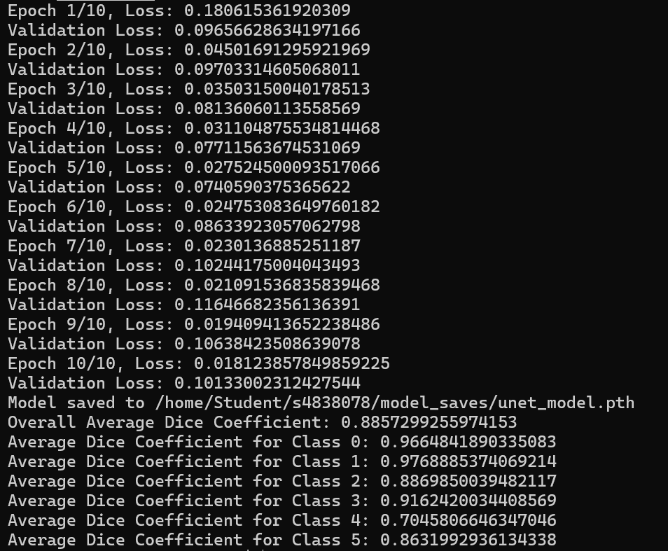
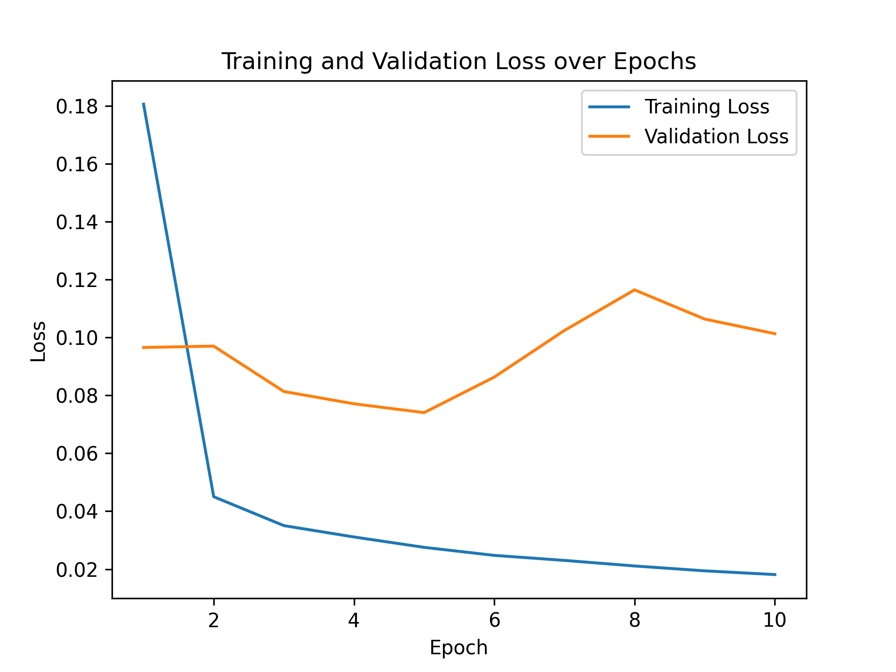
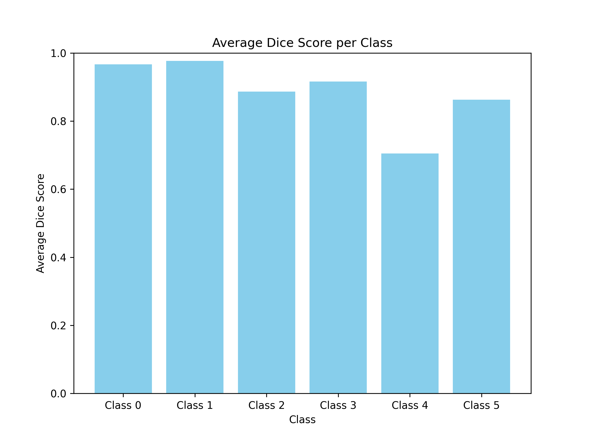
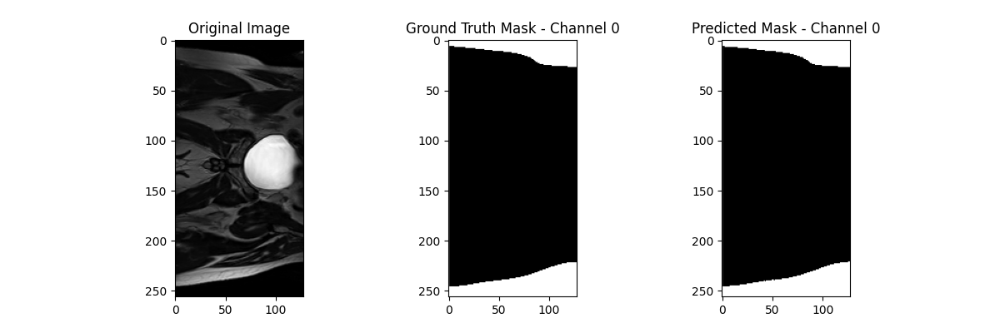
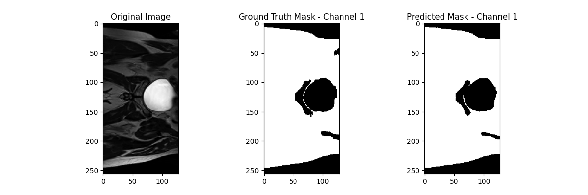
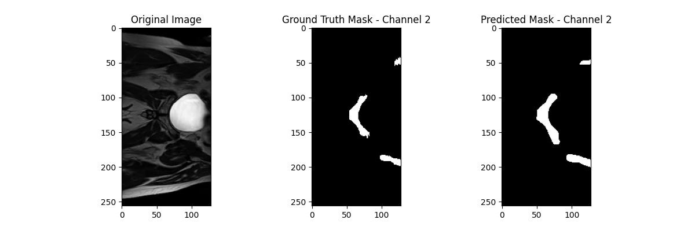
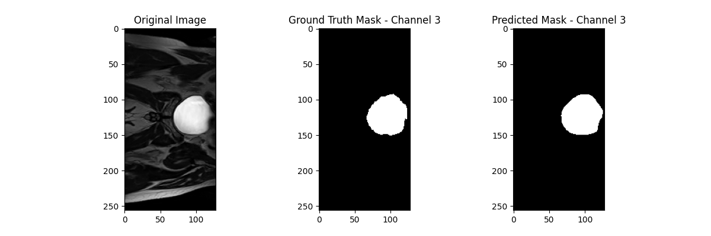
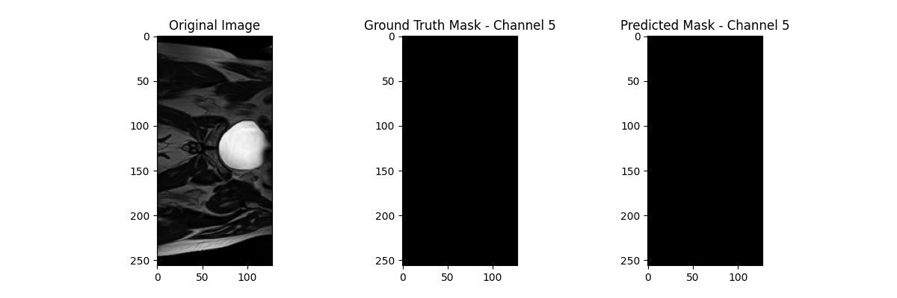

# 2D UNet for Medical Image Segmentation

This project implements a 2D UNet architecture for medical image segmentation. In this case, the model has been applied to prostate segmentation from the HipMRI dataset. 2D UNet models can map high resolution images to segmentation masks, upscale low resolution images to high resolution images, or even be used in diffusion models to transform Gaussian noise to new images. With a set of input images and segmentation masks, images can be passed to the model and used to create an initial guess at a ground truth mask. This guess won't be very accurate at the beginning but can still be compared to the original labels for the loss which can be used to adjust parameters. 2D UNet features an encoder, bottleneck, and decoder. The encoder extracts features from the image, and the decoder upsamples these features to produce a final output. The encoder and decoder are symmetrical, hence making a U shape, thus the name (see figure 1). 2D UNet can also utilise skip connections between the symmetric encoder and decoder, which can be helpful for retaining high resolution information which can be lost during downsampling.

### What Problem is Solved?

The 2D UNet model solves the problem of medical image segmentation, which is particularly helpful in complex cases. Through the use of 2D UNet regions of interest such as organs or anomalies can be accurately identified and delineated. The model can automate this process causing it to be completed much quicker than by hand.

**Figure 1:**

The left half of this figure depicts the encoder of the 2D UNet model, and the right half the decoder. This model is symmetrical, hence the U shape, and the connections between each symmetric part are the skip connections.

*Reference Video: The U-Net (actually) explained in 10 minutes [YouTube Video](https://www.youtube.com/watch?v=NhdzGfB1q74)*

---

# Dependencies
- Python 3.x
- PyTorch 2.0
- NumPy 1.22
- nibabel 3.2
- scikit-image 0.18
- tqdm 4.60
- Matplotlib 3.3

---

# Plots
Here is the output from the uploaded saved model:

and the associated loss plot:

These are the dice scores per class, as well as some visualisations of the predicted masks:

Channels 4 and 5 are blank for this specific image:

---

# Preprocessing and Data Splits
The data was loaded using a provided load_data_2d() function. This function was called individually on each image due to varying sizes of data. Once each image was loaded individually it was resized via scikit-image, before being turned into pytorch tensors and provided to a dataloader.

The data was split prior to implementation within the dataset.