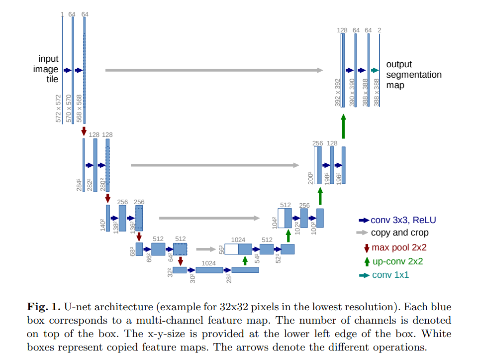

# Segmentation of the HipMRI Study on Prostate Cancer with the 2D U-Net

Author: Øystein Kvandal

Course: COMP3710

University of Queensland

## Introduction

This project focuses on the segmentation of MRI images from the HipMRI Study on Prostate Cancer (Dowling & Greer, 2021) through making a model using the 2D U-Net architecture.
The U-Net, developed by Ronneberger et al (2015), is designed for biomedical image segmentation. It is based on a fully convolutional network, meaning it only uses convolution- pooling, and upsampling layers in its architecture (Long et al., 2014).

## U-Net architecture

The architecture of the U-Net consists of two main components: 
* Contracting path (encoder): here the spatial dimensions of the image are decreased, while the feature information is increased.
* The expanding path (decoder): the feature map is upsampled with the goal of producing an accurate segmentation map based on the patterns the model has during the contracting.

Another key feature in the U-Net architecture is the use of skip-connections, which link the corresponding encoder and decoder layers. These connections help preserve the spatial information that may be lost in the contracting path.

You can see the model of Ronneberger et al.'s U-Net model in Figure 1 below.


 
*Figure 1: U-Net Architecture (Ronneberger et al., 2015)*

## Task

Our objective is to develop a segmentation algorithm utilizing the 2D U-Net architecture to analyze MRI images from the HipMRI Study on Prostate Cancer. We wantto accurately segment the prostate regions in the provided 2D slices, targeting a minimum Dice similarity coefficient (DSC) of 0.75 in the testing phase.


## Python script structure

1. `modules.py` - Contains the functionality for the model class (`UNet2D`).
2. `dataset.py` - Contains the dataset and dataloader classes which utilize the hand out code for loading data from NIfTI files.
3. `train.py` - Contains the functionality for training a model and calculating the Dice-Sørensen coefficient of an segmentation.
4. `predict.py` - Contains the functionality for loading and testing a pretrained model.

## Dependencies

To run this project, you will need the following Python packages:

* PyTorch (version 2.2.2)
* torchvision (version 0.17.2)
* NumPy (version 0.20.1)
* Matplotlib (version 3.9.1)
* Nibabel (version 5.3.1)
* tqdm (version 4.66.5)

### Installation

You can install these dependencies using pip:
```bash
pip install torch

## with version
pip install torch==2.2.2+cpu
```

## Running the program

To run the program, you first have to update the paths to the directories where the MRI data is located, the output images, predictions and loss graphs should be saved, and the models should be saved and/or loaded from. 

To train a model, run:
```bash
python.exe train.py
```

To test a model, run:
```bash
python.exe prediction.py
```

## Results


## References

Ronneberger, O., Fischer, P., & Brox, T. (2015). U-Net: Convolutional networks for      biomedical image segmentation. ArXiv (Cornell University). https://doi.org/10.48550/arxiv.1505.04597

‌Dowling, Jason; & Greer, Peter (2021): Labelled weekly MR images of the male pelvis. v2. CSIRO. Data Collection. https://doi.org/10.25919/45t8-p065

Long, J., Shelhamer, E., & Darrell, T. (2014). Fully Convolutional Networks for Semantic Segmentation. https://doi.org/10.48550/arxiv.1605.06211

‌