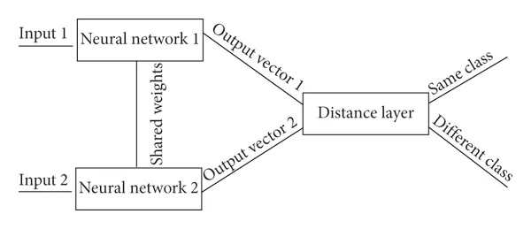

# Classification of Cancerous Moles using a Siamese Network
**Student number:** 47044232
## Introduction
The goal of this project was to make use of a Siamese network to determine the similarity between images in the ISIC 2020 Kaggle Challenge dataset.
Then making use of the Siamese network's feature extraction, to train a binary classification model to determine whether the mole in the image is benign or malignant.
## The File Structure
- `dataset.py` Handles the class object storing the dataset and the function to get the data loader objects.
- `modules.py` Contains the code for both the Siamese network model and the binary classifier.
- `utils.py` Contains the code for some helper functions used throughout the project. Mainly used to provide readability in code.
- `config.py` The goto place for changing any hyperparameters or changing where data is loaded and stored to.
- `train.py` Contains the code for training, testing and validating both the siamese network and the binary classifier. 
It also can save the model and plots of loss in either model, a t-SNE scatter plot and a confusion matrix. Please see the section ***USAGE*** on how to properly run this file.
- `predict.py` Contains the code for performing inference on a sample set of the dataset. It requires `train.py` to have been ran first so that it has some trained models to use.
## The Models
### Siamese Network Basics
The Siamese network was introduced as a solution to finding the similarity between two images. Typically it has been used for signature verification and distinguishing between people.
As seen in the diagram below, it performs similarity learning by having two models share the weights. Two images can then be forwarded through the model obtaining their feature vector.
Using these vectors, a distance function can be used to see how close or far the two images are from each other. 
If the images are closer together they are more likely to be from the same class as they would have similar features. \

### Triplet Loss Basics
Triplet loss has been seen as very effective in face recognition and other complicated forms of
