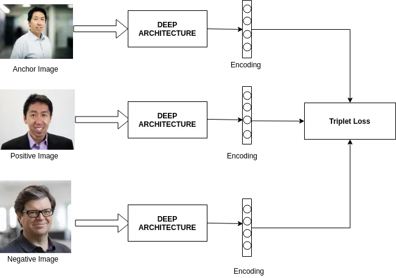
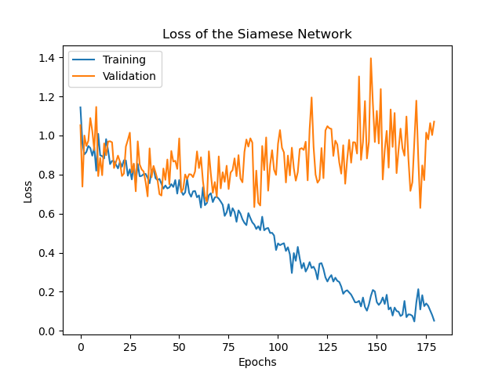

# Classification of Cancerous Moles using a Siamese Network
**Student number:** 47044232

## Introduction
The goal of this project was to make use of a Siamese network to determine the similarity between images in the ISIC 2020 Kaggle Challenge dataset.
Then making use of the Siamese network's feature extraction, to train a binary classification model to determine whether the mole in the image is benign or malignant.\
The goal for accuracy was to be around 80%.


## The File Structure
- `dataset.py` Handles the class object storing the dataset and the function to get the data loader objects.
- `modules.py` Contains the code for both the Siamese network model and the binary classifier.
- `utils.py` Contains the code for some helper functions used throughout the project. Mainly used to provide readability in code.
- `config.py` The goto place for changing any hyperparameters or changing where data is loaded and stored to.
- `train.py` Contains the code for training, testing and validating both the siamese network and the binary classifier. 
It also can save the model and plots of loss in either model, a t-SNE scatter plot and a confusion matrix. Please see the section on [Usage](#usage) for how to properly run this file.
- `predict.py` Contains the code for performing inference on a sample set of the dataset. Please also see the [Usage](#usage) section before running the file.


## The Models
### Siamese Network Basics
The Siamese network was introduced as a solution to finding the similarity between two images. Typically it has been used for signature verification and distinguishing between people.
As seen in the diagram below, it performs similarity learning by having two models share the weights. Two images can then be forwarded through the model obtaining their feature vector.
Using these vectors, a distance function can be used to see how close or far the two images are from each other. 
If the images are closer together they are more likely to be from the same class as they would have similar features. \


### Triplet Loss Basics
Triplet loss has been seen as very effective in face recognition and other areas where the dataset is not consisten in noise.
That is, the images can of different perspectives viewing the subject, the camera used to take the image and many other things (see the section regarding [The Dataset](#the-dataset) to see why this applies well).
As seen in the image below, triplet loss instead has the Siamese network process three images:
- **the anchor**: Any image in the dataset.
- **the positive**: An image of the same class as the anchor.
- **the negative**: An image of a different class to the anchor.

 \
Triplet loss then then computes the difference between the similarity of the anchor and the postive images. And the similarity of the anchor and the negative images.
The goal of the training (shown below) is then to maximise this difference between these two distances so that overtime the postive images, are pulled closer to the anchor wile the negative gets pushed away.
This will mean the feature extraction in the Siamese Network will produce more unique feature vectors for either class. \
 \
The actual equation for it is then the following.\
Observe the alpha value in it. This is a margin to prevent overfitting of features.


### Implementing the Siamese Network
Triplet loss was selected as the loss function for model, so the model implemented looks very similar to the diagram under [Triplet Loss Basics](#triplet-loss-basics).
For the feature extraction, a pre-modelled resnet50 was used from pytorch. This meant that for each image, there were 1000 features extracted.
After the training cycle, all of the images had their features extracted and passed onto the binary classifier.

**Hyperparameter Fine Tuning** \
See [Results](#siamese-network-results) for the loss plot and t-SNE graph.

It was chosen to be trained for 180 epochs as anymore and overfitting was started to be seen. \
The margin used in the triplet loss was 1 as it seemed to work well for the seperation of the features. \
For optimisation, Adam was used with a learning rate of 0.0001.
When a higher learning rate was used, the loss would keep going down to 0 indefinitely, suggesting that it was passing the weights minima.
The betas used were just the standard (0.9, 0.999) as it seemed to cause no problems.

### Implementing the Binary Classifier
A basic binary classifier was implemented with four fully connected layers and ReLU as the activation function after each layer.
The classifier reduced the features recieved from the siamese netowrk from 1000 down to two.
The first being its prediction of it being benign and the second being its prediction of it being malignant.
To train it, cross entropy loss was used to maximise of each prediction. \
When performing inference, argmax was used to see which of the two predictions was greater and suggesting more likely to be of that class.

**Hyperparameter Fine Tuning** \
See [Results](#binary-classifier-results) for the loss plot and the confusion matrix.

These values were fine tuned by seeing whether they maxmised the average accuracy of inference. \
It was chosen to be trained for 140 epochs as going beyond this lead to overfitting and hence lower accuracy. \
Again, Adam was used for optimisation. This time with a higher learning rate of 0.0005.
This was chosen because it helped the losses converge.
Also again, the standard betas were used as the training worked well.


## The Dataset
For this, the preprocessed version of the dataset is used (it can be found [here](https://www.kaggle.com/datasets/nischaydnk/isic-2020-jpg-256x256-resized/data)).
This one is used mainly to reduce system storage. Additonally, it is easier to train as all of the images have been resized to be of the same 256x256 resolution. \
This dataset was highly imbalanced as it has 2 classes of of which 32543 were of the benign class while only 585 were malignant.
To handle this, each of the splits took a sample of the malignant images and then a unique matching number of benign images. 
This meant that there was a 1:1 ratio of the classes in each set so that neither dominated the other in training.\
To account for the low number of samples in each split, the following augmentions are applied (with a 50% possibility of it applying for the first three augmentations listed):
- Random rotation
- Random Horizontal Flip
- Random Vertical Flip
- Normalisation of the data

Aside from normalisation being standard, the others were chosen as these augmentations better simulated the variation between the images already present.
As the images of the moles are taken with different perspectives, cameras, lighting and some even have hair partially covering it.
It was also thought that the colour could be an important part in the feature extraction so no augments affecting the colour were used aside from the colours normalisation. \
See below for for some sample data with no augmentations followed by some others with augmentions applied. \
  \
For the data split, it was chosen to take 70% for train, 10% for validation and 20% for testing. 
It was chosen to have as much information as possible go to the training split, but it couldn't be increased anymore as the number of images in the other two would be too low for consisntent validation and testing.


## Results
### Siamese Network Results
**Loss Plot** \
 \
After the 180th epoch, it would coninue to flatten out. But as seen, the validation set stated to get very unpredictable.
This suggests that there may have been a loss of generalisation in the training.

**t-SNE Scatterplot** \
 \
This grpah shows the feature seperation on the training set.\
Evidently there was fairly effective seperation of features between the benign and malignant classes. But, there was some overlap in the middle. \
Please see [Future Recommendations](#future-recommendations) on what can be done to further improve the seperation.

### Binary Classifier Results
**Loss Plot** \
 \
At first validation loss was lower than the training, this can be assumed to be due to the small size of the validation set.
After this they do start to converge, but with a bit of variation in the loss.

**Confusion Matrix/ Accuracy of Prediction** \
 \
This confusion matrix represents a total accuracy of 81.7% on the test set of data. And hence achieved the goal of this project.
It also seems that the malignant was more frequently predicted than the benign class. This caused the correct benign predictions to be a bit low.\
Please note this was one of the better confusion matrix's generated (see below for more details on accuracy).

### Reproducability of Results
The siamese network was very consitent in training as training it multiple times yielded similar loss plots and t-SNE scatterplots each time.
However, the classifier was rather unpredictable in its results. This meant it had to be fine tuned based off of a saved siamese network.
This meant that one run through of the whole of `train.py` yielded a lower accuracy (typically in the lower half of 70%).
But after fine tuning the classifier to the saved siamese network, the accuracy would go up to an average of between 79% and 80% (this accuracy was calculated by rerunning the binary classifer part of the code 10 times and taking the average of the accuracy outputted.)
As the accuracy was still getting to the target of around 80%, this should be considered successful but could have some improvements made to increase the consistency of the resulting classifier.
Please see the section [Future Recommendations](#future-recommendations) on recommendations to resolve this.


## Usage
Before running any scripts please ensure the directories in `config.py` are present or changed. This includes:
- `DATAPATH`: The path to the dataset mentioned in [The Dataset](#the-dataset).
- `MODELPATH`: The path to where the trained models should be saved.
- `IMAGEPATH`: The path to where the plots and other images should be stored from training.

Also, ensure all dependencies listed in [Dependencies](#dependencies) are installed.

To perform training run the following:
```
python train.py [-nm|--nomodels] [-sp|--saveplots]
```
Optional arguments:
- `-nm|--nomodels` - will prevent trained models being saved to `MODELPATH`.
- `-sp|--saveplots` - will save plots to `IMAGEPATH` instead of showing them straight away.

This will also print a log of the training information like the following:
```
Starting training now...
Epoch: 0, Batch: 0, Loss: 1.0341612100601196
Epoch: 0, Batch: 6, Loss: 1.0053060054779053
Epoch: 0, Batch: 12, Loss: 1.222240686416626
Epoch: 0, Batch: 18, Loss: 0.9875248670578003
Epoch: 0, Batch: 24, Loss: 1.0720434188842773
Validation: Batch: 0, Loss: 0.9928829073905945
Validation: Batch: 2, Loss: 1.0370172262191772
⋮
Epoch: 179, Batch: 0, Loss: 0.08213412761688232
Epoch: 179, Batch: 6, Loss: 0.0037293434143066406
Epoch: 179, Batch: 12, Loss: 0.010097414255142212
Epoch: 179, Batch: 18, Loss: 0.0
Epoch: 179, Batch: 24, Loss: 0.04419383406639099
Validation: Batch: 0, Loss: 0.7135723233222961
Validation: Batch: 2, Loss: 1.3651185035705566
Training complete! It took 277.00923438072203 minutes

Testing the model to see loss...
Testing: Batch: 0, Loss: 1.6736994981765747
Testing: Batch: 4, Loss: 1.3294098377227783

Test Accuracy for Classification: 72.23076923076923%
```
Note that it only shows full print reporting the siamese network's training as it is a lot longer to train.

To perform inference on trained models:
```
python predict.py <siamese model path> <classifier model path>
```
This will generate a confusion matrix for  the predictions of a random sample of images from the dataset. It will also print the following:
```
Testing on a sample of 116 images.

Test Accuracy for Classification: 82.05128205128206 %
```

## Dependencies
The following must be installed to be able to use the code in this project.\
Please have cuda installed to ensure that the code runs efficiently.
| Dependency   | Version     |
| ------------ | ----------- |
| pandas       | 2.2.2       |
| python       | 3.12.4      |
| pytorch      | 2.4.0       |
| matplotlib   | 3.8.4       |
| numpy        | 1.26.4      |
| scikit-learn | 1.0.2       |
| seaborn      | 0.13.2      |

When installing dependencies, conda as it will ensure that there are no dependency conflicts/ errors.


## Future Recommendations
There are three recommendations for what could further improve what has been done:

1. To improve seperation of the features extracted, it is recommended to add hard positive and hard negative mining so that the triplets formed are maximising their difference in their distance to the anchor. This will also help the binary classifier in determining the difference between the extracted features.

2. It would be recommended to add an argument and method to only retrain the classifier using a saved Siamese network model. This would make it easier to retrain the classifier when needed. As currently the siamese training cycle would have to be commented out to get this functionality.

3. It would be interesting to also generate t-SNE scatterplots for the features extracted on the validation and testing sets. Unfortunately, this wasn't done due to deadline.


## References
https://www.kaggle.com/datasets/nischaydnk/isic-2020-jpg-256x256-resized/data \
https://medium.com/@rinkinag24/a-comprehensive-guide-to-siamese-neural-networks-3358658c0513 \
https://medium.com/analytics-vidhya/triplet-loss-b9da35be21b8 \
https://arxiv.org/pdf/1503.03832 \
https://github.com/andreasveit/triplet-network-pytorch/blob/master/triplet_mnist_loader.py \
https://github.com/sohaib023/siamese-pytorch/blob/master/siamese/siamese_network.py \
https://github.com/2-Chae/PyTorch-tSNE/blob/main/main.py
