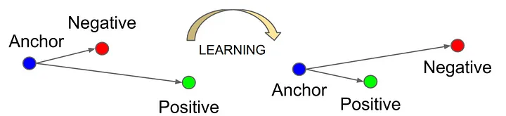

# Classification of Cancerous Moles using a Siamese Network
**Student number:** 47044232

## Introduction
The goal of this project was to make use of a Siamese network to determine the similarity between images in the ISIC 2020 Kaggle Challenge dataset.
Then making use of the Siamese network's feature extraction, to train a binary classification model to determine whether the mole in the image is benign or malignant.

## The File Structure
- `dataset.py` Handles the class object storing the dataset and the function to get the data loader objects.
- `modules.py` Contains the code for both the Siamese network model and the binary classifier.
- `utils.py` Contains the code for some helper functions used throughout the project. Mainly used to provide readability in code.
- `config.py` The goto place for changing any hyperparameters or changing where data is loaded and stored to.
- `train.py` Contains the code for training, testing and validating both the siamese network and the binary classifier. 
It also can save the model and plots of loss in either model, a t-SNE scatter plot and a confusion matrix. Please see the section on [usage](#usage) for how to properly run this file.
- `predict.py` Contains the code for performing inference on a sample set of the dataset. Please also see the [usage](#usage) section before running the file.

## The Models
### Siamese Network Basics
The Siamese network was introduced as a solution to finding the similarity between two images. Typically it has been used for signature verification and distinguishing between people.
As seen in the diagram below, it performs similarity learning by having two models share the weights. Two images can then be forwarded through the model obtaining their feature vector.
Using these vectors, a distance function can be used to see how close or far the two images are from each other. 
If the images are closer together they are more likely to be from the same class as they would have similar features. \

### Triplet Loss Basics
Triplet loss has been seen as very effective in face recognition and other areas where the dataset is not consisten in noise.
That is, the images can of different perspectives viewing the subject, the camera used to take the image and many other things (see the section regarding [the dataset](#the-dataset) to see why this applies well).
As seen in the image below, triplet loss instead has the Siamese network process three images:
- **the anchor**: Any image in the dataset.
- **the positive**: An image of the same class as the anchor.
- **the negative**: An image of a different class to the anchor.

 \
Triplet loss then then computes the difference between the similarity of the anchor and the postive images. And the similarity of the anchor and the negative images.
The goal of the training (shown below) is then to maximise this difference between these two distances so that overtime the postive images, are pulled closer to the anchor wile the negative gets pushed away.
This will mean the feature extraction in the Siamese Network will produce more unique feature vectors for either class. \
 \
The actual equation for it is then the following.\
Observe the alpha value in it. This is a margin to prevent overfitting of features.

### Implementing the Siamese Network
Triplet loss was selected as the loss function for model, so the model implemented looks very similar to the diagram under [Triplet Loss Basics](#triplet-loss-basics).
For the feature extraction, a pre-modelled resnet50 was used from pytorch. This meant that for each image, there were 1000 features extracted.
After the training cycle, all of the images had their features extracted and passed onto the binary classifier.

**Hyperparameter Fine Tuning** \
See [Results](#results) for the loss plot and t-SNE graph.

It was chosen to be trained for 180 epochs as anymore and overfitting was started to be seen. \
The margin used in the triplet loss was 1 as it seemed to work well for the seperation of the features. \
For optimisation, Adam was used with a learning rate of 0.0001.
When a higher learning rate was used, the loss would keep going down to 0 indefinitely, suggesting that it was passing the weights minima.
The betas used were just the standard (0.9, 0.999) as it seemed to cause no problems.

### Implementing a Binary Classifier
A basic binary classifier was implemented with four fully connected layers and ReLU as the activation function after each layer.
The classifier reduced the features recieved from the siamese netowrk from 1000 down to two.
The first being its prediction of it being benign and the second being its prediction of it being malignant.
To train it, cross entropy loss was used to maximise of each prediction. \
When performing inference, argmax was used to see which of the two predictions was greater and suggesting more likely to be of that class.

**Hyperparameter Fine Tuning** \
See [Results](#results) for the loss plot and the confusion matrix.

These values were fine tuned by seeing whether they maxmised the average accuracy of inference. \
It was chosen to be trained for 140 epochs as going beyond this lead to overfitting and hence lower accuracy. \
Again, Adam was used for optimisation. This time with a higher learning rate of 0.0005.
This was chosen because it helped the losses converge.
Also again, the standard betas were used as the training worked well.

## The Dataset
For this, the preprocessed version of the dataset is used (it can be found [here](https://www.kaggle.com/datasets/nischaydnk/isic-2020-jpg-256x256-resized/data)).
This one is used, mainly to reduce system storage. Additonally, it is easier to train as all of the images have been resized to be of the same 256x256 resolution. \
This dataset was highly imbalanced as it contained 32543 benign images but only 585 that were malignant.
To handle this, each of the splits took a sample of the malignant images and then a unique matching number of benign images. 
This meant that there was a 1:1 ratio of the classes in each set so that neither dominated the other in training.\
To account for the low number of samples in each split, the following augmentions are applied (with a 50% possibility of it applying for the first 3):
- Random rotation
- Random Horizontal Flip
- Random Vertical Flip
- Normalisation of the data

Aside from normalisation being standard, the others were chosen as these augmentations better simulated the variation between the images already present.
As the images of the moles are taken with different perspectives, cameras, lighting and some even have hair partially covering it.
It was also thought that the colour could be an important part in the feature extraction so no augments affecting the colour were used aside from the colours normalisation. \
See below for for some sample data with no augmentations followed by some others with augmentions applied. \
  \
For the data split, it was chosen to take 70% for train, 10% for validation and 20% for testing. 
It was chosen to have as much information as possible go to the training split, but it couldn't be increased anymore as the number of images in the other two would be too low for consisntent validation and testing.

## References
https://www.kaggle.com/datasets/nischaydnk/isic-2020-jpg-256x256-resized/data \
https://medium.com/@rinkinag24/a-comprehensive-guide-to-siamese-neural-networks-3358658c0513 \
https://medium.com/analytics-vidhya/triplet-loss-b9da35be21b8 \
https://arxiv.org/pdf/1503.03832
