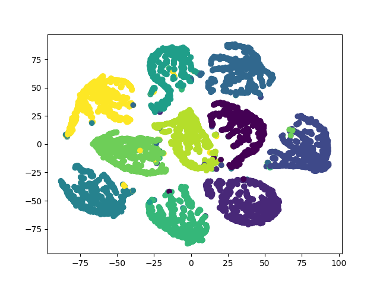
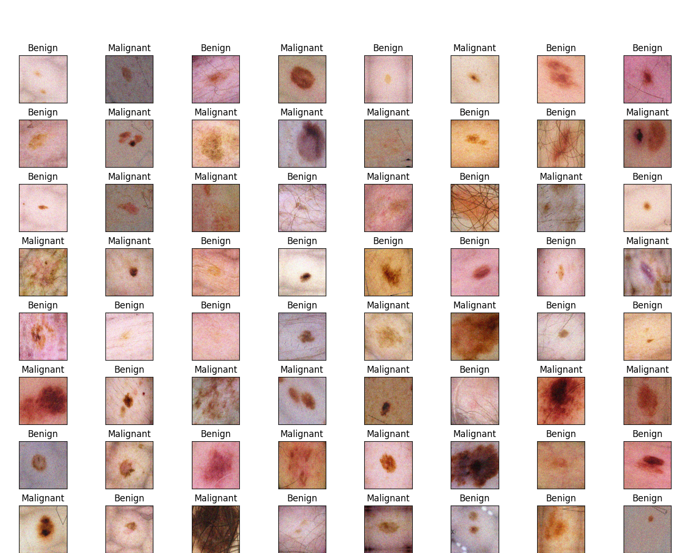
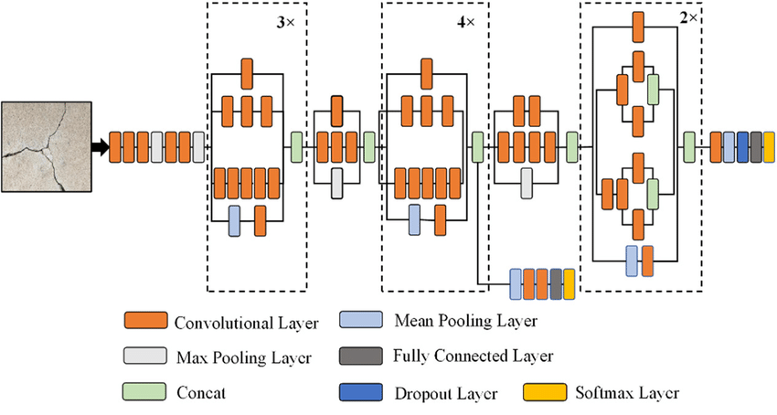
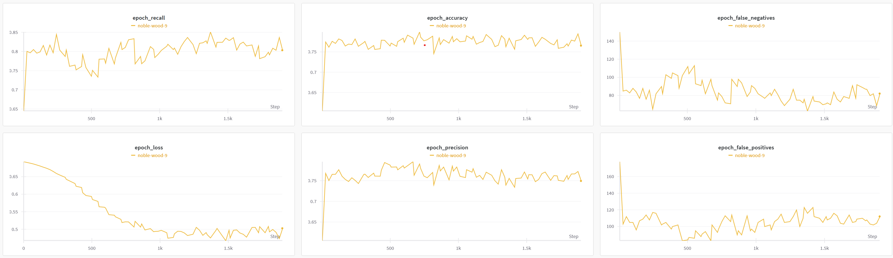
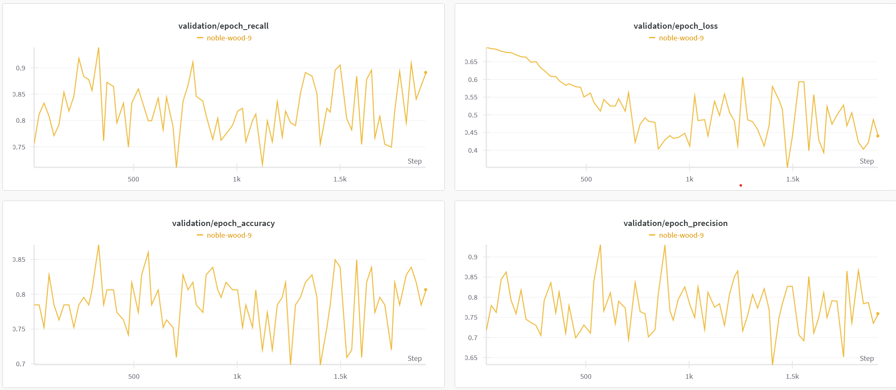
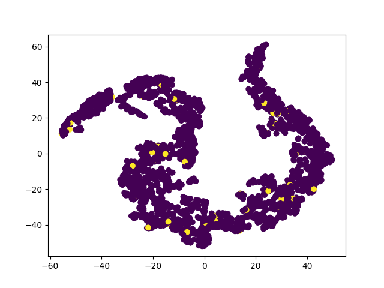

# Metric Learning for Melanoma Classification

The contents of this repository address the ISIC2020 Challenge of classifying benign and malignant skin markings. 

## Siamese Networks and Metric Learning

This repository utilises a type of neural network known as a Siamese network. Instead of directly classifying images, Siamese networks learn an embeddings network which maps the input data to a manifold, with the intention of making such a manifold which maximises the separation between two classes. The foundations of this type of metric learning are in facial recognition, where there is a large amount of general data but very little data about specific people. Where traditional learning can degenerate due to this limited information, Siamese networks can instead thrive. As they effectively learn to quantify the similarity between two images, only a single image of the positive class is needed to perform classification.
This task was initially completed on the MNIST dataset, and the embedding visualisations provide a strong argument for using Siamese Networks. The below image shows the embeddings represented using TSNE after training the network on the MNIST dataset. The manifold it creates performs exceptionally well at distinguishing the distinct classes from one another, making subsequent classification trivial.

## Data Preprocessing

The ISIC2020 dataset is challenging to work with for a number of reasons. Firstly, it is heavily biased towards the negative class, with about 98% of the dataset being benign cases. This can make it difficult for the classifier to learn meaningful distinctions between benign and malignant cases. To account for this, the positive class of the dataset was oversampled to the be the same proportion as the negative class.

In addition to having an unbalanced dataset, there were several cases of data leakage. In a few instances, multiple images were taken from the same skin lesion. This can be problematic as test sets are usually assumed to be comprised of unseen data, however having some replicas of the training data can give a false representation of the true testing performance. Further to this, the image size throughout the dataset was not homogeneous, with some images being up to 2000x4000. Given the length of this that this resolution of dataset would require, a downsize 256x256 replica of the dataset was instead chosen.

Because of how few positive images there were, heavy data augmentation had to be applied. Random flips, brightness and rotations were implemented, as it makes physical sense that changing how the picture of a lesion is taken should not cause the model to break. Small amounts of noise were also added to both positive and negative samples. The intention of this was to increase the model's robustness to imperfections in the images, which happen quite frequently in this case - many images have hair obscuring the lesion, ruler lines to show size or markings made by the dermatologist.

A standard 80/20 split is used for training and testing. Usually, this split should be stratified to ensure that the training and testing datasets have similar proportions of both classes. However, it turned out that this usually happened without the need to enforce it. After this split, the training set was further broken down into 70/10 for training and validation.

A representative portion of input images is shown below, after having undergone the above preprocessing. As shown, there are many textures, such as hair follicles and markings, which are common to both classes. The goal of this model is to learn to a point where it treats these textures as noise. 

The model presently uses two distinct datasets. The first dataset, used on the deep portion of the network, is smaller and manually balanced to be a 50/50 split of both classes. This dataset needs to be generated using `generate_balanced_dataset.py`, which also accounts for data leakage by removing duplicate images. The second dataset is the full (but downsized) dataset. In order to use this, you must download the dataset from Kaggle and store it under `datasets/smaller`: https://www.kaggle.com/datasets/nischaydnk/isic-2020-jpg-256x256-resized/data.
 

## Siamese Network Implementation

This siamese network uses an image network as the backbone for its embeddings, in order to extract salient characteristics from the samples. Initially, the ResNet50 was used because it is very common in medical environments. However, upon testing various backbones the InceptionV3 network showed to be much less computationally expensive, without diminishing any of the performance. The Inception network makes use of factorised convolutions, which are intended to increase efficiency with minimal loss of performance. The architecture of the network is shown below (image courtesy of https://www.researchgate.net/figure/The-architecture-of-Inception-V3-model_fig5_349717475)

Several fully connected layers were added to the end of the InceptionV3 network to better synthesis and obtain meaningful embeddings. Triplet loss, a common loss function for metric learning, was used as the loss function for the similarity network. This loss function works by comparing a positive and a negative image to a reference anchor, and then trying to minimise the distance to the positive class while maximising the distance to the negative class. Mathematically, it is shown as

$$L(x_a,x_p,x_n )=max⁡(0,|x_a-x_p |^2-|x_a-x_n |^2+m)$$

In this equation, m is the margin of the loss function, and represents how far apart the classes are being driven.
Although Siamese networks can be done with two distinct networks, it is more common to use a single network and a miner. When using triplet loss, the miner is responsible for generating triplets of images in a way that forces the network to learn. These are often referred to as semihard triplets and are subject to the following constraint:

$$|x_a-x_p |<|x_a-x_n |<|x_a-x_p |+m$$

In this architecture, a semi-hard triplet loss was used, with a margin set to 0.4.
The other hyperparameters chosen for the metric learning are as follows:
- Batch size of 128
- Image size of 256x256
- Learning rate of 0.001
- Epochs of 20
- Optimiser of Adam

Once class separation had been performed, the layers of the embeddings network were frozen, and a new fully connected network was created from the output embeddings. Given that the intention of Siamese Networks is to obtain meaningful embeddings, the classification network did not need to be complex. Three dense layers were chosen, with the output layer being fed through a sigmoid activation to obtain probabilistic outcomes. 50 epochs were used for the classifier, using the Adam optimiser and binary cross entropy as the loss function. 

## Results

The below figure shows the monitored training metrics over the best model run. This model was using the lightweight Siamese Network with the full dataset (see 'Replication'). As seen from the graphs, the accuracy approaches 80% (ending on about 79%), with good scores for precision and recal as well. Because of the unabalanced dataset, accuracy may not be the most ideal metric to monitor, as it puts equal weights on both the positive and negative classes regardless of their proportions. Instead, it is more interesting to monitor the precision and recall. Recall is important in medical settings because we want maligant lesions to be identified at a high rate. However at the same time, precision is important because we don't want to misdiagnose. A good trade off between these two is F1 score (not plotted here), which is the harmonic mean of the two.

The validation loss is shown below. It follows the same characteristics as the training loss, indicating that there is no presence of overfitting. One discrepancy noted is that the precision of the validation set was slightly lower. This is reasonable because the data has not been fit on the validation set, however it does likely indicate a slight bias of the model towards classifying images as malignant.

However, when analysing the embeddings space, it wasn't clear that the metric learning portion of the classifier had succeeded. The below graph shows the loss curve of the embeddings training performed. The loss seemed to bottom out at the margin of 0.3, and the embeddings network did perform well in class separation. The reason for this is not could not quite be ascertained, as the loss function used (semi-hard triplet loss) and data preprocessing was done in accordance to industry standards. The only possible cause that could be identified was the use of `tfa.losses.TripletSemiHardLoss`. It is possible that this method, having no official support from Tensorflow, is not adept at extracting hard triplets. In future, pytorch is recommended for metric learning problems.

Therefore, in summary the model achieves the required accuracy, however the embeddings network is still not well developed. Future work on this should be to port the algorithm over to PyTorch to use its more advanced triplet mining strategy. This is forecasted to vastly improve the embeddings.

#### A note on accuracy

Technically, the requirements of this model is to meet 80% accuracy. Given how unbalanced the original dataset is, this can be trivially solved by classifying everything as benign. However, this would defeat the purpose of this model. Therefore, a 50/50 dataset was used for testing.

#### Replication

This repository has two models: a full model based on ResNet50 and a lightweight version (which is used to show the results above) which is based on the lighter inception network and the smaller balanced dataset. To train a network, run `python train.py`. There are two command line flags you can optionally add:
- `full-dataset`: if included, the full dataset will be used.
- `full-model`': if included, the heavyweight model will be used instead of the lightweight.

You should use WandB to capture the training curves of the network, although they are also saved individually to image files.

Trained networks, by default, will be stored in `checkpoints/best_epoch.keras`. You may change this if you want, but you will also have to change `predict.py` to reference the correct file.

## Dependencies
This network relies on the use of tensorflow_addons, which is deprecated as of mid-2024. For compatibility reasons, this model therefore uses an older version of Python (3.11.1) and numpy/tensorflow. To install, you must first have Python 3.11.1, or create a virtual environment that supports it. All relevant packages can then be installed using `pip install -r requirements.txt`. Or, instead, the following key ones need to be installed:

- tensorflow 2.14.0
- torch 2.4.1
- tensorboard 2.14.1
- keras 2.14.0
- tensorflow-datasets 4.9.6
- tensorflow-addons 0.22.0

Finally, you must initialise the submodule. To do this, run `git submodule update --init --recursive`. Alternatively, you can clone the module separately from https://github.com/tranjamin/machine-learning.

## Disclaimer
The commit log admittedly is inconsistent. This is primarily because trials were run on different branches with more than questionable commit history. For a clean history, these incremental changes were copied over to the main branch. 

This assignment also makes use of a submodule called `Modules`. The intention behind this was to incrementally develop a library which abstracts away all of the esoteric API calls of pytorch/tensorflow. It has been used for other courses but it should be clear that it is largely only wrapper functions for API calls. I'm not sure whether it should be referenced in marking (in some way, it supplements the `modules.py`), but if so the only function used for this project is `Modules/NeuralNetwork.py`. (Admittedly, the code structure and commenting of this function is pretty decent).