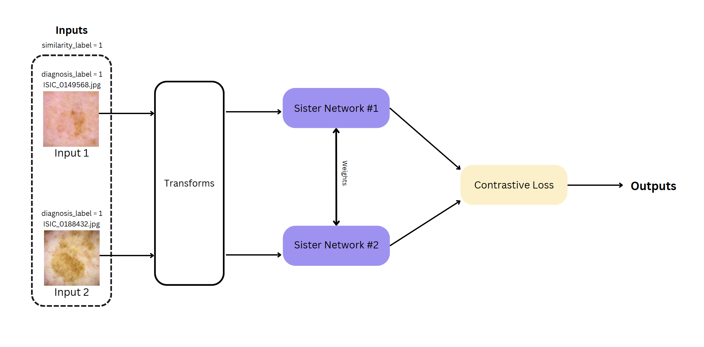
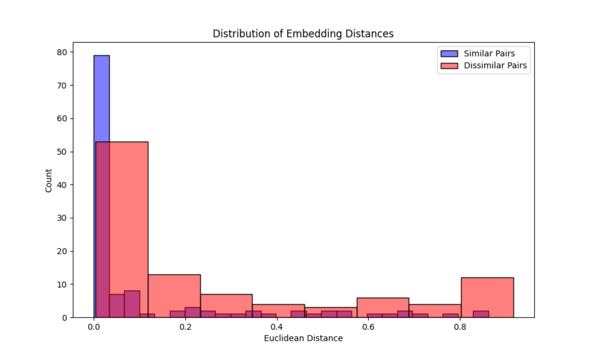
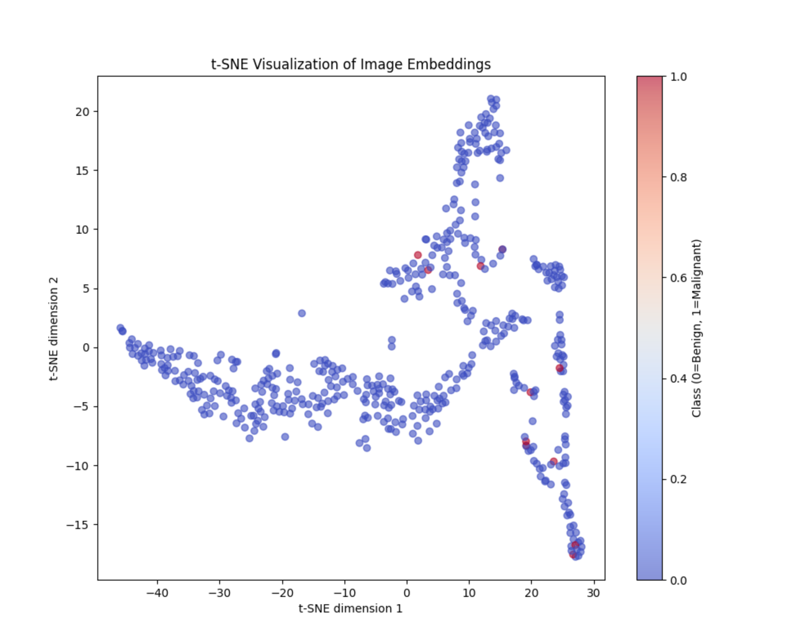
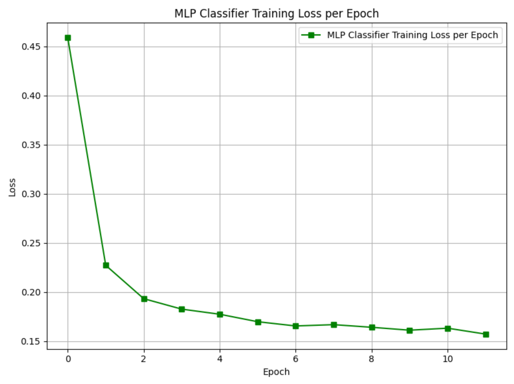
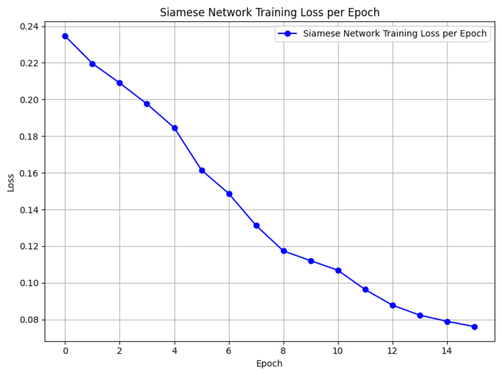
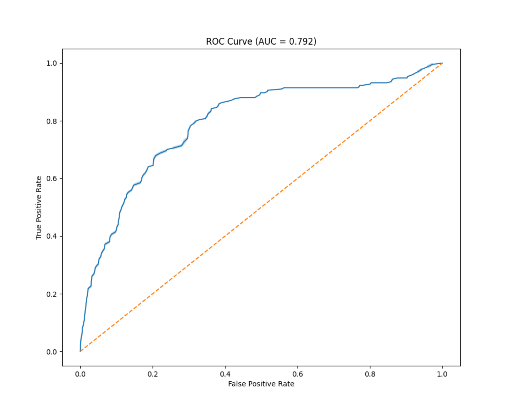

# Classification of Melanoma using the ISIC 2020 Kaggle Challenge Dataset with Siamese Networks

Author: Richard Chantra  
Student Number: s43032053

## Problem Statement

Melanomas are responsible for 75% of skin cancer deaths, with an estimated 7,000 annual fatalities. This project aims to assist dermatologists by developing a computer vision system to assist in classifying melanomas. We utilize the International Skin Imaging Collaboration (ISIC) 2020 Dataset, the largest publicly available collection of dermatologically-QC skin lesions, with the goal of achieving 0.8 accuracy on the test set.

## Structure of Dataset

The dataset comes from the ISIC 2020 Challenge and presents a significant class imbalance challenge:

- Total Images: 33,126
  - Benign (non-melanoma): 98% (32,626 images)
  - Malignant (melanoma): 2% (584 images)
- Image Format: 256x256 pixel JPG files
- Source: https://www.kaggle.com/datasets/nischaydnk/isic-2020-jpg-256x256-resized/data

## Preprocessing

Our preprocessing pipeline addresses several key challenges:

**Adjusting Class Imbalance:**
The extreme 98:2 ratio of benign to malignant cases required careful handling. We implemented an oversampling strategy targeting a 67:33 (benign:malignant) distribution in the training set. This ratio was chosen after extensive experimentation, as it provided optimal balance between benign case accuracy and melanoma detection sensitivity.

**Data Augmentation:**
To improve model robustness, we implemented a controlled augmentation strategy:
- Random horizontal and vertical flips
- Random rotations between 0-360 degrees
- Augmentations applied with 30% probability to maintain dataset characteristics
- Ratio of transformations: horizontal flips : vertical flips : rotations = 1:1:2

**Image Normalization:**
Images are normalized using ResNet50's pretrained requirements:
- Mean values: [0.485, 0.456, 0.406]
- Standard deviation: [0.229, 0.224, 0.225]
This normalization ensures optimal feature extraction from the pretrained network.

**Dataset Organization:**
- 80:20 train-test split for model evaluation
- Siamese pair creation with 50% similar and 50% dissimilar pairs
- Careful control to prevent self-pairing of images

## Architecture

We used a Siamese network with ResNet50 to learn features from skin lesion images. ResNet50 creates 2048-length vectors from each image. These vectors contain the key patterns that help identify melanomas.

The Siamese setup compares images in pairs using two ResNet50s that share the same weights. We used contrastive loss because we only need to separate two classes: benign and malignant. This was simpler than triplet loss which would add unnecessary complexity.



The MLP classifier takes these features and makes the final decision. It reduces the 2048 features through three layers (128→64→32→1). We added high dropout rates (0.7, 0.5) because we had few malignant samples and needed to prevent overfitting.

## Training Observations

Key insights from the training process:

1. Class imbalance significantly impacts model performance:
   - Initial experiments showed bias toward benign prediction
   - 67:33 ratio provided best balance of sensitivity and specificity

2. Model Stability:
   - Embeddings showed overfitting beyond 8 epochs
   - Addressed through learning rate adjustment and weight decay
   - Upsampling outperformed downsampling in maintaining data characteristics

3. Class Distribution Effects:
   - 50:50 split showed high malignant recall but poor benign performance
   - Final 67:33 ratio achieved better overall balance

## Results


### Performance Metrics
- Overall Accuracy: 94%
- Malignant Detection Rate: 32%
- Benign Accuracy: 95%
- ROC-AUC Score: 0.792

### Detailed Classification Performance
```
              Precision    Recall    F1-score   Support
Benign           0.99      0.95      0.97       6509
Malignant        0.10      0.32      0.15        117
```

### Confusion Matrix
```
Predicted:    Benign  Malignant
Actual Benign:  6162      347
Actual Malignant: 79       38
```

### Training and Evaluation Plots


*Distribution of embedding distances. It shows a clear separation between similar and dissimilar pairs*


*t-SNE visualization of learned embeddings showing clusters*


*MLP Classifier training loss showing consistent convergence*


*Siamese Network training loss demonstrating stable learning*


*ROC curve with AUC = 0.792 indicating good discriminative ability*

### Discussion
The model achieved mixed results across different metrics. The overall accuracy was 94% but only 32% of melanomas were detected. The benign detection rate was strong at 95% accuracy.

Looking at the confusion matrix:
6162 Benign were correctly identified
347 Benign were mistakenly flagged as melanomas
79 Malignant were missed
38 Malignant were caught

The training graphs show steady improvement. Siamese network loss dropped from 0.23 to 0.08 over 15 epochs, while the MLP classifier stabilized at 0.16 loss after 10 epochs.
The t-SNE visualization displays clear grouping of similar cases, though some overlap exists between benign and malignant clusters. The ROC curve analysis produced an AUC score of 0.792, indicating decent separation between classes despite the severe data imbalance.

## Conclusions

The results highlight a key issue in melanoma detection: getting high overall accuracy doesn't mean the system works well enough for practical use. Missing 68% of melanomas is a critical problem that needs addressing. The data suggests the model can spot general patterns separating benign from malignant cases, but lacks the precision needed for clinical applications. More melanoma samples and targeted architectural changes could improve detection rates while maintaining the current strong performance on benign cases.

## Instructions

1. **Data Preparation:**
   - Download the ISIC 2020 dataset from Kaggle
   - Extract images to a designated folder
   - Ensure CSV metadata file is present

2. **Environment Setup:**
   - Install Python 3.8 or higher
   - Install required dependencies
   - Set up appropriate paths in configuration

3. **Model Training:**
   - `dataset.py` only needs to be run to get an overview of the data otherwise all data preparation happens in `train.py`
   - Run `train.py` with any additional parameters
   - Monitor training progress (Using the current set up should take around 30 minutes using a NVIDIA L40s)
   - Review generated metrics

4. **Making Predictions:**
   - Ensure images are in a designated directory
   - Run `predict.py` with any additional parameters
   - Review classification results

## Files

- `modules.py`: Defines Siamese network, MLP classifier, loss functions, and evaluation
- `dataset.py`: Manages data loading, augmentation, and data balancing
- `train.py`: Trains the Siamese Network and MLP classifier
- `predict.py`: Performs predictions and evaluation on new image data
- `README.md`: Project documentation


```markdown
## Dependencies

matplotlib==3.8.2  
numpy==2.1.2  
pandas==2.2.3  
Pillow==11.0.0  
scikit_learn==1.3.2  
seaborn==0.13.2  
torch==2.2.1+cu121  
torchvision==0.17.1+cu121  
tqdm==4.66.5  
```

## References

1. Becoming Human. (n.d.). *Siamese networks: Algorithm, applications and PyTorch implementation*. Retrieved from https://becominghuman.ai/siamese-networks-algorithm-applications-and-pytorch-implementation-4ffa3304c18

2. Song, T. (n.d.). *PyTorch implementation of Siamese network*. Retrieved from https://tianyusong.com/projects/pytorch-implementation%E2%80%8B-siamese-network/

3. Challenge Enthusiast. (n.d.). *Training a Siamese model with a triplet loss function on MNIST dataset using PyTorch*. Retrieved from https://challengeenthusiast.com/training-a-siamese-model-with-a-triplet-loss-function-on-mnist-dataset-using-pytorch-225908e59bda

4. Analytics Vidhya. (n.d.). *A friendly introduction to Siamese networks*. Retrieved from https://medium.com/analytics-vidhya/a-friendly-introduction-to-siamese-networks-283f31bf38cd

5. Hackernoon. (n.d.). *One-shot learning with Siamese networks in PyTorch*. Retrieved from https://hackernoon.com/one-shot-learning-with-siamese-networks-in-pytorch-8ddaab10340e?source=post_page-----283f31bf38cd--------------------------------

6. PyTorch. (n.d.). *Siamese network main code example*. GitHub. Retrieved from https://github.com/pytorch/examples/blob/main/siamese_network/main.py

7. Analytics India Magazine. (n.d.). *A beginner's guide to Scikit-learn’s MLPClassifier*. Retrieved from https://analyticsindiamag.com/ai-mysteries/a-beginners-guide-to-scikit-learns-mlpclassifier/

8. GeeksforGeeks. (n.d.). *How to normalize images in PyTorch*. Retrieved from https://www.geeksforgeeks.org/how-to-normalize-images-in-pytorch/

9. Abdallah, A. (2022). *Oversampling for better machine learning with imbalanced data*. Medium. Retrieved from https://medium.com/@abdallahashraf90x/oversampling-for-better-machine-learning-with-imbalanced-data-68f9b5ac2696

10. Metaor AI. (2023). *Solving the class imbalance problem*. Medium. Retrieved from https://medium.com/metaor-artificial-intelligence/solving-the-class-imbalance-problem-58cb926b5a0f