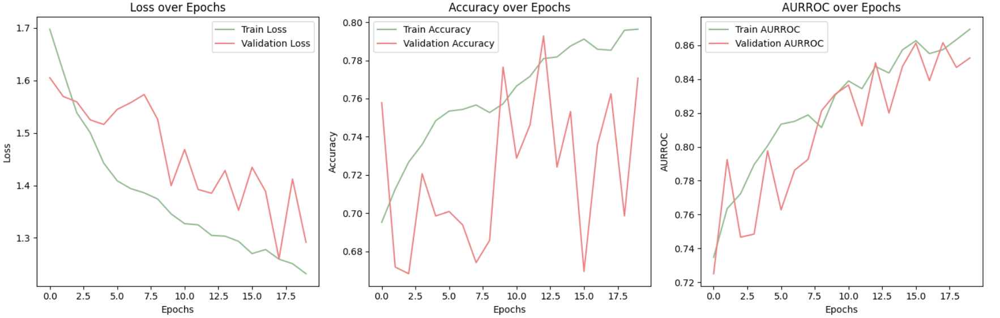
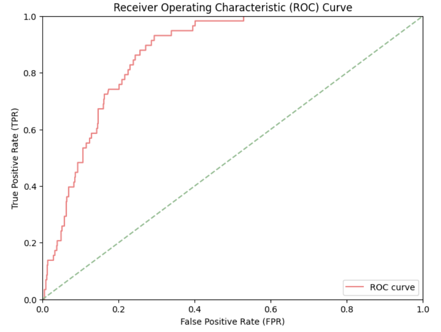
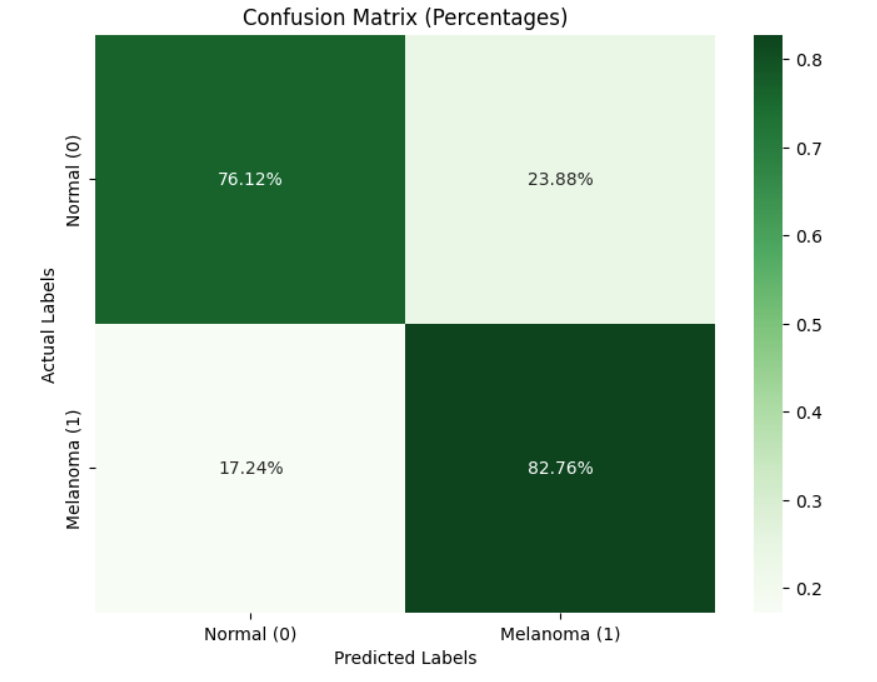
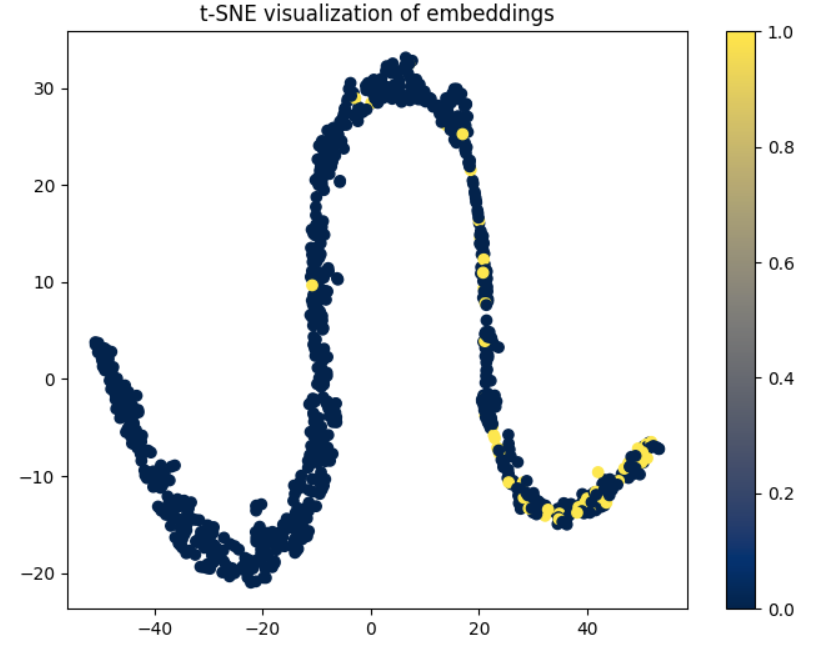

# Siamese network for Classification of ISIC 2020 Data Set
## Project Introduction
### Project Summary and Aim
The purpose of this project was to create a Siamese Network that is able to classify skin lesions from the ISIC 2020 Kaggle Challenge data set as either 'normal' or 'melanoma'. The full data set contains 33,126 images of skin lesions  (584 (1.8%) melanoma and 32,542 (98.2%) normal).

The aim of this project is to produce a model that is able to achieve an 'accuracy' of 'around' 0.8 when the model is used to predict a testing set (set of data that was unseen during training).

### Accuracy  Metric
As noted above the data set is highly unbalanced (1.8% melanoma images and 98.2% normal images). Thus using the standard accuracy score metric to gauge the performance of the model is very misleading. As, for example, we could just have our model predict all images as normal thus achieving an 'accuracy' of 98.2% whilst learning nothing about the data and being unable to predict melanomas.

Therefore it was decided that AUR ROC should be used as the metric to gauge the performance of the model. This metric was chosen as it provides a balance between sensitivity (True Positive Rate) and specificity (True Negative Rate) ensuring that both classes are considered [[1](#References)]. This metric is very commonly used for imbalanced datasets such as this [[1](#References)]. Thus this project will aim to maximise AUR ROC on the testing set. (See ed post #253 for support of this approach [[2](#References)]). Additionally it should be noted that the official kaggle challenge that this dataset originated from used AUR ROC as the metric to determine accuracy of test predictions [[3](#References)] (https://www.kaggle.com/c/siim-isic-melanoma-classification/overview).


## File Structure
### Current Structure
This is the current structure of the project when cloned directly from the repo
```
PatternAnalysis-2024/recognition/siamese_s46387334/
│
├── readme_figures/
│   ├── readme_image_1.jpg
│   ├── readme_image_2.jpg
│   └── ...
│
├── dataset.py
├── modules.py
├── predict.py
├── train.py
└── README.md
```

### After Data Imports
However to run these scripts it is a requirement that the ISIC 2020 Kaggle Challenge data set is downloaded into this folder. The following section ('Downloading the data') will outline how to do this. After the data is downloaded the folders should look like this.
```
PatternAnalysis-2024/recognition/siamese_s46387334/
│
├── readme_figures/
│   ├── example1.jpg
│   ├── example2.jpg
│   └── ...
│
├── dataset.py
├── modules.py
├── predict.py
├── train.py
├── README.md
│
└── data/
    ├── train-metadata.csv
    └── train-image/image/
        ├── ISIC_0015719.jpg
        ├── ISIC_9995166.jpg
        └── ...
```

## Environment Setup
First you will need to ensure you are in the `siamese_s46387334` folder, if you are starting in the repo root folder `PatternAnalysis-2024`. Run the following command:

```
cd recognition/siamese_s46387334/
```

### Downloading the data
1. Visit this page to download the data: https://www.kaggle.com/datasets/nischaydnk/isic-2020-jpg-256x256-resized

2. Once the data is downloaded - position the data into the folder structure to match the structure listed in the above section


### Python and Package Setup
1. Install Python 3.10.14
    - This can be done via the following link https://www.python.org/downloads/release/python-31014/

2. Install the following Python packages (This can be done in a virtual enviroment if desired)
    ```
    pip install matplotlib==3.7.5 numpy==1.26.4 pandas==2.2.2 scikit-learn==1.2.2 seaborn==0.12.2   
    pip install torch==2.4.0 torchvision==0.19.0
    ```

The environment should be setup with the follow versions:
- Python - 3.10.14
- matplotlib - 3.7.5
- numpy - 1.26.4 
- pandas - 2.2.2
- scikit-learn - 1.2.2
- seaborn - 0.12.2 
- torch - 2.4.0
- torchvision - 0.19.0


## Dataset Details
This section will contain details that pertain mainly to `dataset.py`

### Dataset Introduction
The ISIC 2020 Kaggle Challenge data set is self described as a "Skin Lesion Analysis Towards Melanoma Detection" (https://challenge2020.isic-archive.com/). The dataset contains 33,126 dermoscopic images of unique skin lesions from over 2,000 patients. (https://challenge2020.isic-archive.com/).

The full original dataset can be sourced from https://challenge2020.isic-archive.com/. However due to the dataset size - to ensure efficient computation a resized version of the data set was used that was sourced from https://www.kaggle.com/datasets/nischaydnk/isic-2020-jpg-256x256-resized. From now on the resized data set will be discussed. The images are located in a single folder (train-image/image/) and the classifications of each image are contained within a single csv file (train-metadata.csv) Each of the images from the resized data set are 256 x 256 pixels and a few examples of these images are pictured bellow.


### Dataset Train Validation Test Split
The first thing that was done to the data was to split the images up into three sets. Stratified sampling is used to ensure an even split of the classes.

- Train Set (80% of all data) 
    - This is the only data that the model will learn from

- Validation Set (10% of all data)
    - To be used for validation purposes while training (or be used for hyper parameter tuning)
    - To gauge how the current model is preforming on unseen data

- Test Set (10% of all data)
    - Will be used to evaluate the performance of the final model

The validation and testing sets were kept relatively small to maximise performance of the model by giving it a larger set of data to train on. Due to the large size of the data set the validation and testing sets are still large enough to give a good representation of the population. This is a standard split to apply when we have a dataset of over 10,000+ samples [[4](#References)].  Due to the unbalanced nature it could result in some variation however this is deemed as acceptable in industry as we will still have enough samples from the minority class in each set [[4](#References)].

### Dataset Oversampling and Augmentation
Due to the large class imbalance mentioned above it is preferred if a method is used to ensure that the model is trained on balanced data [[5](#References)].To do this we use a two step approach - oversampling the minority class, then data augmentation. It should be noted this class balancing was only done for the training set.

For oversampling - the minority class (melanoma) was oversampled until both classes had an equal number of data points. Then to ensure that this oversampling does not lead to overfitting - we apply data augmentation to all samples. Augmentation methods used are as follows (see the following documentation for details https://pytorch.org/vision/main/transforms.html). The following augmentations were chosen as they are commonly used for medical imaging problems such as this [[6](#References)].
- `RandomRotation` (Randomly rotate the image)
- `RandomHorizontalFlip` (Randomly horizontally flip the image)
- `RandomVerticalFlip` (Randomly vertically flip the image)
- `ColorJitter` (Randomly adjust the brightness, contrast, saturation and hue of the image)

Note, all images (Train, Validation and Test) also underwent normalisation [[6](#References)].

### Triplet Data Generation
Before the data can be used to train the Siamese Network - it must be arranged into triplets (this is due to the unique `TripletLoss` function we use). `dataset.py` implements the `TripletDataGenerator` class that generates triplets (anchor, positive, negative) for Siamese network training. Each triplet consists of two images from the same class (anchor and positive) and one from the opposite class (negative). Note - this only needs to be done for the training data - testing and validation data can just use the anchor (positive and negative have no use) when preforming predictions.


> ### How to use dataset.py
> - The full data set (images and labels) and be accessed via the `get_isic2020_data()` function in `dataset.py`
> - The train (with oversampling, augmentation and triplets formed), validation and test data loaders can be accessed accessed via the `get_isic2020_data_loaders()` function in `dataset.py`


## Siamese Network Details
This section will contain details that pertain mainly to `modules.py`

### Siamese Network Overview
Siamese Networks are a type model that takes advantage of metric learning to preform classification [[7](#References)]. Siamese Networks are made of two components:

1. The Feature Extractor model: This model will map data points into a new space where the distances between points reflect their similarities [[7](#References)]. Minimising the distance between similar pairs and maximising the distance between dissimilar pairs. This will be done via the use of a loss function focused on metric learning (We will use TripletLoss). This new space is called the 'embedding' of the data [[7](#References)].

2. The Classifier model: This model will take the 'embedded' data points and based on the embedding produce a classification (normal or melanoma) [[7](#References)].

### Feature Extractor (Embedding) Model Architecture
Our model will use a modified implementation of `resnet50` as the Feature Extractor. The bulk of the model follows the traditional `resnet50` architecture pictured bellow.


However the last fully connected layer, FC1000 (layer normally used for class predictions) of `resnet50` is replaced by a sequence of fully connected layers to form our 'Feature Extractor Head' used to produce embeddings. The layers are as follows:

- Linear layer: in: 2048, out: 512
- ReLU Layer
- Dropout Layer: prob: 0.5
- Linear layer: in: 512, out: 256
- ReLU Layer
- Dropout Layer: prob: 0.5
- Linear layer: in: 256, out: `embedding dimensions` 

(see bellow sections for `embedding dimensions` used in training)

### Feature Extractor Model Loss function (Triplet Loss)
For the desired metric learning to take place when training the feature extractor, we must use a unique loss function. For this problem we implement the loss function `TripletLoss`, a popular loss for siamese networks [[7](#References)]. `Tripletloss` will take each triplet output by the data loader and will calculate the loss via the following function [[7](#References)]:

```
loss = max(0, D(A, P) - D(A, N) + margin)
```

Where D represents Euclidean distance, A, P and N represent the output embeddings of the Anchor, Positive and Negative images from the triplet respectively, and margin is a hyper parameter to enforce a minimum separation between classes. The diagram bellow shows how the loss will react to learning [[7](#References)].


### Classifier Model Architecture
For the classifier a single layer neural net (perceptron) was used. The input will be the output embedding from the feature extractor and the output will be the chosen class (normal or melanoma). i.e. the classifier is - Linear Layer: in: `embedding dimensions` out: 2. The bulk of the training / work should be done by the feature extractor.

### Classifier Loss function
Since we have a two unit output from the classifier we will use `CrossEntropyLoss` as our loss function for the classifier.

> ### How to use modules.py
> - The full model (Feature Extractor + Classifier model) can be accessed via the `SiameseNet()` class in `modules.py`
> - The loss function for the Feature Extractor, `TripletLoss()` can be found in `modules.py`


## Training Details
This section will contain details that pertain mainly to `train.py`

### Hyper Parameter Selection
Grid Search using a validation set was used determine the optimal set of hyper parameters for training, the parameters are as follows:
- Batch Size: `32`
- Learning Rate: `0.0001`
- Epochs: `20`
- Embedding Dimensions: `128`
- TripletLoss Margin: `1.0`


## Other Training Selections
List of other selections made for training. Where possible - Grid Search using a validation set was used determine the optimal selection:
- Learning Rate Scheduler: `ReduceLROnPlateau`
- Feature Extractor Loss: `TripletLoss`
- Classifier Loss: `CrossEntropyLoss`
- Optimiser: `Adam`
- Save best model based on: AUR ROC on Validation Set (Form of early stopping)

### Training Process
A standard training loop will take place ensuring that both the Feature Extractor and Classifier models are trained. The model that preforms best on the validation set (in terms of AUR ROC metric) will be saved as `siamese_net_model.pt`.

>### How to use train.py
> - The config (including hyper parameters) used for the model can be accessed via the `get_config()` function in `modules.py`
> - The training process can be run by running `python3 train.py` in the terminal.
> - Results / progress will be printed to stdout, and figures saved to `PatternAnalysis/recognition/siamese_s46387334/`


## Evaluation Details
This section will contain details that pertain mainly to `predict.py`

### Evaluation Metrics
1. Testing AUC ROC (Area Under the Receiver Operating Characteristic Curve)
    - This is the primary evaluation metric for the model (see above for reasoning)
2. Testing Specificity (true negative rate)
    - Gauges how well the model preforms at predicting normal examples
3. Testing Sensitivity (true positive rate)
    - Gauges how well the model preforms at predicting melanoma examples

### Evaluation Figures
1. Training / Validation loss, accuracy and AUR ROC over the training epochs
    - Visualise the performance of the model as it trains
    - (This will be produced directly after training in `train.py`)
2. Testing ROC Curve
    - Visualise the Trade-off Between Sensitivity and Specificity
3. Testing Confusion Matrix
    - Visualise prediction results in a single figure
4. Testing t-SNE Embedding Visualization
    - Visualise how well the model is able to apply metric learning (using TripletLoss) to separate the embeddings for each class.

>### How to use predict.py
> - To run evaluation the test set using the 'best' model (`siamese_net_model.pt`) run `python3 predict.py` in the terminal.
> - Metrics will be printed to stdout, and figures saved to `PatternAnalysis/recognition/siamese_s46387334/`

## Results Summary
After running training and prediction as listed above, these were the results produced when predicting on the unseen testing set using the final model.

### Evaluation Metrics
#### 1. Testing AUC ROC (Area Under the Receiver Operating Characteristic Curve)
```
Testing AUR ROC: 0.867
```
- This is the primary metric for evaluation of the model and we can see it has achieved the desired score of greater that 0.8.
- This indicates that the model is effective at predicting both classes even in the case of the class imbalance seen in the dataset

#### 2. Testing Specificity (true negative rate)
```
Testing Specificity: 0.761
```
- Indicates that the model preforms reasonably well at predicting true normal skin as normal.

#### 3. Testing Sensitivity (true positive rate)
```
Testing Sensitivity: 0.828
```
- Indicates the the model preforms very well at predicting true melanomas as melanomas.
- It is widely accepted that for medical screening tests - such as this model - Sensitivity should be prioritised [[8](#References)].
- This is because it is much better to have a healthy person undergo more tests then be ruled out than have an unhealthy person think they are fine and never do more tests [[8](#References)].
- Thus the fact that this model favours Sensitivity over Specificity is ideal for this situation.


### Evaluation Figures
#### 1. Training / Validation loss, accuracy and AUR ROC over the training epochs

- Training curve does not pull away from validation, and validation does not plateau. This indicates little to no overfitting.
- Neither set plateau's this could indicate that the model could be run for longer to further improve results. However we can see the rates slowing down - and due to hardware compute limitations running it for too long was infeasible. Since the model was able to reach the desired AUR ROC ('accuracy metric' of 0.8) further training was not required.
- Validation set metrics over training epochs are erratic, this is because the model does not train on the validation data. This could be exacerbated by the fact that only the training data is augmented. A possible solution for this is discussed in the 'improvements' section.
- We can see that 'overall' validation accuracy had a lot of movement (up and down) while training - but validation AUR ROC steadily improved. This makes sense as at the start the model was getting the high accuracy by just predicting a majority of the images as normal (as this is the majority class) however as training progressed it was able to form a more balanced way to predict - successfully predicting both classes (minority and majority).


#### 2. Testing ROC Curve

- As mentioned in the metrics section, this model preforms well in high sensitivity regions, but less so in the high specificity regions. This is preferred vs the other way around [[8](#References)], however to improve the model its specificity should be the focus of improvement.


#### 3. Testing Confusion Matrix

- Details were covered in the Metric Section


#### 4. Testing t-SNE Embedding Visualization

- We can very clearly see via the embeddings that the Feature Extractor model has successfully identified ways to help separate the two classes.
- We can see that the melanoma samples (class 1) have formed general groups in the embedding separate from the normal samples (class 0) indicating that the feature extractor was able to identify methods of separating the two classes. We can see partial overlap - this is mainly due to trying to condense the 128 dimension embedding into 2D - however these overlapping points could also represent the overlap between classes in the model (Similar images but from different classes).
- This shows the implementation of metric learning utilised by TripletLoss to minimize the distance between similar pairs and maximize the distance between dissimilar pairs.


## Reproduction of Results
Note that due to the inescapable randomness of GPUs [[11](#References)] (among other factors) there may be some variation between runs. However due to the `set_seed()` function within the `train.py` script the results should be generally reproducible if the following steps are followed.

1. Follow steps above for downloading data
2. Follow steps above for setting up environment
3. Running training script, enter the following command in your terminal `python3 train.py`
4. Results / progress will be printed to stdout, and figures saved to `PatternAnalysis/recognition/siamese_s46387334/`


## Future Work and Improvements
- Test Time Augmentation (TTA) could be applied when making predictions (i.e. applying each combination of augmentations used on the train set to the test / validation set and then using a voting system to decide the prediction). This may improve accuracy of predictions as model was trained on augmented data [[9](#References)].
- Gain access to more powerful compute to allow the model to be trained for more epochs (Train without cluster timing out) to ensure that the model has fully learnt all it can from the data set.
- Domain specific knowledge - via consultation with dermatologists - could be applied to the problem to help the model focus on certain areas that are predictive of melanoma [[10](#References)].

## References
- [1] The receiver operating characteristic curve accurately assesses imbalanced datasets. ScienceDirect. Available at: https://www.sciencedirect.com/science/article/pii/S2666389924001090.
- [2] ED #253 - ISIC 2020 Kaggle Test Dataset. Edstem. Available at: https://edstem.org/au/courses/18266/discussion/2246247.
- [3] ISIC 2020 Melanoma Classification. Kaggle. Available at: https://www.kaggle.com/c/siim-isic-melanoma-classification/overview.
- [4] Effect of Dataset Size and Train/Test Split Ratios. MDPI. Available at: https://www.mdpi.com/1420-3049/26/4/1111.
- [5] Kambhampati, C. Balancing Class for Performance of Classification with a Clinical Dataset. ResearchGate. Available at: https://www.researchgate.net/profile/Chandra-Kambhampati/publication/288795645_Balancing-Class-for-Performance-of-Classification-with-a-Clinical-Dataset/links/5818783108ae50812f5d9d64/Balancing-Class-for-Performance-of-Classification-with-a-Clinical-Dataset.pdf.
- [6] Data augmentation for improving deep learning in image classification problem. IEEE Xplore. Available at: https://ieeexplore.ieee.org/abstract/document/8388338.
- [7] Triplet-Loss Based Siamese Convolutional Neural Network for 4-Way Classification of Alzheimer’s Disease. SpringerLink. Available at: https://link.springer.com/chapter/10.1007/978-3-031-15037-1_23.
- [8] Sensitivity and Specificity of Screening Tests. ResearchGate. Available at: https://www.researchgate.net/publication/264314159_Sensitivity_and_Specificity_of_Screening_Tests.
- [9] Understanding Test-Time Augmentation. SpringerLink. Available at: https://link.springer.com/chapter/10.1007/978-3-030-92185-9_46.
- [10] Artificial Intelligence in Dermatology Image Analysis: Current Developments and Future Trends. MDPI. Available at: https://www.mdpi.com/2077-0383/11/22/6826.
- [11] Challenges for the Repeatability of Deep Learning Models. IEEE Xplore. Available at: https://ieeexplore.ieee.org/abstract/document/9266043.
