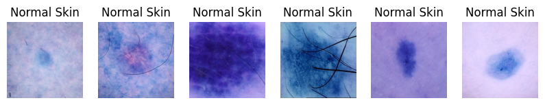
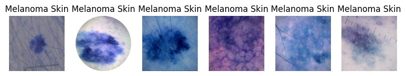
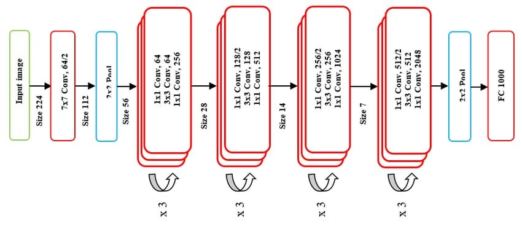
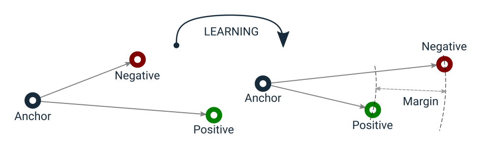

# Siamese network for Classification of ISIC 2020 Kaggle Challenge data set
## Project Introduction
### Project Summary and Aim
The purpose of this project was to create a Siamese Network that is able to classify skin lesions from the ISIC 2020 Kaggle Challenge data set as either 'normal' or 'melanoma'. The full data set contains 33,126 images of skin lesions  (584 (1.8%) melanoma and 32542 (98.2%) normal).

The aim of this project is to produce a model that is able to achieve an 'accuracy' of 0.8 when the model is used to predict a testing set (set of data that was unseen during training).

### Accuracy  Metric
As noted above the data set is highly unbalanced (1.8% melanoma images and 98.2% normal images). Thus using the standard accuracy score metric to gauge the performance of the model is very misleading. As,for example we could just have our model predict all images as normal thus achieving an 'accuracy' of 98.2% whilst learning nothing about the data and being unable to predict melanomas.

Therefore it was decided that AUR ROC should be used as the metric to gauge the performance of the model. This metric was chosen as it provides a balance between sensitivity (True Positive Rate) and specificity (True Negative Rate) ensuring that both classes are considered (REFERENCE!!!). This metric is very commonly used for imbalanced datasets such as this (REFERENCE!!!). Thus this project will aim to maximise AUR ROC on the testing set. (See ed post #253 for support of this approach (REFERENCE!!!)). Additionally it should be noted that the official kaggle challenge that this dataset originated from used AUR ROC as the metric to determine accuracy of test predictions (REF https://www.kaggle.com/c/siim-isic-melanoma-classification/overview).

## File Structure
### Current Structure
This is the current structure of the project as is when cloned from it
```
PatternAnalysis-2024/recognition/siamese_s46387334/
│
├── readme_figures/
│   ├── readme_image_1.jpg
│   ├── readme_image_2.jpg
│   └── ...
│
├── dataset.py
├── modules.py
├── predict.py
├── train.py
└── README.md
```

### After Data Imports
However to run these scripts it is a requirement that the ISIC 2020 Kaggle Challenge data set is downloaded into this folder. The following section ('Downloading the data') will outline how to do this. After the data is downloaded the folders should look like this.
```
PatternAnalysis-2024/recognition/siamese_s46387334/
│
├── readme_figures/
│   ├── example1.jpg
│   ├── example2.jpg
│   └── ...
│
├── dataset.py
├── modules.py
├── predict.py
├── train.py
├── README.md
│
└── data/
    ├── train-metadata.csv
    └── train-image/image/
        ├── ISIC_0015719.jpg
        ├── ISIC_9995166.jpg
        └── ...
```

## Environment Setup
### Downloading the data
1. Visit this page to download the data: https://www.kaggle.com/datasets/nischaydnk/isic-2020-jpg-256x256-resized (REF)

2. Once the data is downloaded - position the data into the folder structure to match the structure listed in the above section


### Python and Package Setup
1. Install Python 3.10.14  (REF)
    - This can be done via the following link https://www.python.org/downloads/release/python-31014/

2. Install the following Python packages (This can be done in a virtual enviroment if desired)
    ```
    pip install pytorch torchvision matplotlib pandas numpy seaborn
    ```

The environment should be setup as follows:
- Python - 3.10.14


(TODO FINISH - add all moduals nad == for vresions)


## Dataset Details
This section will contain details that pertain mainly to `dataset.py`

### Dataset Introduction
The ISIC 2020 Kaggle Challenge data set is self described as a "Skin Lesion Analysis Towards Melanoma Detection" (REF https://challenge2020.isic-archive.com/). The dataset contains 33,126 dermoscopic images of unique skin lesions from over 2,000 patients. (REF https://challenge2020.isic-archive.com/).

The full original dataset can be sourced from https://challenge2020.isic-archive.com/ (REF). However due to the dataset size - to ensure efficient computation a resized version of the data set was used that was sourced from https://www.kaggle.com/datasets/nischaydnk/isic-2020-jpg-256x256-resized (REF). From now on the resized data set will be discussed. The images are located in a single folder (train-image/image/) and the classifications of each image are contained within a single csv file (train-metadata.csv) Each of the images from the resized data set are 256 x 256 pixels and a few examples of these images are pictured bellow.






### Dataset Train Validation Test Split
The first thing that was done to the data was to split the images up into three sets. Stratified sampling is used to ensure an even split of the classes.

- Train Set (80% of all data) 
    - This is the only data that the model will learn from

- Validation Set (10% of all data)
    - To be used for validation purposes while training (or be used for hyper parameter tuning)
    - To gauge how the current model is preforming on unseen data

- Test Set (10% of all data)
    - Will be used to evaluate the performance of the final model

The Validation and testing sets were kept relatively small to maximise performance of the model by giving it a larger set of data to train on. Due to the large size of the data set the validation and testing sets are still large enough to get a good idea of the population.

### Dataset Oversampling and Augmentation
Due to the large class imbalance mentioned above it is preferred if a method is used to ensure that the model is trained on balanced data (REF).To do this we use a two step approach - oversampling the minority class, then data augmentation. It should be noted this class balancing was only done for the training set.

For oversampling - the minority class (melanoma) was oversampled until both classes had an equal number of data points. Then to ensure that this oversampling does not lead to overfitting - we apply data augmentation to all samples. Augmentation methods used are as follows (see the following documentation for details https://pytorch.org/vision/main/transforms.html)  (REF):
- `RandomRotation` (Randomly rotate the image)
- `RandomHorizontalFlip` (Randomly horizontally flip the image)
- `RandomVerticalFlip` (Randomly vertically flip the image)
- `ColorJitter` (Randomly adjust the brightness, contrast, saturation and hue of the image)

### Triplet Data Generation
Before the data can be used in the Siamese Network each of the dataset must be arranged into triplets (this is due to the unique `TripletLoss` function we use). `dataset.py` implements the `TripletDataGenerator` class that generates triplets (anchor, positive, negative) for Siamese network training. Each triplet consists of two images from the same class (anchor and positive) and one from the opposite class (negative).


> ### How to use dataset.py
> - The full data set (images and labels) and be accessed via the `get_isic2020_data()` function in `dataset.py`
> - The train (with oversampling), validation, test split triplet data loaders (datasets have been grouped into triplets) (with augmentation applied) can be accessed accessed via the `get_isic2020_data_loaders()` function in `dataset.py`


## Siamese Network Details
This section will contain details that pertain mainly to `modules.py`

### Siamese Network Overview
Siamese Networks are a type model that takes advantage of metric learning to preform classification. Siamese Networks are made of two components:

1. The Feature Extractor model: This model will map data points into a new space where the distances between points reflect their similarities. Minimising the distance between similar pairs and maximize the distance
between dissimilar pairs (REF to blacboard powerpoint). This will be done via the use of a loss function focused on metric learning. This new space is called the 'embedding' of the data.

2. The Classifier model: This model will take the 'embedded' data points and based on the embedding produce a classification (normal or melanoma)

### Feature Extractor (Embedding) Model Architecture
Out model will use a modified implementation of `resnet50` as the Feature Extractor. The bulk of the model follows the traditional `resnet50` architecture pictured bellow.



However the last fully connected layer, FC1000 (layer normally used for class predictions) of `resnet50` is replaced by a sequence of fully connected layers to form our 'Feature Extractor Head' used to produce embeddings. The layers are as follows:

- Linear layer: in: 2048, out: 512
- ReLU Layer
- Dropout Layer: prob: 0.5
- Linear layer: in: 512, out: 256
- ReLU Layer
- Dropout Layer: prob: 0.5
- Linear layer: in: 256, out: `embedding dimensions` 

(see bellow sections for `embedding dimensions` used in training)

### Feature Extractor Model Loss function (Triplet Loss)
For the desired metric learning to take place when training the feature extractor, we must use a unique loss function. For this problem we implement the loss function `TripletLoss`, a popular loss for siamese networks (REF). `Tripletloss` will take each triplet output by the data loader and will calculate the loss via the following function (REF):

$
loss = \max(0, D(A, P) - D(A, N) + margin)
$

Where $D$ represents Euclidean distance, A, P and N represent the output embeddings of the Anchor, Positive and Negative images from the triplet respectively, and margin is a hyper parameter to enforce a minimum separation between classes. The diagram bellow shows how the loss will react to learning.



### Classifier Model Architecture
For the classifier a single fully connected layer was used. The input will be the output embedding from the feature extractor and the output will be the chosen class (normal or melanoma). i.e. the classifier is - Linear Layer: in: `embedding dimensions` out: 2. The bulk of the training / work should be done by the feature extractor.

### Classifier Loss function
Since we have a two unit output from the classifier we will use `CrossEntropyLoss` as our loss function for the classifier.

> ### How to use modules.py
> - The full model (Feature Extractor + Classifier model) can be accessed via the `SiameseNet()` class in `modules.py`
> - The loss function for the Feature Extractor, `TripletLoss()` can be found in `modules.py`


## Training Details
This section will contain details that pertain mainly to `train.py`

### Hyper Parameter Selection
Grid Search using a validation set was used determine the optimal set of hyper parameters for training, the parameters are as follows:

(TODO: add final values)

### Training Process
A standard training loop will take place ensuring that both the Feature Extractor and Classifier models are trained. The model that preforms best on the validation set (in terms of AUR ROC metric) will be saved as `siamese_net_model.pt`.

>### How to use train.py
> - The config (including hyper parameters) used for the model can be accessed via the `get_config()` function in `modules.py`
> - The training process can be run by running `python3 train.py` in the terminal.
> - Results / progress will be printed to stdout, and figures saved to `PatternAnalysis/recognition/siamese_s46387334/`


## Evaluation Details
This section will contain details that pertain mainly to `predict.py`

### Evaluation Metrics
1. Testing AUC ROC (Area Under the Receiver Operating Characteristic Curve)
    - This is the primary evaluation metric for the model (see above for reasoning)
2. Testing Specificity (true negative rate)
    - Gauges how well the model preforms at predicting normal examples
3. Testing Sensitivity (true positive rate)
    - Gauges how well the model preforms at predicting melanoma examples

### Evaluation Figures
1. Training / Validation loss, accuracy and AUR ROC over the training epochs
    - Visualise the performance of the model as it trains
    - (This will be produced directly after training in `train.py`)
2. Testing ROC Curve
    - Visualise the Trade-off Between Sensitivity and Specificity
3. Testing Confusion Matrix
    - Visualise prediction results in a single figure
4. Testing t-SNE Embedding Visualization
    - Visualise how well the model is able to apply metric learning (using TripletLoss) to separate the embeddings for each class.

>### How to use predict.py
> - To run evaluation the test set using the 'best' model (`siamese_net_model.pt`) run `python3 predict.py` in the terminal.
> - Metrics will be printed to stdout, and figures saved to `PatternAnalysis/recognition/siamese_s46387334/`

## Results Summary
### Evaluation Metrics
1. Testing AUC ROC (Area Under the Receiver Operating Characteristic Curve)

2. Testing Specificity (true negative rate)

3. Testing Sensitivity (true positive rate)


### Evaluation Figures
1. Training / Validation loss, accuracy and AUR ROC over the training epochs

2. Testing ROC Curve

3. Testing Confusion Matrix

4. Testing t-SNE Embedding Visualization


## Reproduction of Results
Note that due to the inescapable randomness of GPUs (REF) there may be some variation between runs.

1. Follow steps above for downloading data
2. Follow steps above for setting up environment
3. Running training script, enter the following command in your terminal `python3 train.py`
4. Results / progress will be printed to stdout, and figures saved to `PatternAnalysis/recognition/siamese_s46387334/`


## Future Work and Improvments


## References


