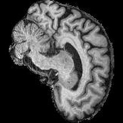
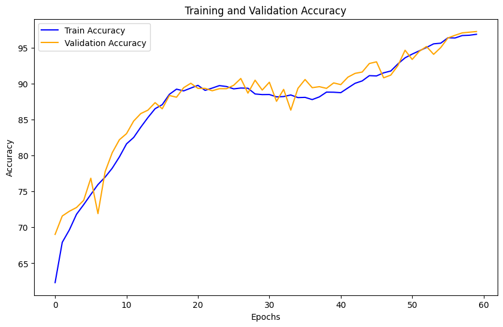
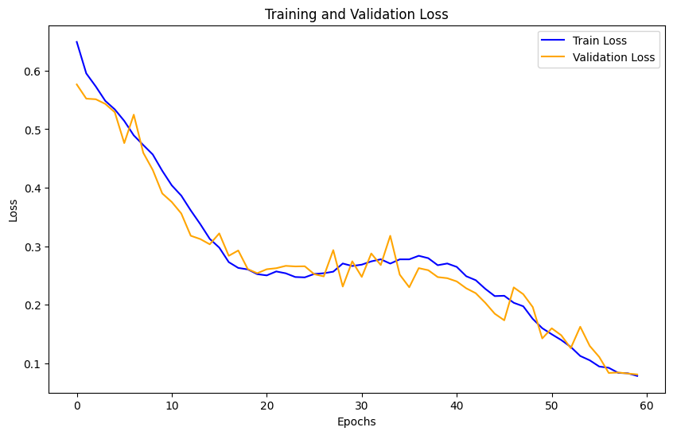

# Alzheimer's Disease Classification using GFNet

A GFNet was used to train a binary classifier to identify Alzheimer's disease from MRI brain scans. The [ADNI dataset](https://adni.loni.usc.edu/) was used for both training and testing of our model. We achieved a test accuracy of 80.67%, which exceeds the accuracy requirement outlined in the project specifications.

## Model Architecture

The Global Filter Network (GFNet) is a neural network similar in structure to transformers, but it learns long-term spatial dependencies in the frequency domain, differing from the attention mechanism used in transformers. GFNet replaces the self-attention layers in traditional transformers with three key components: a discrete Fourier transform, element-wise multiplication between the frequency-domain features and global filters, and an inverse Fourier transform. With these modifications, GFNet achieves log-linear complexity while effectively learning long-term spatial dependencies.

GFNet consists of following key components:  
**Patch Embedding**: Converts the input image into patches, allowing the model to process the image efficiently in a tokenized format, similar to vision transformers.  
**Global Filter (GF) Layer**: Applies global filters in the frequency domain using the Fast Fourier Transform (FFT) to capture long-range dependencies, enabling better global context understanding.  
**Residual Block with Global Filter**: Integrates the GF Layer within a residual block to combine global context with local features while ensuring stable gradients and effective training.  
**Feed-Forward Network (FFN)**: Refines the extracted features by applying linear transformations with non-linear activation, further enhancing global feature representation.  


We adopted the official implementation of GFNet [1] with several necessary adaptations for the binary classification task. Specifically, we modified the final fully connected (FC) layer to output a single logit that can be processed by the sigmoid function to calculate the predicted probability for the positive class (AD). Additionally, we set the input channel to 1, enabling the network to process grayscale MRI scan images correctly. This GFNet takes 210x210 single-channel images as input, which are then split into 15 patches. Each patch is processed by Global Filters in the frequency domain to learn global spatial dependencies. The Global Filters operate in the Fourier domain, capturing long-term dependencies by manipulating the frequency components of the image patches. After the filtering stage, the output undergoes Layer Normalization followed by a Multi-Layer Perceptron (MLP) to apply non-linear transformations and generate the final logits. This approach allows GFNet to learn features more globally compared to conventional convolutional methods, making it especially effective for image classification tasks.

During the test phase, we utilized patient-level information to improve predictions. Each patient has 20 MRI brain scans, and the scans should share consistent information. GFNet assigns a probability of being diseased for each image. We compute the average probability of the 20 images from the same patient and classify the patient as having AD if the average probability exceeds 0.5.

## Data Preparation

We directly used the dataset processed and provided by the COMP3710 course. Two dataset classes were prepared: one for loading single grayscale images for training and another for loading patient-level batches of images for testing.

### Data Preprocessing

We observed slight variations in brain size across different MRI scan images. Furthermore, the surrounding large black background contains no useful information, making it challenging for the model to locate and learn features from the brain. Therefore, we used the `cv2` package to crop the valid region. A rectangular boundary is assigned to the valid area, which is then resized and padded to 210x210 before being saved to the `AD_processed` or `NC_processed` folders. We chose 210x210 because no image in the dataset exceeds this size in terms of valid region, and our implementation supports downsampling to ensure the robustness of our code and its ability to process images of any size.

<div style="display: flex; justify-content: center; gap: 10px;">
  <div style="text-align: center;">
    
    <p>Raw Image</p>
  </div>
  <div style="text-align: center;">
    
    <p>Processed Image</p>
  </div>
</div>

This data preprocessing is handled automatically by our dataset classes. *Please ensure you have write permissions for the folder where the dataset is located.*

### Dataset Classes

Two dataset classes are provided for loading the data. Both classes automatically crop the valid area in the original images and save the processed images to the `processed` folders. Both dataset classes support a `transform` parameter for applying image transformations. Additionally, the labels are assigned with AD as 1 and NC as 0.


- **`ADNIDataset`**: This dataset loads each image as a single-channel grayscale image. The dataset splits the data into training and validation sets based on the `seed` and `split_ratio` provided. By setting `val=True`, you can load the validation set. When `seed` and `split_ratio` are fixed, the dataset provides a *consistent and complementary* split between the training and validation sets, ensuring all data is loaded correctly. The `split` parameter determines which subset (train or test) is being loaded. In our implementation, we used `seed=0` and `split_ratio=0.9`.
  
- **`ADNIDatasetTest`**: This dataset loads patient-level batches of 20 grayscale images from the same patient based on their patient ID. It will load the data from `test` folder.

### Additional Remarks on the Implementation

I attempted to use patient-level information during the training phase by either using Conv3D to capture sequential information or treating a set of images as a 20-channel input for GFNet. However, both methods significantly reduced the number of training samples, and it was also difficult for the model to learn the relationships between the images, leading to challenging training. The test accuracies were both below ~76% and did not improve significantly compared to our final implementation.

In the final approach, we simplified the process. The model learns from single images to focus on the features within each image. This approach was easier to implement and resulted in a more stable training process. The model learns the probability that a given MRI image indicates Alzheimer's disease.

During testing, we load all 20 images from the same patient and calculate the probability that each image is diseased. The patient's diagnosis is determined by the average probability across the 20 images. If this value exceeds 0.5, the patient is classified as having Alzheimer's disease.

Although a single MRI image may not conclusively diagnose Alzheimer's (as it may not capture the lesion area), averaging the 20 predictions helps mitigate this issue. Using this approach, we achieved a test accuracy that exceeded the required level for this assignment.


## Training

Several techniques were used during the training phase.

**Transformation**: Several data augmentation techniques were applied to avoid overfitting and improve generalization:
- `RandomRotation`: Up to 10 degrees of random rotation.
- `RandomErasing`: Randomly erases a small area of the images.
- `RandomResizedCrop`: Crops a portion of the boundary area.
- `RandomAffine`: Applies affine transformations.
- `ElasticTransform`: Slightly stretches the image.

**AdamW**: We used the AdamW optimizer with regularization (`weight_decay=5e-4`) to avoid overfitting.

**CosineAnnealingLR**: The learning rate scheduler changes the learning rate between `1e-6` and `1e-3` over a cycle of 20 epochs, helping the model converge.

**Early stopping**: We monitored the validation accuracy to avoid overfitting. If the validation accuracy did not improve within 20 epochs, the training was stopped, and the model with the highest validation accuracy was saved.

**Patch size**: The patch size of 14 was set to accommodate the 210x210 image size.

## Results

We provided our trained model. You can download the **model** and **tensorboard event file** from [Dropbox](https://www.dropbox.com/scl/fo/i683tej1l5i5yok4smnmz/ANG_mNtO6PRg-dywu7zuSUU?rlkey=3pllz6j1nrvod35u4jh08wmwp&st=coir7fak&dl=0). Please place the `logs` folder under the `vision_transformer_47147571` directory.

We also visualized the training/validation accuracy and average training/validation loss per batch over the epochs below.





It is noticeable that the validation accuracy is almost consistently higher than the training accuracy, and the validation loss is almost consistently lower than the training loss. This occurs because data augmentation was **only** applied to the training data. As a result, the model faces fewer challenges during validation, leading to better generalization.

Running `predict.py` will output the following:
```
using linear droppath with expect rate 0.0
100%|██████████████████████████████████████████████████████████████████████████████████████████████████████| 450/450 [00:19<00:00, 23.45it/s]
Confusion Matrix:
TN      FP
211     16
FN      TP
71      152
Precision: 0.90
Recall: 0.68
F1 Score: 0.78
Test Accuracy: 80.67%
```

These results are generated by performing inference on the entire test dataset and comparing our model's predictions with the true labels at the patient level.

## How to Use

To train the model, simply run the following:
```
python train.py --data_path="path_to/ADNI/AD_NC" --show_progress=True --device="cuda:0"
```

The `show_progress` and `device` parameters are optional. `show_progress` enables a progress bar to visualize the training process, and the model will be saved automatically.

To test our model, run:
```
pytorch predict.py --data_path="path_to/ADNI/AD_NC"
```
It also supports the optional `show_progress` and `device` parameters.

You can run these commands from any directory as long as you specify the correct paths to `train.py` and `test.py`. The generated files will automatically be saved in the same folder as `train.py` and `test.py`.

## Dependencies

The following are the main libraries and their versions required for this project:

- PyTorch: 2.3.0
- NumPy: 1.26.4
- Scikit-learn: 1.4.2
- OpenCV (cv2): 4.10.0
- Pillow (PIL): 10.3.0
- tqdm: 4.66.4
- timm: 1.0.9
- tensorboard: 2.17.1

Install them by running:
```
pip install torch numpy scikit-learn opencv-python pillow tqdm timm tensorboard
```

## Reproducibility

I have carefully checked the code and fixed the seed to maximize reproducibility. The experiments were conducted on an NVIDIA 2080Ti GPU. However, different hardware platforms may produce slightly different results. The asynchronous loading mechanism of the `Dataloader` cannot be fully controlled and may also contribute to minor variations in the results.


## Reference

[1] Rao, Y., Zhao, W., Zhu, Z., Lu, J., & Zhou, J. (2021). Global filter networks for image classification. In Advances in Neural Information Processing Systems (NeurIPS).
