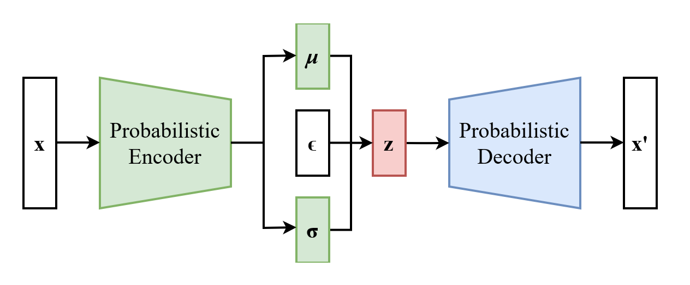
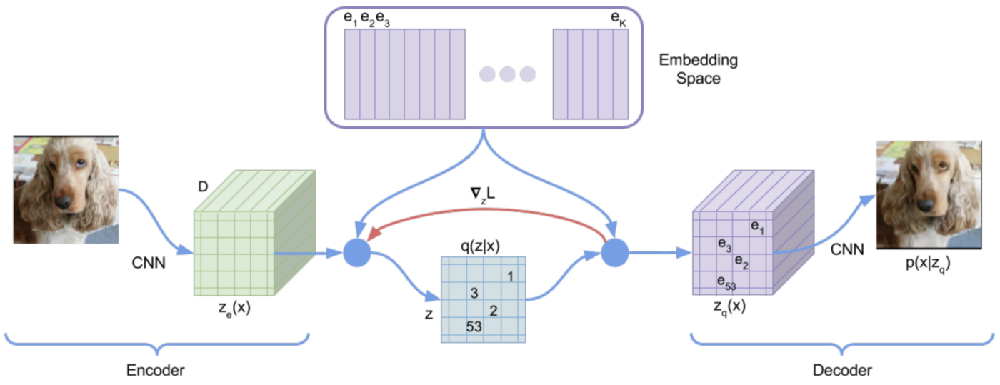

# Generative VQ-VAE Model on HipMRI Prostate Cancer Dataset
### Author: s4743500, Aidan Lok, University of Queensland

## Project Overview 
This project aims to develop a generative model for the HipMRI Study on Prostate Cancer dataset using a **Vector Quantized Variational Autoencoder (VQ-VAE)** model. VQ-VAE models are trained to learn a discrete latent representation of the MRI data, which is then used to create realistic prostate MRI images. 

The main purpose of this project is to improve upon the limitations of a standard Variational Autoencoder (VAE) where they would typically struggle to generate high-quality medical images. This is because VAE's learn to represent data in a continuous latent space which makes it difficult to encode precise and detailed features. As a result, VAEs suffer from issues like blurriness and lack of detail in the reconstructed images [[1]](#1).  

  

On the other hand, VQ-VAEs uses discrete latent variabes instead of continuous ones by incorporating vector quantization. This creates clearer and better image reconstructions.  

Refering to the image below [[2]](#2), it shows a simple illustration of a VQ-VAE architecture. The data flow through a VQ-VAE model is made up of 5 key components:  
&nbsp;&nbsp;&nbsp;&nbsp;1. Encoder  
&nbsp;&nbsp;&nbsp;&nbsp;2. Embedding Space  
&nbsp;&nbsp;&nbsp;&nbsp;3. Quantization  
&nbsp;&nbsp;&nbsp;&nbsp;4. Decoder  
&nbsp;&nbsp;&nbsp;&nbsp;5. Training Signal (Backpropagation Path)  

Firstly, the process starts with an input image being **encoded** into a latent representation using a convolutional neural network (CNN). This CNN maps the image to a latent representation denoted as \( z_e(x) \), where each spatial location of the latent map is transformed into a vector representing the features of that region. The latent representation is then quantized using a set of discrete embedding vectors stored in an **embedding space**. The **quantization** process involves mapping each vector in the latent representation to its closest embedding vector in the codebook. This quantized representation, \( z_q(x) \), is passed to the **decoder** (which is another CNN) where its job is to reconstruct the image from its compressed representation. The output of the decoder is an approximation of what it thinks the original input looked like \( p(x \mid z_q) \). Furthermore, the red arrow in the image indicates the gradient flow used for training. During training, **backpropogration** is perfored to continually update the encoder and embedding vectors in order to try minimise the reconstruction loss. 

### Reference List  
<a name="1">[1]</a> What is VQ-VAE (Vector Quantized Variational Autoencoder): [https://www.activeloop.ai/resources/glossary/vq-vae-vector-quantized-variational-autoencoder/#:~:text=The%20main%20difference%20between%20them,finite%20set%20of%20learned%20embeddings.](https://www.activeloop.ai/resources/glossary/vq-vae-vector-quantized-variational-autoencoder/#:~:text=The%20main%20difference%20between%20them,finite%20set%20of%20learned%20embeddings.)  
<a name="2">[2]</a> VQ-VAE Architecture Illustration: [https://arxiv.org/abs/1711.00937](https://arxiv.org/abs/1711.00937)