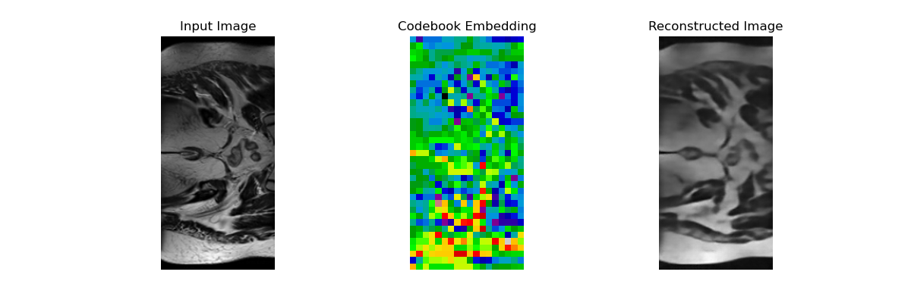

# Generative VQ-VAE Model on HipMRI Prostate Cancer Dataset
### Author: s4743500, Aidan Lok, University of Queensland

## Project Overview 
This project aims to develop a generative model for the HipMRI Study on Prostate Cancer dataset using a **Vector Quantized Variational Autoencoder (VQ-VAE)** model. VQ-VAE models are trained to learn a discrete latent representation of the MRI data, which is then used to create realistic prostate MRI images. 

The main purpose of this project is to improve upon the limitations of a standard Variational Autoencoder (VAE) where they would typically struggle to generate high-quality medical images. This is because VAE's learn to represent data in a continuous latent space which makes it difficult to encode precise and detailed features. As a result, VAEs suffer from issues like blurriness and lack of detail in the reconstructed images [[1]](#1).  

  

On the other hand, VQ-VAEs uses discrete latent variabes instead of continuous ones by incorporating vector quantization. This creates clearer and better image reconstructions. Refering to the image below [[2]](#2), it shows a simple illustration of a VQ-VAE architecture. The data flow through a VQ-VAE model is made up of 5 key components:    
&nbsp;&nbsp;&nbsp;&nbsp;1. Encoder  
&nbsp;&nbsp;&nbsp;&nbsp;2. Embedding Space  
&nbsp;&nbsp;&nbsp;&nbsp;3. Quantization  
&nbsp;&nbsp;&nbsp;&nbsp;4. Decoder  
&nbsp;&nbsp;&nbsp;&nbsp;5. Training Signal (Backpropagation Path)  

  

Firstly, the process starts with an input image being **encoded** into a latent representation using a convolutional neural network (CNN). This CNN maps the image to a latent representation denoted as \( z_e(x) \), where each spatial location of the latent map is transformed into a vector representing the features of that region. The latent representation is then quantized using a set of discrete embedding vectors stored in an **embedding space**. The **quantization** process involves mapping each vector in the latent representation to its closest embedding vector in the codebook. This quantized representation, \( z_q(x) \), is passed to the **decoder** (which is another CNN) where its job is to reconstruct the image from its compressed representation. The output of the decoder is an approximation of what it thinks the original input looked like \( p(x \mid z_q) \). Furthermore, the red arrow in the image indicates the gradient flow used for training. During training, **backpropogration** is perfored to continually update the encoder and embedding vectors in order to try minimise the reconstruction loss.  

### Deep learning pipeline  
The following sections provide an overview of the deep learning pipeline used for this project:  
&nbsp;&nbsp;&nbsp;&nbsp; 1. Data Loading & Preprocessing  
&nbsp;&nbsp;&nbsp;&nbsp; 2. Model Architecture  
&nbsp;&nbsp;&nbsp;&nbsp; 3. Training Procedure  
&nbsp;&nbsp;&nbsp;&nbsp; 4. Testing procedure  

## 1. Data Loading & Preprocessing  
The dataset used for this project was the Prostate 2D HipMRI dataset which can be found and downloaded [[here]](#here). The images consists of grayscale MRI scans of prostate tissue which was loaded and preprocessed using the custom data loader found in the [dataset.py](dataset.py) file.    

### Dataset Description  
The MRI images are stored in NIfTI (.nii or .nii.gz) format, and it was split into training, validation, and test datasets:  
  
Number of training images: 11460  
Number of validation images: 660  
Number of testing images: 540  
  
which corresponds to approximately 90% of the data being used for training, 6% for validation, and the remaining 4% for testing. These split percentages allow us to effectively train the data while maintaining a validation and testing set to evaluate the model's ability to generalise unseen data. Therefore, no form of data augmentation was performed as I believed the dataset size was sufficient. 

### Data Pipeline  
The following transformations were applied to the dataset before feeding it into the model:  
  
`transform = transforms.Compose([`  
&nbsp;&nbsp;&nbsp;&nbsp;`transforms.Resize((image_size, image_size)),`   
&nbsp;&nbsp;&nbsp;&nbsp;`transforms.Grayscale(num_output_channels=1),`   
&nbsp;&nbsp;&nbsp;&nbsp;`transforms.ToTensor(),`  
&nbsp;&nbsp;&nbsp;&nbsp;`transforms.Normalize((0.5,), (0.5,))`   
`])`  
  
The images were resized to 256x256 pixels to make sure all images had the same input size. Moreover, to improve training stability, the pixel values for each image were normalized to the range [-1, 1]. Because the images only have one colour channel representing the intensity of the pixels (grayscale images), each image is converted to a single-channel grayscale image using  
  
`transforms.Grayscale(num_output_channels=1)`  
  
This was done to ensure that all images have the expected format (1 channel, grayscale).

### Data Loaders  
The dataset was loaded using PyTorch's DataLoader class within the `torch.utils.data` module. Shuffling was enabled for the training data so that the model did not learn from any specific order of images, which could have led to some form of bias. Three DataLoaders were created for the individual datasets (train, validation, and test dataset):  
  
`train_loader = DataLoader(train_dataset, batch_size=batch_size, shuffle=True, num_workers=1)`  
`val_loader = DataLoader(val_dataset, batch_size=batch_size, shuffle=False, num_workers=1)`  
`test_loader = DataLoader(test_dataset, batch_size=batch_size, shuffle=False, num_workers=1)`  
  
## 2. Model Architecture  
The code for the VQ-VAE Architecture was implemented in the [modules.py](modules.py) file. The encoder, vector quantizer, and decoder modules were also all necessary components needed to build the overall VQ-VAE model. 
  
### Encoder
The main goal for the Encoder is to reduce the 256x256 MRI images to a lower-dimensional latent representation so that it can be passed to the quantization layer. The Encoder is composed of  
  
- **Downsampling layers**: These are the layers responsible for downsampling the input image while also learning sophisticated representations. The parameters are  
  
&nbsp;&nbsp;&nbsp;&nbsp;&nbsp;&nbsp;&nbsp;&nbsp;`nn.Conv2d(`  
&nbsp;&nbsp;&nbsp;&nbsp;&nbsp;&nbsp;&nbsp;&nbsp;&nbsp;&nbsp;&nbsp;&nbsp;`in_channels=in_channels,`  
&nbsp;&nbsp;&nbsp;&nbsp;&nbsp;&nbsp;&nbsp;&nbsp;&nbsp;&nbsp;&nbsp;&nbsp;`out_channels=out_channels,`  
&nbsp;&nbsp;&nbsp;&nbsp;&nbsp;&nbsp;&nbsp;&nbsp;&nbsp;&nbsp;&nbsp;&nbsp;`kernel_size=4,`  
&nbsp;&nbsp;&nbsp;&nbsp;&nbsp;&nbsp;&nbsp;&nbsp;&nbsp;&nbsp;&nbsp;&nbsp;`stride=2,`  
&nbsp;&nbsp;&nbsp;&nbsp;&nbsp;&nbsp;&nbsp;&nbsp;&nbsp;&nbsp;&nbsp;&nbsp;`padding=1`  
&nbsp;&nbsp;&nbsp;&nbsp;&nbsp;&nbsp;&nbsp;&nbsp;`)`  
  
&nbsp;&nbsp;&nbsp;&nbsp;&nbsp;&nbsp;&nbsp;&nbsp;I initialised the kernel size to equal 4, which meant the size of the filter that slides over the image was 4x4.
&nbsp;&nbsp;&nbsp;&nbsp;&nbsp;&nbsp;&nbsp;&nbsp;A stride of 2 was set to effectively downsample the image by half while still being able to retain and campture important information  
  
- **Residual connections**: The encoder also has a residual stack to improve feature learning and facilitate gradient flow. Residual connections (or skip connections) help the network capture the important spatial details while avoiding the risk of vanishing gradients  
  
&nbsp;&nbsp;&nbsp;&nbsp;&nbsp;&nbsp;&nbsp;&nbsp;`class Encoder(nn.Module):`  
&nbsp;&nbsp;&nbsp;&nbsp;&nbsp;&nbsp;&nbsp;&nbsp;&nbsp;&nbsp;&nbsp;&nbsp;`def __init__(self, in_channels, num_hiddens, num_downsampling_layers, num_residual_layers, num_residual_hiddens):`  
&nbsp;&nbsp;&nbsp;&nbsp;&nbsp;&nbsp;&nbsp;&nbsp;&nbsp;&nbsp;&nbsp;&nbsp;&nbsp;&nbsp;&nbsp;&nbsp;`super().__init__()`  
&nbsp;&nbsp;&nbsp;&nbsp;&nbsp;&nbsp;&nbsp;&nbsp;&nbsp;&nbsp;&nbsp;&nbsp;&nbsp;&nbsp;&nbsp;&nbsp;`# Stack of downsampling layers with convolution`  
&nbsp;&nbsp;&nbsp;&nbsp;&nbsp;&nbsp;&nbsp;&nbsp;&nbsp;&nbsp;&nbsp;&nbsp;&nbsp;&nbsp;&nbsp;&nbsp;`# ...`  
&nbsp;&nbsp;&nbsp;&nbsp;&nbsp;&nbsp;&nbsp;&nbsp;&nbsp;&nbsp;&nbsp;&nbsp;&nbsp;&nbsp;&nbsp;&nbsp;`self.residual_stack = ResidualStack(num_hiddens, num_residual_layers, num_residual_hiddens)`  
  
The fundamental aspects of the Encoder that were discussed above was adapted from Michael A. Alcorn's encoder module which can be found here [[4]](#4).

### Vector Quantizer  
The Vector Quantizer module is one of the most important components of the VQ-VAE architecture. Inspiration for coding the Vector Quantizer architecture can be found in the following YouTube video [[5]](#5) which outlines the topic of Neural Discrete Representation Learning.  
  
Similar to the video, I used nn.Embedding to initialise the codebook with `num_embeddings` unique vectors, where each of them have a size of `embedding_dim`  
  
`class VectorQuantizer(nn.Module):`  
&nbsp;&nbsp;&nbsp;&nbsp;`def __init__(self, embedding_dim, num_embeddings, beta = 0.25, decay=0.99, epsilon=1e-5):`  
&nbsp;&nbsp;&nbsp;&nbsp;&nbsp;&nbsp;&nbsp;&nbsp;`...`  
&nbsp;&nbsp;&nbsp;&nbsp;&nbsp;&nbsp;&nbsp;&nbsp;`self.embedding = nn.Embedding(num_embeddings, embedding_dim)`  
&nbsp;&nbsp;&nbsp;&nbsp;&nbsp;&nbsp;&nbsp;&nbsp;`self.embedding.weight.data.uniform_(-1 / num_embeddings, 1 / num_embeddings)`  
  
For each input latent vector, the nearest embedding vector was chosen based on the Euclidean distance in the latent space. After calculating the distances, the closest embedding index for each vector was selected using PyTorch's argmin() function  
  
`encoding_indices = torch.argmin(distance, dim=1)`  
  
The quantization processes includes an embedding loss to force the embedding vectors to move closer and closer to the encoder outputs. This embedding loss is computed using the mean squared error (MSE) between the original latent vector and the quantized vectors  
  
`embedding_loss = F.mse_loss(quantized.detach(), z)`  
  
Additionally, I trained the quantized vectors so that it was able to better match the latent vectors produced by the encoder. This was also calculated using the MSE function between the encoder output and the quantized vector  
  
`quantized_loss = F.mse_loss(quantized, z.detach())`  

The total loss for the quantization process is the sum of these two losses, along with a beta factor to balance them:  
  
`total_loss = quantized_loss + self.beta * embedding_loss`  
  

### Decoder   
The decoder takes the quantized latent representation and tries to reconstruct an image that resembles the original high-resolution MRI input image. The decoder is composed of  
  
- **Upsampling layers**: This layer follows a similar process as the convolutional layers in the encoder, except now we use upsampling layers to progressively restore the spatial resolution. It works by doubling the spatial dimensions for the purpose of recovering the original 256x256 image size that was reduced in the encoder  

&nbsp;&nbsp;&nbsp;&nbsp;&nbsp;&nbsp;&nbsp;&nbsp;`nn.ConvTranspose2d(`  
&nbsp;&nbsp;&nbsp;&nbsp;&nbsp;&nbsp;&nbsp;&nbsp;&nbsp;&nbsp;&nbsp;&nbsp;`in_channels=in_channels,`  
&nbsp;&nbsp;&nbsp;&nbsp;&nbsp;&nbsp;&nbsp;&nbsp;&nbsp;&nbsp;&nbsp;&nbsp;`out_channels=out_channels,`  
&nbsp;&nbsp;&nbsp;&nbsp;&nbsp;&nbsp;&nbsp;&nbsp;&nbsp;&nbsp;&nbsp;&nbsp;`kernel_size=4,`  
&nbsp;&nbsp;&nbsp;&nbsp;&nbsp;&nbsp;&nbsp;&nbsp;&nbsp;&nbsp;&nbsp;&nbsp;`stride=2,`  
&nbsp;&nbsp;&nbsp;&nbsp;&nbsp;&nbsp;&nbsp;&nbsp;&nbsp;&nbsp;&nbsp;&nbsp;`padding=1`  
&nbsp;&nbsp;&nbsp;&nbsp;&nbsp;&nbsp;&nbsp;&nbsp;`),`  
  
&nbsp;&nbsp;&nbsp;&nbsp;&nbsp;&nbsp;&nbsp;&nbsp;The key parameter above is initialising the stride parameter to equal 2, as this is what upsamples the layers by double.  
  
- **Resiual connections**: The decoder, similar to the encoder, also uses residual connections to improve the generated image  
  
&nbsp;&nbsp;&nbsp;&nbsp;&nbsp;&nbsp;&nbsp;&nbsp;`class Decoder(nn.Module):`  
&nbsp;&nbsp;&nbsp;&nbsp;&nbsp;&nbsp;&nbsp;&nbsp;&nbsp;&nbsp;&nbsp;&nbsp;`def __init__(self, embedding_dim, num_hiddens, num_upsampling_layers, num_residual_layers, num_residual_hiddens):`  
&nbsp;&nbsp;&nbsp;&nbsp;&nbsp;&nbsp;&nbsp;&nbsp;&nbsp;&nbsp;&nbsp;&nbsp;&nbsp;&nbsp;&nbsp;&nbsp;`# ConvTranspose layers for upsampling`  
&nbsp;&nbsp;&nbsp;&nbsp;&nbsp;&nbsp;&nbsp;&nbsp;&nbsp;&nbsp;&nbsp;&nbsp;&nbsp;&nbsp;&nbsp;&nbsp;`self.upconv = nn.Sequential()`  
&nbsp;&nbsp;&nbsp;&nbsp;&nbsp;&nbsp;&nbsp;&nbsp;&nbsp;&nbsp;&nbsp;&nbsp;&nbsp;&nbsp;&nbsp;&nbsp;`self.residual_stack = ResidualStack(num_hiddens, num_residual_layers, num_residual_hiddens)`  
  
The fundamental aspects of the Decoder that were discussed above was adapted from Michael A. Alcorn's decoder module which can be found here [[4]](#4).  
  
### Final VQ-VAE Model  
The final VQ-VAE model integrates the encoder, vector quantizer, and decoder into a single network:  
  
`class VQVAE(nn.Module):`  
&nbsp;&nbsp;&nbsp;&nbsp;`def forward(self, x):`  
&nbsp;&nbsp;&nbsp;&nbsp;&nbsp;&nbsp;&nbsp;&nbsp;`z = self.pre_vq_conv(self.encoder(x))  # Encode the input MRI into the latent space`  
&nbsp;&nbsp;&nbsp;&nbsp;&nbsp;&nbsp;&nbsp;&nbsp;`quantization_loss, z_quantized, encoding_indices = self.vq(z)  # Quantize the latent space into discrete embeddings`  
&nbsp;&nbsp;&nbsp;&nbsp;&nbsp;&nbsp;&nbsp;&nbsp;`x_recon = self.decoder(z_quantized)  # Decode the quantized representations back to the original image size`  
&nbsp;&nbsp;&nbsp;&nbsp;&nbsp;&nbsp;&nbsp;&nbsp;`return {"commitment_loss": quantization_loss, "x_recon": x_recon}`  
  
## 3. VQ-VAE Training Process  
The [train.py](train.py) file contains the code for the VQ-VAE training procedure. To begin, the VQ-VAE model and data loaders were imported from the [modules.py](modules.py) and [dataset.py](dataset.py) files respectively.  
  
Before starting the training process, I saved a fixed batch of original training images. This was used as reference when comparing it against the reconstructed images generated by the VQ-VAE model:  
  
  
  
### Training Parameters  
The training was performed using the following hyperparameters (these  hyperparameters were repeatedly tuned to find the optimal values for training):  
- **Batch size**: A batch size of **32** was selected  
- **Beta**: The commitment loss coefficient was set to **0.25**
- **Learning rate**: After initially experimenting with a very low learning rate of 0.0001, I ended up setting it to **0.001** as it provided faster convergence without significant stability issues.  
- **Number of epochs**: Since the learning rate was set to 0.001, I found that using only **20** epochs was sufficient to observe stabilisation.  
  
### Model Parameters  
- **num_hiddens**: The number of hidden channels in the encoder and decoder was set to **128** to balance between capturing sufficient details and maintaining computational efficiency  
- **embedding_dim**: The embedding dimension was initially set to 64, but **128** was used as the final value as it produced clearer reconstructions  
- **num_embeddings**: The number of embeddings was increased and set to **512** as having a larger embedding space allowed the model to better capture more complex features of the training images  
- **num_residual_layers**: The model uses **2** residual layers to improve the models ability to rconstruct key details without any gradient issues  
- **num_downsampling_layers**: The number of downsampling layers was set to **3** to progressively reduce the spatial dimensions of the input images  
  
### Training The Model  
  
The **Adam Optimizer** was used toup date the model parameters within the training loop. A reason why I chose to use the Adam optimiser was becaue it was able to effectively adjust the learning rate for each parameter individually, and so it worked well for intensive hyperparameter tuning.  
  
At each step of the training loop, the input images are passed through the encoder, vector quantizer, and then reconstructed by the decoder. **Mean Squared Error (MSE)** is used as the reconstruction loss because I believed it was a good fit for this task where the goal was to minimise the pixel-wise differences between the original and reconstructed MRI images.  
  
The training set and validation set was used to calculate the **Structural Similarity Index (SSIM)** between the reconstructed and original images. This metric was used to evaluate the visual quality for how well the VQ-VAE model was able to generate the reconstructed images. Moreover, the reconstructed training and validation images were saved at each epoch to visually see the improvements as the model went through more epochs (refer to the images under [Results](#results)).  
  
After training, the SSIM scores and training reconstruction losses for each batch were plotted to visualise how the models performance evolved during training (refer to the graphs under [Results](#results)). Finally, the model with the lowest validation loss was saved in order for it to be used in the [predict.py](predict.py) script as this would likely be the model that generalises best to unseen data.  
  
### Results  
  
After 1 epoch:  
.png)  
  
After 5 epochs:  
.png)  
  
After 20 epochs:  
.png)  
  
SSIM scores for each epoch:  
  
  
Training reconstruction losses per batch:  
  
  
Input validation image vs. codebook embedding representation vs. reconstructed validation image:  

## 4. VQ-VAE Testing Process

## Reference List  
<a name="1">[1]</a> What is VQ-VAE (Vector Quantized Variational Autoencoder): [https://www.activeloop.ai/resources/glossary/vq-vae-vector-quantized-variational-autoencoder/#:~:text=The%20main%20difference%20between%20them,finite%20set%20of%20learned%20embeddings.](https://www.activeloop.ai/resources/glossary/vq-vae-vector-quantized-variational-autoencoder/#:~:text=The%20main%20difference%20between%20them,finite%20set%20of%20learned%20embeddings.)  
<a name="2">[2]</a> Neural Discrete Representation Learning, Aaron van den Oord, Oriol Vinyals, Koray Kavukcuoglu, 2017: [https://arxiv.org/abs/1711.00937](https://arxiv.org/abs/1711.00937)  
<a name="here">[3]</a> 2D HipMRI slices: [https://filesender.aarnet.edu.au/?s=download&token=76f406fd-f55d-497a-a2ae-48767c8acea2](https://filesender.aarnet.edu.au/?s=download&token=76f406fd-f55d-497a-a2ae-48767c8acea2)  
<a name="4">[4]</a> Michael A. Alcorn's VQ-VAE Model Architecture: [https://github.com/airalcorn2/vqvae-pytorch/blob/master/vqvae.py](https://github.com/airalcorn2/vqvae-pytorch/blob/master/vqvae.py)  
<a name="5">[5]</a> VQ-VAEs Neural Discrete Representation Learning (PyTorch Code Explained): [https://www.youtube.com/watch?v=VZFVUrYcig0](https://www.youtube.com/watch?v=VZFVUrYcig0)  