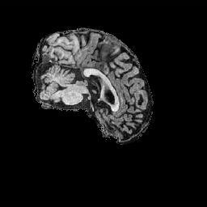
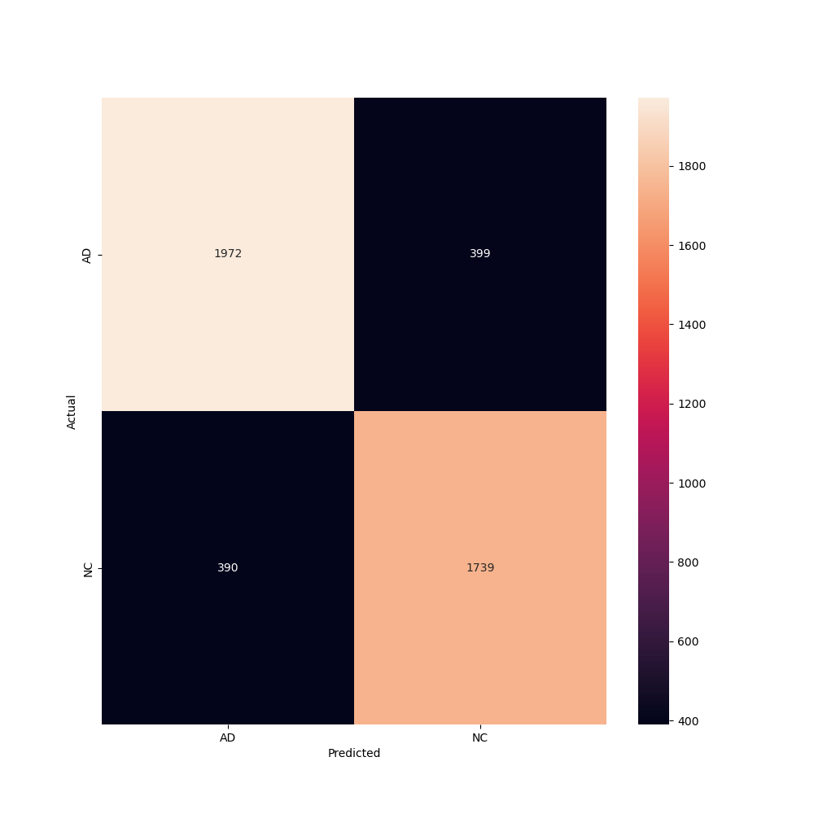

# Alzheimer's Disease Classification using SWIN Transformer
___

# Overview  
___

Alzheimer disease (AD) is a neurodegenerative disorder characterized by β-amyloid (Aβ)­ containing extracellular plaques and tau-containing intracellular neurofibrillary tangles, The presentation of AD withshort-term memory difficulty is most common but impairment in expressive speech, visuospatial processing and executive (mental agility) functions also occurs [[1]](#ref1).

For obvious reasons the early detection of AD is crucial for the treatment and management of the disease. In this project, we aim to classify MRI images of the brain as either AD or no condition (NC) using the Swin Transformer architecture.

# Model Architecture

___

The Swin Transformer is a hierarchical vision transformer that uses shifted windows to capture long-range dependencies in images. The Swin Transformer architecture is shown below.


The Swin Transformer architecture consists of a series of stages, each of which contains a series of Swin blocks. Each Swin block consists of a window-based self-attention mechanism followed by a feedforward neural network. The Swin blocks are connected in a hierarchical manner, with the output of one block being passed to the next block in the hierarchy. The Swin Transformer architecture is designed to capture long-range dependencies in images by using shifted windows to process the image in a hierarchical manner. [[2]](#ref2) 

Because of its ability to capture long-range dependencies and fine details in images, the Swin Transformer architecture is well-suited for medical imaging tasks, such as the classification of MRI images of the brain. In this project, we use the Swin Transformer architecture to classify MRI images of the brain as either AD or NC.

The Swin Transformer architecture consists of the following components:

### Patch Partitioning:
The input image is first divided into patches, where each patch is flattened and projected into an embedding space. In this project, each MRI image is resized to 224x224 pixels, which is split into 4x4 patches, resulting in an initial patch size of 4x4. This yields a patch grid of size 56x56 with each patch represented by a feature vector.
### Hierarchical Feature Representation:
The Swin Transformer uses a series of stages, each with multiple layers (or Swin blocks). The first stage operates at the highest resolution and captures local features. Subsequent stages progressively decrease the resolution but increase the number of channels, allowing the model to capture increasingly abstract features. This hierarchical structure aligns well with medical imaging needs, as it captures both fine details and global structural changes in the brain.
### Shifted Window Attention:
A unique feature of the Swin Transformer is its use of shifted windows in self-attention. In each Swin block, self-attention is calculated within fixed-size windows (e.g., 7x7 pixels), allowing the model to focus on local regions. The windows are then shifted by a fixed offset in the next block, facilitating connections across window boundaries. This strategy enhances the model’s ability to capture long-range dependencies without an excessive computational burden.
### Multi-Head Self-Attention (MHSA):
Within each window, multi-head self-attention is applied, where the attention mechanism assigns varying weights to different patches based on their similarity. This allows the model to focus on critical regions that may indicate AD, such as areas with brain atrophy or hippocampal shrinkage. Multi-head attention enables the model to learn different patterns at different heads, thus capturing multiple aspects of the MRI features.
### Feedforward Network (FFN):
After the attention layers, a feedforward neural network (FFN) processes each feature independently. The FFN consists of two linear transformations separated by a non-linear activation function. This layer further refines the learned representations and contributes to the model's capacity to differentiate subtle anatomical changes in the brain.

# Dataset Description

___

The dataset used in this project is the ADNI dataset, which contains MRI images of the brain from patients with Alzheimer's disease (AD) and healthy controls. The dataset contains a total of 30520 images, split into 21520 training images and 9000 test images. The train split contains 10400 AD images and 11120 NC images, while the test split contains 4460 AD images and 4540 NC images.

The images in the dataset are grayscale and have a resolution of 256x224 pixels. The images are labeled as either AD or NC, with the AD images corresponding to patients with Alzheimer's disease and the NC images corresponding to healthy controls.

A sample of the images in the dataset is shown below.

### AD Images
||

### NC Images
||

# Training Process
___

The model was trained over 100 epochs using the AdamW optimizer. The CrossEntropyLoss function was used as the loss function to measure the model's performance. A cosine learning rate scheduler was used to adjust the learning rate during training. Early stopping was implemented by measuring the test loss on the dataset and stopping if no improvement was observed after a set number of epochs. For this purpose, the testing data was randomly split into test and validations sets with 50% of the original test data each.The following hyperparameters were used during training:

- Batch Size: 32
- Learning Rate: 0.0001
- weight_decay: 0.01
- num_epochs: 100
- patience: 50
- drop_rate: 0.5

### Transformations

Image augmentation techniques such as random horizontal flip, random rotation, and random crop were used to increase the diversity of the training data and improve the model's generalization performance. The images in the dataset were preprocessed using the following transformations:

1. Resize: The images were resized to 224x224 pixels to match the input size of the Swin Transformer model.
2. Normalize: The pixel values of the images were normalized to have a mean of 0.5 and a standard deviation of 0.25.
3. Random Horizontal Flip: The images were randomly flipped horizontally with a probability of 0.5.
4. Random Rotation: The images were randomly rotated by an angle between -10 and 10 degrees.

Transformations that introduce noise or distortions to the images were avoided since in the context of medical imaging, preserving the original features of the images is crucial for accurate diagnosis. Real world images are not likely to be distorted or noisy and so the model should be trained on clean images to ensure it can generalize to unseen data.

# Results
___

### Performance Metrics

The test and train loss was recorded for each epoch and is shown below.


As can be seen from the plot, the model was trained for 100 epochs and the best model was selected as the one which achieved the lowest test loss at epoch 96. The training and validation loss consistently decrease throughout the training process with the validation loss starting to flatten out towards the end. Since the model with the lowest validation loss was chosen we can be confident that no overfitting has occured. The results of the model on the training set are as follows:


|           | Precision | Recall | F1-Score | Support |
|-----------|-----------|--------|----------|---------|
| 0.0       | 0.83      | 0.83   | 0.83     | 2371    |
| 1.0       | 0.81      | 0.82   | 0.82     | 2129    |
|           |           |        |          |         |
| Accuracy  |           |        | 0.82     | 4500    |
| Macro Avg | 0.82      | 0.82   | 0.82     | 4500    |
| Weighted Avg | 0.82   | 0.82   | 0.82     | 4500    |

The confusion matrix of the model is shown below.



The predictions of the model seem fairly well balanced and accurate 

As an additonal note, the model achieved an accuracy of 0.85 on the training set and 0.82 on the test set.

### Example Predictions

For each given image, the model produces probabilities for each class (AD and NC). The class with the highest probability is selected as the predicted class. The following are some example predictions made by the model:

| Image | Prediction | Confidence | Actual |
|-------|------------|------------|--------|
|  | AD | 0.99 | AD |
|  | AD | 0.87 | AD |
|  | NC | 0.65 | AD |
|  | NC | 0.92 | NC |
|  | NC | 0.88 | NC |
|  | AD | 0.54 | NC |


# Usage
___

To train your own model, follow the steps below.

### 1. Clone the repository

Clone the repository and navigate to the
alzheimer-classification directory.

```bash
$ git clone
$ cd alzheimer-classification
```

### 2. Install dependencies

Install the required dependencies using pip.

```bash
$ pip install -r requirements.txt
```

### 3. Adjust data directory
Assuming the dataset has been downloaded and is in its original format, run preprocess.py to adjust file structure to be suitable for train.py

```bash
$ python preprocess.py
```

Or manually adjust the file structure to be as follows:
```
wills_harrison_s4698315_adni_transformer/
    train/
        AD/
            ad_001.jpg
            ad_002.jpg
            ...
        ND/
            nd_001.jpg
            nd_002.jpg
            ...
    test/
        AD/
            ad_001.jpg
            ad_002.jpg
            ...
        ND/
            nd_001.jpg
            nd_002.jpg
            ...
```

### 4. Adjust hyperparameters and train the model

Adjust config.yaml to set the hyperparameters for the model. To train the model, run the following command.

```bash
$ python train.py
```

### 5. Evaluations
To evaluate the accuracy of the model, run the following command.

```bash
$ python predict.py --accuracy
```

To produce the confusion matrix, run the following command.

```bash
$ python predict.py --confusion_matrix
```

To generate a classification report, run the following command.

```bash
$ python predict.py --classification_report
```

To predict the class of an image, run the following command.

```bash
$ python predict.py --image_path <path_to_image>
```

# References

<a id="ref1">1.</a>Knopman, D. S., Amieva, H., Petersen, R. C., Chételat, G., Holtzman, D. M., Hyman, B. T., Nixon, R. A., & Jones, D. T. (2021). Alzheimer disease. Nature Reviews. Disease Primers, 7(1), 33–33. https://doi.org/10.1038/s41572-021-00269-y

<a id="ref2">2.</a>Liu, Z., Lin, Y., Cao, Y., Hu, H., Wei, Y., Zhang, Z., Lin, S., & Guo, B. (2021). Swin Transformer: Hierarchical vision transformer using shifted windows. arXiv. https://arxiv.org/abs/2103.14030
