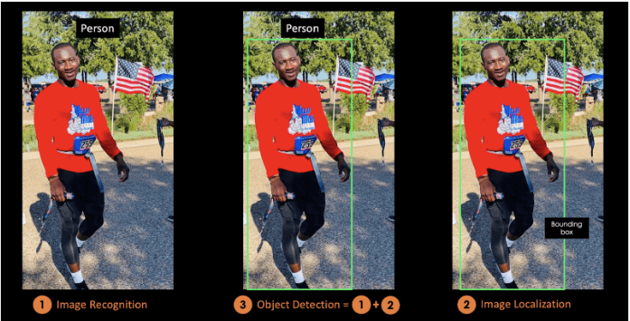

# YOLOv8 Lesion Detection

Using the detection network YOLOv8 to detect lesions in the ISIC 2017/8 data set.

## Task

The task is to detect melanoma in images of peoples skin. This will be done using the ISIC 
2017/8 data set which contains 2000 jpeg images of lesions. To do this the YOLO detection 
network will be used on the segmentation data to detect lesions. Specifically the YOLOv8 
model will be used.

## Model

Image classification only aims to predict the class of an object within an image to 
only one category or class. Image localization instead is the process of using bounding 
boxes to identify the location of one or many objects in an image. Object detection is a 
combination of both of these as it identifies and localises objects in images or videos. 



You Only Look Once, YOLO, is a real-time object detection algorithm that was made in 
2015 using a single deep convolutional neural network. It can operate at a high speed 
as, like the name implies, given the image and a text file specifiying the boundries 
it makes predictions of the bounding boxes and class probabilities at the same time. 
In addition, not only is it fast but it has a high detection accuracy which makes it 
suitable for a task such as detecting melonoma as it may need to be done in real time. 

## Usage

1. Install the ISIC 2017/8 data set. You will need to install the training, validation and test data, in addition to task 1 for each of them.
2. Next you will need to go to dataset.py and change the signified file paths to your own, so it takes the sementation data (the png masks) and creates labels for the YOLO model.
3. Then you will have to copy the data structure below to configure your files. The masks can now be deleted as it is the jpg and the labels we just created that are relevant. 
```
dataset/
├── train
│   ├── images
│   │   ├── ISIC_0000000.jpg
│   │   └── ...
│   └── labels
│       ├── ISIC_0000000.txt
│       └── ...
├── val
│   ├── images
│   │   ├── ISIC_xxxxxxx.jpg
│   │   └── ...
│   └── labels
│       ├── ISIC_xxxxxxx.txt
│       └── ...
├── test
│   ├── images
│   │   ├── ISIC_xxxxxxx.jpg
│   │   └── ...
│   └── labels
│       ├── ISIC_xxxxxxx.txt
│       └── ...
```
4. Now you need to navigate to the traindata.yaml file to configure the file paths to match your own file paths that you just created.
5. Next go to train.py and ensure that all the relevant file paths are updated. 
6. Ensure that your environment is properly setup to run the model. Conda was used to create the environment. Ensure you have nvidia toolkit installed. Then run the following commands:
conda install pytorch=2.1.1 torchvision=0.16.1 torchaudio pytorch-cuda=11.8 -c pytorch -c nvidia
conda install scikit-learn=1.3.2 matplotlib=3.7.2 seaborn=0.13.2 tqdm=4.66.5 pillow=10.4.0 pandas=2.0.3 numpy=1.24.3
conda install ultralytics
7. Now that everything is done the model can now begin training. Model details and graphs will be created by YOLO when it finishes training.

## Results


## Dependencies

### Dependencies

- [PyTorch](https://pytorch.org/) 
- [OpenCV](https://opencv.org/) 
- [Ultralytics](https://github.com/ultralytics/ultralytics) 
